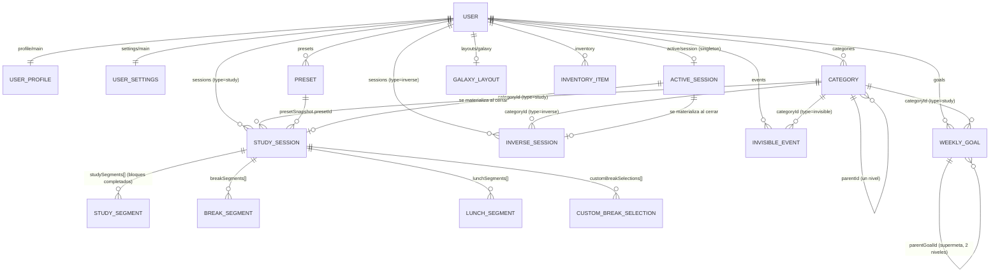

# 02 — Dominio, modelo de datos y convenciones

## Propósito

Este documento es la columna vertebral del canon de Productvt Beta v2: fija el glosario, el modelo conceptual, las interfaces TypeScript del dominio, los invariantes verificables, el esquema de Firestore (rutas, campos, índices y `firestore.rules`) y las convenciones de tiempo, identificadores y versionado. Todos los demás documentos de `docs/` citan los nombres definidos aquí y no los redefinen. El destinatario es un implementador (Claude Code, sesión `BC Orquestador Productvt`) que debe poder construir las fases de dominio, repositorios y sincronización sin volver a preguntar.

Distingue en todo momento dos planos:

- **As-built**: lo ya commiteado en `productvt-beta/src/domain/**` (Fase 1) y `src/infrastructure/firebase/collections.ts`, `src/repositories/user/userRepository.ts` (Fase 2). Es la verdad para nombres de tipos y campos; aquí se copia literalmente y no se renombra.
- **Adición propuesta**: lo que falta para cumplir el brief y las decisiones del creador (singleton de sesión activa, ganchos de galaxia, `completionReason: 'ended_by_user'`, `DeviceId`, `schemaVersion`, etc.). Cada adición indica en qué fase la agrega BC.

## Fuentes

Orden de autoridad (si dos fuentes chocan, gana la de arriba):

1. Respuestas literales del creador — anexo de `_brief-orquestador.md` (etiquetas `R1..R24`).
2. `03-requisitos/decisiones-tomadas.md` v2 (etiquetas `D <sección/punto>`).
3. `_brief-orquestador.md` revisado 2026-09-06 (etiquetas `B §n`).
4. Código commiteado en `productvt-beta/src/domain/**` y `src/infrastructure/firebase/collections.ts` (etiqueta `CODE`): verdad para identificadores.
5. `03-requisitos/revision-spec-beta.md` (etiquetas `REV-ALTA-n`, `REV-MEDIA-<fila>`): todo hallazgo ALTO y MEDIO de modelo de datos queda resuelto en la sección 8.
6. `01-mockups/mobile/cronometro.html` y `03-requisitos/nueva-funcionalidad-galaxia-tienda.md` (requerimiento de galaxia + tienda).
7. Originales v1 (`docs/originales/SPEC-v1.md` §12–13, §22, §24, §26, §41–44; `ARCHITECTURE-v1.md` §9–10, §16–17, §26): punto de partida, no fuente de verdad.

Cuando el código as-built y el brief difieren solo en nombre o forma de guardar, este documento adopta el código (regla de gobierno del brief) y lo señala. Cuando el código contradice una decisión del creador, este documento marca el cambio que BC debe hacer.

## 1. Glosario canónico y tabla de mapeo español/código

Regla de oro (brief §1, R2, R4, R5): en español para humanos —UI y documentos— **"sesión"** es la corrida completa (`StudySession`) y **"bloque"** es el tramo de estudio de ~25 min. La palabra "ciclo" no se usa en español. Los identificadores de código (`cyclesCompleted`, `cycleNumber`, `cyclesBeforeLongBreak`, `StudySegment`) se citan tal cual están commiteados y no se renombran; en código nunca se introduce `block`/`Block` como identificador nuevo para el tramo.

### 1.1 Tabla de mapeo español ↔ código (obligatoria en todo documento que mezcle ambos planos)

| Término en español (UI/docs) | Identificador en código | Dónde vive |
|---|---|---|
| Sesión | `StudySession`, `ActiveStudySession`, `activeSession` | `sessions/{sessionId}` (cerrada), `active/session` (en curso) |
| Bloque (tramo de estudio) | `StudySegment`, `cycleNumber`, `cyclesCompleted`, `cyclesSinceLunch`, `Preset.cyclesBeforeLongBreak` | `StudySession.studySegments[]`, `ActiveStudySession` |
| Descanso | `BreakSegment` (`breakType`: `short` / `long` / `custom` / `skipped`) | `StudySession.breakSegments[]` |
| Elección de descanso personalizado | `CustomBreakSelection` | `StudySession.customBreakSelections[]` |
| Almuerzo | `LunchSegment` (con `returnState`), `stateBeforeLunch` | `StudySession.lunchSegments[]`, `ActiveStudySession` |
| Banco de descanso | `bankRemainingSeconds`, `BreakSegment.bankDeltaSeconds` | `StudySession`, `ActiveStudySession` |
| Tiempo efectivo | `effectiveStudySeconds` | `StudySession`, `ActiveStudySession` |
| Ventana de respuesta | `responseDeadlineAt` | `ActiveStudySession` |
| Bloque inverso | `InverseSession`, `ActiveInverseSession` | `sessions/{sessionId}` con `type: 'inverse'`, `active/session` |
| Evento invisible | `InvisibleEvent`, `WeeklyRecurrence` | `events/{eventId}` |
| Meta semanal / supermeta | `WeeklyGoal`, `parentGoalId` | `goals/{goalId}` |
| Dominante / Espectador | `dominantDeviceId`, `DeviceRole` | `active/session` |
| Checkpoint | `lastCheckpointAt` | `active/session` |

### 1.2 Definiciones con ejemplos numéricos

Los ejemplos usan el preset `Estándar` as-built (`STANDARD_PRESET_VALUES`): estudio 25 min, descanso corto 5 min, descanso largo 35 min, `cyclesBeforeLongBreak: 4`.

| Término | Definición precisa | Ejemplo |
|---|---|---|
| **Sesión** (`StudySession`) | Contenedor único desde "Iniciar" hasta el cierre por `completed`, `cancelled` o `expired`. Contiene bloques, descansos, almuerzos y el banco. Es un solo documento; no existe subcolección de bloques. | Una sesión con 4 bloques completados y 3 descansos dura desde `startedAt` 09:00:00 hasta `endedAt` 10:52:00: `totalElapsedSeconds = 6720`. |
| **Bloque** (`StudySegment`) | Tramo continuo de estudio de duración `presetSnapshot.studyDurationMinutes × 60` segundos. Solo se registra cuando se **completa**; el bloque en curso no existe en `studySegments[]`. Es la unidad de registro y de estadísticas. | `{ cycleNumber: 1, durationSeconds: 1500, start: '…T09:00:00Z', end: '…T09:25:00Z' }`. |
| **Tiempo efectivo** (`effectiveStudySeconds`) | Suma de `durationSeconds` de los bloques completados. Nunca incluye descansos ni almuerzo. | 4 bloques completados → `effectiveStudySeconds = 6000` (100 min), aunque `totalElapsedSeconds = 6720`. |
| **Descanso ganado** (`BreakSegment.grantedSeconds`) | Segundos que otorga terminar un bloque: `shortBreakMinutes × 60`; si `cycleNumber % cyclesBeforeLongBreak === 0`, además `longBreakMinutes × 60` (brief §3.2: "corto + largo"). | Bloques 1–3: `grantedSeconds = 300`. Bloque 4: `grantedSeconds = 300 + 2100 = 2400`. |
| **Banco de descanso** (`bankRemainingSeconds`) | Segundos de descanso no usados acumulados dentro de la sesión. Empieza en 0, vive y muere con la sesión. `disponible = banco + ganado`; `usado ∈ [0, disponible]`; `bancoNuevo = disponible − usado`. | Tras bloque 1 (ganado 300) el usuario descansa 120 s → banco 180. Tras bloque 2 salta (usado 0) → banco 480. Tras bloque 3 elige 600 s → banco 180. Tras bloque 4 (ganado 2400, disponible 2580) descansa 2100 → banco 480. |
| **`bankDeltaSeconds`** | `grantedSeconds − usedSeconds`. Positivo: el banco crece; negativo: se consumió banco previo. `bankRemainingSeconds` es la suma de todos los `bankDeltaSeconds` de la sesión. | Los cuatro descansos del ejemplo: `+180`, `+300`, `−300`, `+300` → suma `480`. |
| **Descanso corto / largo / personalizado / saltado** (`breakType`) | `short`: el usuario aceptó exactamente el descanso corto ganado. `long`: aceptó exactamente el descanso ganado en un bloque múltiplo de `cyclesBeforeLongBreak`. `custom`: eligió otro valor con el selector (cualquier entero de minutos en `(0, disponible]`, incluido un descanso largo tomado parcialmente). `skipped`: `usedSeconds = 0` por cualquier vía. | Tomar 35 min cuando el disponible era 43 → `{ breakType: 'custom', grantedSeconds: 2400, usedSeconds: 2100, bankDeltaSeconds: 300 }`. |
| **Elección personalizada** (`CustomBreakSelection`) | Registro de la **decisión** tomada en el selector personalizado: banco disponible y valor elegido. El `BreakSegment` registra la **ejecución**. Solo existe cuando el usuario abrió el selector (no cuando tocó las fichas "Corto", "Largo" o "Saltar"). | `{ cycleNumber: 3, availableSeconds: 780, chosenSeconds: 600, selectedAt }`. |
| **Almuerzo** (`LunchSegment`) | Pausa fija de 45 min (`2700` s). No consume banco ni cuenta como tiempo efectivo. Disponible si `cyclesSinceLunch ≥ 3` o si `lunchUsed === false` (brief §3.3). Se puede pedir desde `study_running`, `break_selection`, `break_running` y ambos `*_waiting_response`; el estado de origen se guarda en `stateBeforeLunch` y en `LunchSegment.returnState`. | Sesión con 2 bloques y sin almuerzo → disponible. Tras usarlo, `cyclesSinceLunch` vuelve a 0 y se rehabilita al completar el bloque 5. |
| **Ventana de respuesta** (`responseDeadlineAt`) | Plazo para responder al terminar un bloque o un descanso: 30 s si el tramo terminado fue ≤ 30 min (o descanso corto), 10 min si fue > 30 min o descanso largo (brief §3.1, detalle en `03-CRONOMETRO.md`). Al vencer: la sesión expira. | Bloque de 25 min terminado a 09:25:00 → `responseDeadlineAt = 09:25:30`. Descanso largo → deadline = fin + 600 s. |
| **Expirar** (`status: 'expired'`) | Cierre por ventana vencida (`completionReason: 'expired_no_response'`) o por zombie de 24 h (`zombie_timeout_24h`). Se pierde **solo el bloque en curso**; `effectiveStudySeconds` conserva los bloques completados y **cuenta** en estadísticas (R2). | Expira durante el bloque 3 → `cyclesCompleted: 2`, `effectiveStudySeconds: 3000`, `status: 'expired'`. |
| **Color de un bloque** (§1.2, D6/D6.b) | Jerarquía CONFIRMADA por el creador 2026-09-06 (reemplaza la resolución anterior "el color de meta es solo cosmético"): si `StudySession.goalId` está presente, manda el color de **esa meta** (`WeeklyGoal.color`); si esa meta tiene `parentGoalId`, la supermeta aporta un **segundo acento** (franja) en el calendario, no reemplaza el color principal; si no hay `goalId`, se usa el color **vigente de la categoría** (D6, sin cambios para este caso). El Cronómetro (panel activo) pinta con el color de la meta cuando hay una asociada; el calendario pinta relleno = color de la meta, franja secundaria = color de la supermeta (si la hay). | Bloque con `goalId` apuntando a una meta hija de color naranja cuya supermeta es azul → Cronómetro naranja; en el calendario, relleno naranja con franja azul. Bloque sin `goalId` de categoría "Física" (azul vigente) → todo azul, sin franja. |
| **Cancelar** (`status: 'cancelled'`) | Cierre voluntario con doble confirmación 15 + 15 s (se mantiene sin cambios pese a lo siguiente — decisiones-tomadas.md, "Fricción de cancelación"). Misma severidad que expirar (CONFIRMADO por el creador, R25/D1.b, 2026-09-06): conserva `effectiveStudySeconds` de los bloques ya completados, pierde solo el bloque en curso; `studySegments[]` se conserva íntegro como histórico. Se calcula con `resolveCancelledSessionEffectiveSeconds` (una sola función, ver §3.6). | Cancela en el bloque 3 (2 bloques de 1500 s ya completados) → `effectiveStudySeconds: 3000`, igual que si esa sesión hubiera expirado en el mismo punto. |
| **Terminar sesión** (`status: 'completed'`, `completionReason: 'ended_by_user'`) | Cierre normal entre bloques (en `break_selection` o `break_completed_waiting_response`): simplemente no empezar otro bloque. Sin penalización. No existe "terminar conservando" a mitad de un bloque (R1). | Termina tras el bloque 4 → `cyclesCompleted: 4`, `effectiveStudySeconds: 6000`. |
| **Bloque inverso** (`InverseSession`) | Registro de ocio con temporizador inverso: duración objetivo `T` (`targetDurationSeconds`), sigue tras `T`, tope duro `2·T` con cierre automático (`autoFinished: true`). Estadísticas de ocio usan `totalElapsedSeconds`. | `T = 3600` → recordatorios cada 900 s (`remindersTriggered` hasta 7 antes del tope), "meta alcanzada" en 3600, cierre forzado en 7200. |
| **Evento invisible** (`InvisibleEvent`) | Evento planificado visible en calendario, excluido de toda estadística. Recurrencia semanal opcional (`WeeklyRecurrence`) expandida en cliente. | Gimnasio lunes/miércoles/viernes 18:00–19:00 hasta el 2026-12-31 → un solo documento con `recurrence.daysOfWeek: [1, 3, 5]`. |
| **Meta semanal** (`WeeklyGoal`) | Objetivo de tiempo efectivo por categoría de estudio y semana ISO (`weekKey`). `achievedSeconds` se recalcula a partir de bloques completados. Puede agruparse bajo una supermeta vía `parentGoalId` (gancho V1, UI en V1.1). | `{ weekKey: '2026-W36', categoryId: 'calculo3', targetSeconds: 36000, achievedSeconds: 27000, status: 'pending' }`. |
| **Estrella mensual** | El mes tiene estrella solo si tiene ≥ 1 semana cerrada con ≥ 1 meta y todas las metas de todas sus semanas cerradas con metas se cumplieron (R7). Mes sin metas → sin estrella. | Septiembre con semanas W36–W39 cerradas; W37 sin metas; W36, W38, W39 todas cumplidas → estrella. |
| **Dominante / Espectador** (`DeviceRole`) | Dominante: único dispositivo que ejecuta transiciones y escribe checkpoints (`deviceId === dominantDeviceId`). Espectador: recibe el singleton por `onSnapshot` e interpola el reloj. Solo Android puede ser dominante en V1. | Teléfono `dev_a1…` dominante; PWA de escritorio espectadora. |
| **Checkpoint** | Escritura del singleton `active/session` en cada transición relevante, con `lastCheckpointAt = serverTimestamp()` y el detalle acumulado de segmentos completados. | Fin del bloque 2 → checkpoint con `studySegments.length === 2`, `effectiveStudySeconds: 3000`. |
| **Zombie** | Singleton con `now − lastCheckpointAt > 24 h`. El próximo cliente que lo lea lo cierra como `expired` / `zombie_timeout_24h` (estudio) o lo cierra por tope `2·T` (inverso) y lo libera. | Último checkpoint 2026-09-05 22:10Z; lectura 2026-09-06 22:11Z → cierre. |
| **Color vivo** | Todo lo pintado resuelve color y nombre por `categoryId` contra la categoría vigente (R6). `colorSnapshot` y `categoryNameSnapshot` son histórico únicamente. | Cambiar Cálculo 3 de `#3A6B54` a `#2E7B84` repinta todo el calendario pasado. |

## 2. Modelo conceptual

Todo el modelo cuelga del usuario autenticado (`uid` de Firebase Auth). No hay datos compartidos entre usuarios ni colecciones raíz distintas de `users`.



### 2.1 Usuario: perfil y ajustes

- `UserProfile` (`profile/main`): identidad y preferencias que afectan al dominio: `timezone` (IANA, define semanas, días y meses), `cancellationPhrase` (frase de la doble confirmación). Se crea de forma idempotente tras cualquier login (`ensureUserProfileAndSettings`, as-built Fase 2).
- `UserSettings` (`settings/main`): preferencias de sonido, visuales y de notificaciones sincronizadas. El archivo de audio propio del dispositivo es preferencia **local** (AsyncStorage), no está en Firestore (D18). El singleton de sesión activa **no** vive en `settings/main` (el comentario as-built de `collections.ts` sobre `activeStudySessionRef` queda superado por `active/session`, §2.5).

### 2.2 Categorías y presets

- `Category`: tres árboles independientes por `type` (`study` | `inverse` | `invisible`) en una sola colección. Jerarquía de **un nivel** vía `parentId?` (adición propuesta): una subcategoría tiene `parentId` apuntando a una categoría del mismo `type` sin `parentId`. Cambiar el color de la categoría propaga el mismo `color` a sus subcategorías en el mismo batch. Nunca se borra físicamente una categoría referenciada por sesiones, eventos o metas: se archiva (`isArchived: true`) y deja de ofrecerse para nuevas sesiones, pero sigue resolviendo color y nombre del histórico. `imageUrl?` reservado para personalización con imágenes (sin UI en V1).
- `Preset`: configuración de estudio/descanso en **minutos** (excepción intencional: son entrada de usuario). Al iniciar una sesión se congela en `StudySession.presetSnapshot` (`PresetSnapshot`), que **sí** es fuente de verdad para las duraciones de esa sesión aunque el preset cambie o se borre después. `imageUrl?` reservado. Todo usuario nuevo recibe el preset `Estándar` (`STANDARD_PRESET_VALUES`, `isDefault: true`), sembrado en la fase de categorías/presets.

### 2.3 Sesión de estudio (as-built, un solo documento)

`StudySession` es un único documento en `users/{uid}/sessions/{sessionId}` con `type: 'study'` y todo el detalle embebido:

| Campo | Rol en el modelo |
|---|---|
| `studySegments[]` (`StudySegment`, con `cycleNumber`) | Bloques **completados**, en orden. El bloque en curso no está aquí. |
| `breakSegments[]` (`BreakSegment`, `breakType` `short`/`long`/`custom`/`skipped`) | Descansos ejecutados, uno por decisión de descanso (incluido "saltar", con `usedSeconds: 0`). |
| `lunchSegments[]` (`LunchSegment`, con `returnState`) | Usos del almuerzo. Fuente única del almuerzo; `breakType: 'lunch'` no se usa (§8). |
| `customBreakSelections[]` (`CustomBreakSelection`) | Decisiones tomadas en el selector personalizado (incluye `chosenSeconds: 0`). |
| `cyclesCompleted` | `= studySegments.length`. |
| `effectiveStudySeconds` | Tiempo efectivo que cuenta en estadísticas (ver invariante I-1 y regla de cancelación I-8). |
| `totalElapsedSeconds` | `endedAt − startedAt` en segundos; incluye descansos y almuerzos. Nunca se usa para estadísticas de estudio. |
| `bankRemainingSeconds` | Banco al cierre; `= Σ bankDeltaSeconds`. |
| `status` / `completionReason` | Cierre: `completed`/`ended_by_user`; `cancelled`/`cancelled_by_user`; `expired`/`expired_no_response` o `zombie_timeout_24h`. `all_cycles_completed` existe as-built y queda reservado (ningún flujo V1 lo produce: la sesión no tiene número fijo de bloques). |
| `deviceInfo?` | Dispositivo que originó la sesión (`platform`, `deviceName?`, `appVersion?`, `deviceId?`). |
| `colorSnapshot`, `categoryNameSnapshot` | **Histórico únicamente**; ningún renderizador ni agregador los usa (R6). Se rellenan con `buildCategorySnapshot`. |
| `presetSnapshot` | Duraciones congeladas de la sesión (fuente de verdad para esa sesión). |

El documento en `sessions/` se escribe **una sola vez, al cerrar** la sesión (materialización del singleton, §2.5). Por eso `status: 'active'` existe en el tipo pero no debe aparecer en `sessions/`; las reglas de seguridad lo rechazan (§5.3) y los lectores lo excluyen por robustez.

### 2.4 Bloque inverso

`InverseSession` comparte la colección `sessions/` con `type: 'inverse'`. Campos clave: `targetDurationSeconds` (objetivo `T`), `totalElapsedSeconds` (lo que cuenta en estadísticas de ocio), `remindersTriggered` (recordatorios cada 15 min emitidos), `status` (`completed` | `cancelled` | `interrupted`; `active` existe en el tipo y no se persiste en `sessions/`) y la adición `autoFinished: boolean` (cierre forzado por tope `2·T`). También se ejecuta a través del singleton (`ActiveInverseSession`) y se materializa al cerrar.

### 2.5 Sesión activa: singleton dominante/espectador

`users/{uid}/active/session` es el **único** documento que representa "hay algo corriendo". Es una unión discriminada por `type`: `ActiveStudySession` | `ActiveInverseSession`. Su existencia garantiza una sola sesión activa por usuario y la exclusión mutua estudio/ocio (brief §3.5); su campo `dominantDeviceId` designa al único dispositivo que ejecuta transiciones. Contiene todos los campos del brief §5 (con los nombres canónicos de §3.4) **más** el detalle acumulado de segmentos completados (`studySegments[]`, `breakSegments[]`, `lunchSegments[]`, `customBreakSelections[]`, `effectiveStudySeconds`, `bankRemainingSeconds`), escrito en cada checkpoint (D "Robustez ante crash"): un crash nunca pierde bloques completados. Al cerrar por cualquier vía se materializa como `StudySession` o `InverseSession` en `sessions/` y se **borra** el singleton (batch atómico). El detalle de estados y transiciones es de `03-CRONOMETRO.md`; el protocolo de cambio de dominante, de `05-ARQUITECTURA.md`.

### 2.6 Evento invisible, meta semanal y ganchos de galaxia

- `InvisibleEvent`: `startAt`/`endAt` planificados (no `startedAt`/`endedAt`), `recurrence?: WeeklyRecurrence` (`frequency: 'weekly'`, `daysOfWeek: WeekDayIndex[]`, `until?`), borrado lógico `isDeleted?`. Las ocurrencias se expanden en memoria (`expandRecurringInvisibleEvents`); no existe colección de instancias.
- `WeeklyGoal`: una por (`weekKey`, `categoryId`) de tipo `study`. `achievedSeconds` se recalcula desde bloques completados atribuidos a la semana (§6.3); `status` pasa de `pending` a `completed`/`failed` al cerrar la semana. Ganchos V1 sin UI: `parentGoalId?` (supermeta; máximo dos niveles) y `skinId?` (skin de planeta, entrada del AssetRegistry de `06-DISENO-UI.md`).
- `GalaxyLayout` (`layouts/galaxy`, documento único) y `InventoryItem` (`inventory/{itemId}`): previstos en el esquema, sin UI hasta `10-GALAXIA-Y-TIENDA.md`.

## 3. Interfaces TypeScript

### 3.1 As-built: enums y value objects

Copia literal de `productvt-beta/src/domain/enums/**` y `src/domain/value-objects/**` (Fase 1). Se omiten solo los comentarios JSDoc; la semántica vigente es la de este documento.

```ts
// src/domain/enums/category-type.ts — AS-BUILT
export type CategoryType = 'study' | 'inverse' | 'invisible';
export const CATEGORY_TYPES: readonly CategoryType[] = ['study', 'inverse', 'invisible'] as const;

// src/domain/enums/timer-state.ts — AS-BUILT
export type TimerStateName =
  | 'idle'
  | 'study_running'
  | 'study_completed_waiting_response'
  | 'break_selection'
  | 'break_running'
  | 'break_completed_waiting_response'
  | 'lunch_running'
  | 'session_completed'
  | 'session_cancelled'
  | 'session_expired';
export const TIMER_STATES: readonly TimerStateName[] = [/* los 10 anteriores, en ese orden */] as const;
export const TERMINAL_TIMER_STATES: readonly TimerStateName[] = [
  'session_completed',
  'session_cancelled',
  'session_expired',
];
export function isTerminalTimerState(state: TimerStateName): boolean;

// src/domain/value-objects/duration-seconds.ts — AS-BUILT
export type DurationSeconds = number;
export function minutesToSeconds(minutes: number): DurationSeconds;          // Math.round(minutes * 60)
export function secondsToMinutes(seconds: DurationSeconds): number;         // seconds / 60
export function clampDurationSeconds(seconds: number, min?: DurationSeconds, max?: DurationSeconds): DurationSeconds;

// src/domain/value-objects/week-key.ts — AS-BUILT ('YYYY-Www', ISO-8601, lunes-domingo)
export type WeekKey = string;
export function isValidWeekKey(value: string): value is WeekKey;            // /^\d{4}-W(0[1-9]|[1-4]\d|5[0-3])$/
export function buildWeekKey(date: Date): WeekKey;                          // getISOWeekYear + getISOWeek (date-fns)

// src/domain/value-objects/month-key.ts — AS-BUILT ('YYYY-MM')
export type MonthKey = string;
export function isValidMonthKey(value: string): value is MonthKey;          // /^\d{4}-(0[1-9]|1[0-2])$/
export function buildMonthKey(date: Date): MonthKey;

// src/domain/value-objects/preset-snapshot.ts — AS-BUILT (se persiste anidado en StudySession.presetSnapshot)
export interface PresetSnapshot {
  presetId: string;
  nameSnapshot: string;
  studyDurationMinutes: number;
  shortBreakMinutes: number;
  cyclesBeforeLongBreak: number;
  longBreakMinutes: number;
}
export function buildPresetSnapshot(preset: Preset): PresetSnapshot;

// src/domain/value-objects/category-snapshot.ts — AS-BUILT (helper puro; NO se persiste anidado)
export interface CategorySnapshot {
  categoryId: string;
  type: CategoryType;
  nameSnapshot: string;
  colorSnapshot: string;
}
export function buildCategorySnapshot(category: Category): CategorySnapshot;

// src/types/common.ts — AS-BUILT
export type ID = string;
export type ISODateString = string;   // ISO 8601 en UTC; se convierte a la zona horaria del perfil solo para UI
export type Nullable<T> = T | null;
export type Optional<T> = T | undefined;
export type Result<T, E = Error> = { success: true; data: T } | { success: false; error: E };
export type AsyncResult<T, E = Error> = Promise<Result<T, E>>;
export function ok<T>(data: T): Result<T, never>;
export function err<E>(error: E): Result<never, E>;
```

Notas de semántica vigente sobre lo as-built:

- `buildWeekKey` y `buildMonthKey` reciben un `Date` que ya representa la **hora de pared en la zona horaria del perfil** (ver `toZonedWallClock`, §3.6 y §6.2). Nunca se les pasa el instante UTC crudo.
- `CategorySnapshot` solo sirve para rellenar `categoryNameSnapshot`/`colorSnapshot` (histórico). Ningún componente lo usa para pintar.
- `TimerStateName` es el contrato público de la máquina; `paused_transient` del SPEC v1 queda fuera (decisión as-built que este documento confirma).

### 3.2 As-built: entidades

Copia literal de `productvt-beta/src/domain/entities/**` (Fase 1). Los campos marcados `// +` en §3.3 son adiciones que **no** están en estos archivos todavía.

```ts
// src/domain/entities/user-profile.ts — AS-BUILT
export interface UserProfile {
  id: string;                 // = uid de Firebase Auth
  email: string;
  displayName?: string;
  timezone: string;           // IANA, p. ej. 'America/Santiago'; por defecto la del dispositivo al registrarse
  cancellationPhrase: string;
  createdAt: string;
  updatedAt: string;
}
export const DEFAULT_CANCELLATION_PHRASE =
  '¿Seguro que quieres abandonar? Todo tu progreso de este bloque se perderá.'; // ver nota de vocabulario abajo

export interface SoundPreferences {
  enabled: boolean;
  studyFinishedSoundId: string;
  breakFinishedSoundId: string;
  inverseReminderSoundId: string;
  cancelledSoundId?: string;
  volume: number;             // 0..1
}
export interface VisualPreferences {
  colorScheme: 'light' | 'dark' | 'system';
  celebrationEffectsEnabled: boolean;
  reduceMotion: boolean;
}
export interface UserSettings {
  userId: string;
  soundPreferences: SoundPreferences;
  visualPreferences: VisualPreferences;
  notificationsEnabled: boolean;
  createdAt: string;
  updatedAt: string;
}

// src/domain/entities/category.ts — AS-BUILT
export interface Category {
  id: string;
  userId: string;
  type: CategoryType;
  name: string;
  color: string;              // hex #RRGGBB, color VIGENTE: todo renderizado lo lee vía categoryId
  icon?: string;
  imageUrl?: string;
  isArchived: boolean;
  createdAt: string;
  updatedAt: string;
}

// src/domain/entities/preset.ts — AS-BUILT (minutos: excepción intencional, entrada de usuario)
export interface Preset {
  id: string;
  userId: string;
  name: string;
  studyDurationMinutes: number;
  shortBreakMinutes: number;
  cyclesBeforeLongBreak: number;
  longBreakMinutes: number;
  isDefault: boolean;
  imageUrl?: string;
  createdAt: string;
  updatedAt: string;
}
export const STANDARD_PRESET_VALUES = {
  name: 'Estándar',
  studyDurationMinutes: 25,
  shortBreakMinutes: 5,
  cyclesBeforeLongBreak: 4,
  longBreakMinutes: 35,
} as const;

// src/domain/entities/study-session.ts — AS-BUILT
export type StudySessionStatus = 'active' | 'completed' | 'cancelled' | 'expired';
export type StudySessionCompletionReason =
  | 'all_cycles_completed'
  | 'expired_no_response'
  | 'cancelled_by_user'
  | 'zombie_timeout_24h';
export interface StudySegment {
  start: string;
  end: string;
  durationSeconds: number;    // = presetSnapshot.studyDurationMinutes * 60; fuente del tiempo efectivo
  cycleNumber: number;        // número de bloque dentro de la sesión, desde 1
}
export type BreakSegmentType = 'short' | 'long' | 'custom' | 'skipped' | 'lunch'; // 'lunch' NO se usa (§8)
export interface BreakSegment {
  breakType: BreakSegmentType;
  grantedSeconds: number;
  usedSeconds: number;
  bankDeltaSeconds: number;   // = grantedSeconds - usedSeconds
  start: string;
  end: string;
  cycleNumber: number;        // bloque que otorgó este descanso
}
export interface LunchSegment {
  start: string;
  end: string;
  durationSeconds: number;    // 2700 salvo cierre anticipado de la sesión durante el almuerzo
  cycleNumberAtStart: number; // cyclesCompleted en el momento de iniciar el almuerzo
  returnState: TimerStateName;
}
export interface CustomBreakSelection {
  cycleNumber: number;
  availableSeconds: number;   // banco previo + descanso recién ganado
  chosenSeconds: number;      // 0..availableSeconds
  selectedAt: string;
}
export interface SessionDeviceInfo {
  platform: 'ios' | 'android' | 'web';
  deviceName?: string;
  appVersion?: string;
}
export interface StudySession {
  id: string;
  userId: string;
  type: 'study';
  name: string;
  categoryId: string;
  categoryNameSnapshot: string;   // histórico únicamente
  colorSnapshot: string;          // histórico únicamente
  presetSnapshot: PresetSnapshot;
  status: StudySessionStatus;
  startedAt: string;
  endedAt?: string;
  effectiveStudySeconds: number;
  totalElapsedSeconds: number;
  bankRemainingSeconds: number;
  cyclesCompleted: number;
  studySegments: StudySegment[];
  breakSegments: BreakSegment[];
  lunchSegments: LunchSegment[];
  customBreakSelections: CustomBreakSelection[];
  completionReason?: StudySessionCompletionReason;
  deviceInfo?: SessionDeviceInfo;
  createdAt: string;
  updatedAt: string;
}

// src/domain/entities/inverse-session.ts — AS-BUILT
export type InverseSessionStatus = 'active' | 'completed' | 'cancelled' | 'interrupted';
export interface InverseSession {
  id: string;
  userId: string;
  type: 'inverse';
  name: string;
  categoryId: string;
  categoryNameSnapshot: string;   // histórico únicamente
  colorSnapshot: string;          // histórico únicamente
  startedAt: string;
  endedAt?: string;
  targetDurationSeconds: number;  // T; tope duro 2*T
  totalElapsedSeconds: number;    // lo que cuenta en estadísticas de ocio
  remindersTriggered: number;
  status: InverseSessionStatus;
  createdAt: string;
  updatedAt: string;
}

// src/domain/entities/invisible-event.ts — AS-BUILT
export type WeekDayIndex = 0 | 1 | 2 | 3 | 4 | 5 | 6;   // Date.getDay(): 0 = domingo ... 6 = sábado
export interface WeeklyRecurrence {
  frequency: 'weekly';
  daysOfWeek: WeekDayIndex[];
  until?: string;                 // ISO, inclusive; ausente = sin fin
}
export interface InvisibleEvent {
  id: string;
  userId: string;
  type: 'invisible';
  name: string;
  categoryId: string;
  categoryNameSnapshot: string;   // histórico únicamente
  colorSnapshot: string;          // histórico únicamente
  startAt: string;                // planificado (no startedAt)
  endAt: string;
  recurrence?: WeeklyRecurrence;  // ausente = sin repetición
  notes?: string;
  isDeleted?: boolean;
  createdAt: string;
  updatedAt: string;
}

// src/domain/entities/weekly-goal.ts — AS-BUILT
export type WeeklyGoalStatus = 'pending' | 'completed' | 'failed';
export interface WeeklyGoal {
  id: string;
  userId: string;
  weekKey: WeekKey;
  categoryId: string;             // solo categorías type 'study'
  categoryNameSnapshot: string;   // histórico únicamente
  targetSeconds: number;
  achievedSeconds: number;        // recalculado desde bloques completados
  status: WeeklyGoalStatus;
  createdAt: string;
  updatedAt: string;
}
```

Nota de vocabulario sobre `DEFAULT_CANCELLATION_PHRASE`: el texto as-built dice "de este bloque" pero cancelar afecta a la **sesión** (D "Convención de vocabulario", ejemplo del diálogo "¿Cancelar sesión?"). Es un copy, no un identificador: BC debe corregirlo a `'¿Seguro que quieres abandonar? Todo tu progreso de esta sesión se perderá.'` en la fase del cronómetro y moverlo a `src/i18n/es.ts` (brief §8). Los perfiles ya creados conservan su frase hasta que el usuario la edite.

### 3.3 Adiciones propuestas sobre entidades existentes

Cada adición es **compatible hacia atrás** (campo opcional o valor nuevo en una unión): los documentos ya escritos siguen siendo válidos. BC las agrega en la fase indicada; hasta entonces, el código as-built no cambia.

| Adición | Archivo as-built que se toca | Fase de BC | Motivo |
|---|---|---|---|
| `StudySessionCompletionReason` += `'ended_by_user'` | `study-session.ts` | Cronómetro (Fase 3) | "Terminar sesión" entre bloques (brief §2). |
| `SessionDeviceInfo.deviceId?: DeviceId` | `study-session.ts` | Cronómetro (Fase 3) | Correlacionar sesión con dispositivo dominante que la originó. |
| `InverseSession.autoFinished: boolean` | `inverse-session.ts` | Inverso | Cierre forzado por tope `2·T` (R4, brief §3.5). Lector: ausente ⇒ `false`. |
| `Category.parentId?: string` | `category.ts` | Categorías/presets | Subcategorías de un nivel (brief §4). |
| `WeeklyGoal.parentGoalId?: string` | `weekly-goal.ts` | Metas | Gancho supermeta (brief §11, D "Alcance — Galaxia"). |
| `WeeklyGoal.skinId?: string` | `weekly-goal.ts` | Metas | Gancho skin de planeta (brief §11). |
| `schemaVersion?: number` en todas las entidades persistidas | todas las entidades | Fundación de repositorios (Fase 3) | Migración perezosa (§6.5). Ausente ⇒ `1`. |
| `InverseSession.deviceInfo?: SessionDeviceInfo` | `inverse-session.ts` | Inverso | Paridad con `StudySession` para diagnóstico. |

```ts
// src/domain/entities/study-session.ts — ADICIÓN (Fase 3: cronómetro)
export type StudySessionCompletionReason =
  | 'all_cycles_completed'      // as-built, reservado: ningún flujo V1 lo produce
  | 'ended_by_user'             // + "Terminar sesión" en break_selection o break_completed_waiting_response
  | 'expired_no_response'
  | 'cancelled_by_user'
  | 'zombie_timeout_24h';

export interface SessionDeviceInfo {
  platform: 'ios' | 'android' | 'web';   // 'web' incluye la PWA de escritorio
  deviceName?: string;
  appVersion?: string;
  deviceId?: DeviceId;                   // +
}

// src/domain/entities/study-session.ts — ADICIÓN (fase metas / Cronómetro), color de meta 2026-09-06
export interface StudySession {
  // ...campos as-built sin cambios...
  goalId?: string;                       // + meta a la que el usuario asoció este bloque al iniciarlo (elección explícita
                                          //   en el formulario de inicio, NUNCA inferida por categoryId — una categoría
                                          //   puede tener más de una WeeklyGoal). Ausente ⇒ bloque "suelto", sin meta.
}

// src/domain/entities/inverse-session.ts — ADICIÓN (fase inverso)
export interface InverseSession {
  // ...campos as-built sin cambios...
  autoFinished: boolean;                 // + true si cerró por tope 2*targetDurationSeconds
  deviceInfo?: SessionDeviceInfo;        // +
}

// src/domain/entities/category.ts — ADICIÓN (fase categorías/presets)
export interface Category {
  // ...campos as-built sin cambios...
  parentId?: string;                     // + id de la categoría padre (mismo type, sin parentId propio)
}

// src/domain/entities/weekly-goal.ts — ADICIÓN (fase metas), AMPLIADA 2026-09-06
// para reconciliar el modelo simple (una meta por categoría) con la jerarquía
// meta/supermeta de la galaxia (brief §11) — resuelve la pregunta de productvt-9b.
export interface WeeklyGoal {
  // ...campos as-built sin cambios (categoryId, categoryNameSnapshot, targetSeconds,
  // achievedSeconds, status, weekKey siguen siendo obligatorios para TODA meta,
  // sea hoja o supermeta — forma uniforme, sin polimorfismo)...
  name: string;                          // + etiqueta propia de la meta (galaxia y formularios), independiente de categoryName
  color: string;                         // + CONFIRMADO por el creador 2026-09-06 (D6.b): manda sobre el color de categoría
                                          //   cuando el bloque está asociado a una meta (ver §1.2). Al crear una meta hija
                                          //   (parentGoalId presente) se inicializa copiando el color vigente de la
                                          //   supermeta; después es editable de forma independiente por meta (copia, no
                                          //   enlace en vivo al padre).
  parentGoalId?: string;                 // + supermeta a la que pertenece (máximo dos niveles)
  skinId?: string;                       // + skin de planeta (AssetRegistry); ausente = skin por defecto
}

// src/domain/entities/weekly-goal.ts — ADICIÓN (fase metas), calendario por capas 2026-09-06
export interface WeeklyGoal {
  // ...campos ya listados arriba, sin cambios...
  layerVisible?: boolean;                // + visibilidad de la capa de calendario implícita de esta meta; ausente ⇒ true (visible)
}

// src/domain/entities/calendar-layer.ts — NUEVO (fase Calendario), resuelve
// 03-requisitos/nueva-funcionalidad-calendario-por-capas.md (pedido en vivo, 2026-09-06).
// Solo cubre capas PERSONALIZADAS: cada WeeklyGoal ya implica su propia capa "virtual"
// (nunca almacenada como CalendarLayer) que filtra por su propio categoryId — ver §7 abajo.
export interface CalendarLayer {
  id: string;
  userId: string;
  name: string;                          // p. ej. "Horario"
  categoryIds: string[];                 // categorías incluidas (cualquier type: study/inverse/invisible), 1 o más
  isVisible: boolean;
  createdAt: string;
  updatedAt: string;
}
// Firestore: users/{uid}/calendarLayers/{layerId}. CRUD normal, sin arbitraje (no es el timer activo).

// src/domain/versioning.ts — ADICIÓN (Fase 3: fundación de repositorios)
export const SCHEMA_VERSION = 1 as const;
export interface Versioned {
  schemaVersion?: number;                // ausente ⇒ 1
}
// Todas las entidades persistidas (UserProfile, UserSettings, Category, Preset, StudySession,
// InverseSession, InvisibleEvent, WeeklyGoal, ActiveSession, GalaxyLayout, InventoryItem,
// CalendarLayer) extienden Versioned.
```

Mapa terminal → `status`/`completionReason` de una `StudySession` (lo aplica `materializeStudySession`, §3.6):

| Estado terminal (`TimerStateName`) | `status` | `completionReason` | `effectiveStudySeconds` |
|---|---|---|---|
| `session_completed` | `completed` | `ended_by_user` | Σ `studySegments[].durationSeconds` |
| `session_expired` (ventana vencida) | `expired` | `expired_no_response` | Σ `studySegments[].durationSeconds` |
| `session_expired` (zombie) | `expired` | `zombie_timeout_24h` | Σ `studySegments[].durationSeconds` |
| `session_cancelled` | `cancelled` | `cancelled_by_user` | `resolveCancelledSessionEffectiveSeconds(studySegments)` = Σ `studySegments[].durationSeconds` (D1.b) |

### 3.4 Adición propuesta: sesión activa singleton (`ActiveSession`)

Documento `users/{uid}/active/session`. Lo agrega BC en la Fase 3 (cronómetro end-to-end) en `src/domain/entities/active-session.ts`. Es la fuente de verdad de la sesión en curso para **todos** los dispositivos; AsyncStorage solo acelera el arranque del dominante (D15, brief §5).

Correspondencia con los nombres del brief §5 (este documento fija los canónicos; el brief usa nombres descriptivos que aquí se alinean con el código as-built y con la regla "sin `block` en identificadores" de brief §1):

| Brief §5 / decisiones-tomadas | Canónico aquí | Razón |
|---|---|---|
| `state` | `currentState` | D "Aclaraciones técnicas" y REV-ALTA-2 exigen `currentState` (fuente de mayor autoridad que el brief). |
| `blocksCompleted` | `cyclesCompleted` | Mismo nombre que `StudySession.cyclesCompleted` (CODE); la materialización es un `spread`. |
| `blocksSinceLunch` | `cyclesSinceLunch` | Regla brief §1: no introducir `block*` en código. |
| `bankSeconds` | `bankRemainingSeconds` | Mismo nombre que `StudySession.bankRemainingSeconds` (CODE). |
| `sessionId`, `dominantDeviceId`, `stateBeforeLunch?`, `segmentStartedAt`, `segmentTargetSeconds`, `responseDeadlineAt?`, `lunchUsed`, `lastCheckpointAt`, `controlRequest?` | sin cambio | — |

```ts
// src/domain/entities/active-session.ts — ADICIÓN (Fase 3: cronómetro)
import type { TimerStateName } from '../enums/timer-state';
import type { PresetSnapshot } from '../value-objects/preset-snapshot';
import type {
  BreakSegment, CustomBreakSelection, LunchSegment, SessionDeviceInfo, StudySegment,
} from './study-session';

export type DeviceId = string;                       // uuid v4 generado y persistido localmente (§6.4)
export type DeviceRole = 'dominant' | 'spectator';

export interface ControlRequest {
  requesterDeviceId: DeviceId;
  requesterPlatform: 'ios' | 'android' | 'web';      // las reglas exigen 'android' en V1 (§5.3)
  requesterDeviceName?: string;
  requestedAt: string;                               // ISO en dominio; Timestamp (serverTimestamp) en Firestore
}

/** Tramo pausado por un almuerzo pedido desde study_running o break_running. */
export interface PausedSegment {
  startedAt: string;                                 // inicio original del tramo pausado
  targetSeconds: number;                             // duración completa del tramo pausado
  remainingSeconds: number;                          // lo que faltaba al iniciar el almuerzo
}

interface ActiveSessionBase extends Versioned {
  sessionId: string;                                 // será el id del documento en sessions/ al materializar
  userId: string;
  dominantDeviceId: DeviceId;
  name: string;
  categoryId: string;
  startedAt: string;                                 // inicio de la sesión (ISO)
  lastCheckpointAt: string;                          // ISO en dominio; Timestamp (serverTimestamp) en Firestore
  controlRequest?: ControlRequest;
  deviceInfo: SessionDeviceInfo;                     // dispositivo que inició la sesión
  createdAt: string;
  updatedAt: string;
}

export interface ActiveStudySession extends ActiveSessionBase {
  type: 'study';
  presetSnapshot: PresetSnapshot;
  currentState: TimerStateName;                      // nunca 'idle' ni terminal mientras el documento exista
  stateBeforeLunch?: TimerStateName;                 // solo en lunch_running
  pausedSegment?: PausedSegment;                     // solo en lunch_running si stateBeforeLunch ∈ {study_running, break_running}
  segmentStartedAt: string;                          // inicio del tramo en curso (bloque, descanso, almuerzo o ventana)
  segmentTargetSeconds: number;                      // duración planificada del tramo en curso
  segmentResumedAt?: string;                         // solo si el tramo en curso se reanudó tras un almuerzo
  segmentRemainingAtResumeSeconds?: number;          // segundos que faltaban al reanudar
  responseDeadlineAt?: string;                       // solo en *_waiting_response y break_selection
  cyclesCompleted: number;                           // = studySegments.length
  cyclesSinceLunch: number;                          // bloques completados desde el último almuerzo (o desde el inicio)
  lunchUsed: boolean;                                // = lunchSegments.length > 0
  effectiveStudySeconds: number;                     // = Σ studySegments[].durationSeconds
  bankRemainingSeconds: number;                      // = Σ breakSegments[].bankDeltaSeconds
  studySegments: StudySegment[];                     // bloques COMPLETADOS (checkpoint incremental)
  breakSegments: BreakSegment[];
  lunchSegments: LunchSegment[];
  customBreakSelections: CustomBreakSelection[];
}

export interface ActiveInverseSession extends ActiveSessionBase {
  type: 'inverse';
  targetDurationSeconds: number;                     // T; tope duro 2*T
  remindersTriggered: number;                        // recordatorios ya emitidos (cada 900 s)
}

export type ActiveSession = ActiveStudySession | ActiveInverseSession;

export const ZOMBIE_TIMEOUT_SECONDS = 24 * 60 * 60;  // D16, R16
export const LUNCH_DURATION_SECONDS = 45 * 60;       // R5, brief §3.3
export const LUNCH_COOLDOWN_CYCLES = 3;              // R5
export const INVERSE_REMINDER_INTERVAL_SECONDS = 15 * 60; // brief §3.5
export const INVERSE_HARD_CAP_FACTOR = 2;            // tope = factor * targetDurationSeconds
```

Semántica de los campos de tiempo del tramo (la usa el espectador para interpolar sin ticks del dominante):

| `currentState` | `segmentStartedAt` / `segmentTargetSeconds` | `responseDeadlineAt` | Interpolación del reloj |
|---|---|---|---|
| `study_running` | inicio del bloque / `studyDurationMinutes × 60` | ausente | `remaining = segmentResumedAt ? segmentRemainingAtResumeSeconds − (now − segmentResumedAt) : segmentTargetSeconds − (now − segmentStartedAt)` |
| `break_running` | inicio del descanso / `usedSeconds` elegido | ausente | igual que arriba |
| `lunch_running` | inicio del almuerzo / `2700` | ausente | igual que arriba (sin reanudación posible) |
| `study_completed_waiting_response`, `break_completed_waiting_response`, `break_selection` | inicio de la espera / segundos de la ventana (30 o 600) | `= segmentStartedAt + segmentTargetSeconds` | `remaining = responseDeadlineAt − now` |

Reglas de escritura del singleton (detalle de transiciones en `03-CRONOMETRO.md`, protocolo en `05-ARQUITECTURA.md`):

1. **Crear**: solo si no existe (transacción `runTransaction`: leer, fallar si existe, `set`). Un dispositivo web nunca crea (§7).
2. **Checkpoint**: `update` completo del estado en cada transición, con `lastCheckpointAt: serverTimestamp()` y `updatedAt` local. Al completar un bloque se anexa el `StudySegment` y se actualizan `cyclesCompleted`, `cyclesSinceLunch`, `effectiveStudySeconds` en el **mismo** update.
3. **Solicitud de control**: un espectador Android solo puede escribir `controlRequest` (y `updatedAt`).
4. **Toma de control**: transacción que cambia `dominantDeviceId` al `controlRequest.requesterDeviceId` y borra `controlRequest`; o el dominante rechaza/gana y solo borra `controlRequest`.
5. **Cierre**: batch atómico `set(sessions/{sessionId})` + `delete(active/session)`. Nunca se deja un singleton con estado terminal.
6. **Zombie**: cualquier cliente (incluida la web) que lea un singleton con `now − lastCheckpointAt > ZOMBIE_TIMEOUT_SECONDS` ejecuta el cierre del punto 5 con `expired`/`zombie_timeout_24h` (estudio) o `completed`/`autoFinished: true` (inverso, `endedAt = min(now, startedAt + 2·T)`).

### 3.5 Adición propuesta: dispositivo, galaxia e inventario

```ts
// src/domain/entities/device-identity.ts — ADICIÓN (Fase 3: cronómetro). Solo local, nunca en Firestore como documento.
export interface DeviceIdentity {
  deviceId: DeviceId;                    // uuid v4, generado la primera vez que arranca la app en este dispositivo
  platform: 'ios' | 'android' | 'web';
  deviceName?: string;                   // p. ej. 'Pixel 7', 'Chrome · Windows'
  appVersion?: string;
  createdAt: string;
}
export function canBeDominant(platform: DeviceIdentity['platform']): boolean; // V1: platform === 'android'
export function resolveDeviceRole(active: ActiveSession | null, device: DeviceIdentity): DeviceRole | null;
// null si no hay sesión activa; 'dominant' si active.dominantDeviceId === device.deviceId; si no, 'spectator'

// src/domain/entities/galaxy-layout.ts — ADICIÓN (fase metas; sin UI hasta 10-GALAXIA-Y-TIENDA.md)
export interface GalaxyPosition {
  x: number;                             // unidades lógicas relativas al centro de la vista (el renderer escala)
  y: number;
}
export interface GalaxyViewLayout {
  backgroundId?: string;                 // entrada del AssetRegistry; ausente = fondo base gratuito
  positions?: Record<string, GalaxyPosition>; // goalId -> posición "estándar" guardada EXPLÍCITAMENTE por el usuario
                                          // (botón "Guardar como estándar", 2026-09-06). Arrastrar planetas sin guardar
                                          // es efímero: no escribe este campo. AUSENTE ⇒ la vista se calcula en vivo,
                                          // cada vez que se abre, por simulación física (gravedad hacia el centro +
                                          // repulsión mutua hasta equilibrio — NO una fórmula espiral fija, corrige una
                                          // descripción anterior de este documento) y no se persiste. "Restablecer
                                          // orden" = borrar este campo (volver al cálculo en vivo).
}
export interface GalaxyLayout extends Versioned {
  userId: string;
  root: GalaxyViewLayout;                // vista principal (metas y supermetas de nivel superior)
  subgalaxies: Record<string, GalaxyViewLayout>; // parentGoalId -> layout de esa subgalaxia
  updatedAt: string;
}

// src/domain/entities/inventory-item.ts — ADICIÓN (fase metas; sin UI hasta 10-GALAXIA-Y-TIENDA.md)
export type InventoryItemKind = 'planet_skin' | 'background' | 'collection';
export type InventoryAcquisitionSource = 'default' | 'streak' | 'achievement';
export interface InventoryItem extends Versioned {
  id: string;                            // = assetId (idempotente: otorgar dos veces no duplica)
  userId: string;
  kind: InventoryItemKind;
  assetId: string;                       // clave en el AssetRegistry de 06-DISENO-UI.md
  source: InventoryAcquisitionSource;    // nunca dinero real ni moneda comprable (brief §11)
  acquiredAt: string;
}
```

Reglas de estos tipos:

- `DeviceIdentity` se persiste en almacenamiento local bajo la clave `productvt.deviceIdentity` (§6.4) y se reutiliza en `SessionDeviceInfo` y en `controlRequest`. Reinstalar la app genera un `deviceId` nuevo: el singleton remoto sigue siendo la verdad y el dispositivo reinstalado arranca como espectador hasta tomar el control.
- `GalaxyLayout.root.positions` y `subgalaxies[*].positions` solo contienen las metas que el usuario movió; "Restablecer orden" borra las entradas de esa vista (no el fondo). Es preferencia de **usuario**, se sincroniza (brief §11).
- `WeeklyGoal.skinId` y `GalaxyViewLayout.backgroundId` deben referenciar un `InventoryItem` del usuario o un asset marcado como gratuito en el AssetRegistry; si la referencia no resuelve, el renderer usa el asset por defecto (nunca falla).

### 3.6 Funciones de dominio canónicas (firmas)

Funciones puras del dominio (`src/domain/**`, sin React, sin Firebase, sin APIs de dispositivo; 100 % testeables). Aquí solo las que fijan datos; las reglas de la máquina de estados, del banco y de las ventanas se firman en `03-CRONOMETRO.md` y los agregadores en `07-CALENDARIO-Y-ESTADISTICAS.md` / `08-METAS.md`, todos sobre estos tipos.

```ts
// src/domain/rules/session-effective-seconds.ts — ADICIÓN (Fase 3)
/** Suma de bloques completados. Única forma válida de calcular tiempo efectivo. */
export function sumEffectiveStudySeconds(studySegments: readonly StudySegment[]): number;

/**
 * Tiempo efectivo que sobrevive a una cancelación. Regla vigente (CONFIRMADO por el creador,
 * R25/D1.b, 2026-09-06 — misma severidad que expirar): return sumEffectiveStudySeconds(studySegments).
 * Sigue siendo la ÚNICA función que conoce la regla (por si una futura versión quisiera volver
 * a diferenciar cancelación de expiración), aunque hoy su cuerpo es idéntico al de expiración.
 */
export function resolveCancelledSessionEffectiveSeconds(studySegments: readonly StudySegment[]): number;

/** Suma de bankDeltaSeconds; el banco arranca en 0 en cada sesión. */
export function sumBankRemainingSeconds(breakSegments: readonly BreakSegment[]): number;

// src/domain/rules/materialize-session.ts — ADICIÓN (Fase 3)
export interface StudySessionClosure {
  terminalState: 'session_completed' | 'session_cancelled' | 'session_expired';
  completionReason: StudySessionCompletionReason;
  endedAt: string;
}
/** Convierte el singleton en el documento histórico. Aplica la tabla terminal → status de §3.3. */
export function materializeStudySession(active: ActiveStudySession, closure: StudySessionClosure): StudySession;

export interface InverseSessionClosure {
  status: 'completed' | 'cancelled' | 'interrupted';
  autoFinished: boolean;
  endedAt: string;
}
export function materializeInverseSession(active: ActiveInverseSession, closure: InverseSessionClosure): InverseSession;

/** true si now - lastCheckpointAt > ZOMBIE_TIMEOUT_SECONDS. Ambos ISO en tiempo de servidor. */
export function isZombie(active: ActiveSession, nowIso: string): boolean;

// src/domain/time/zoned.ts — ADICIÓN (Fase 3)
/**
 * Devuelve un Date cuyos getters locales (getFullYear, getMonth, getDate, getDay, getHours...) reproducen
 * la hora de pared de `isoUtc` en `timezone` (IANA). Implementado con Intl.DateTimeFormat.formatToParts
 * (disponible en Hermes y navegadores). Es la ÚNICA puerta de entrada a buildWeekKey/buildMonthKey/buildDayKey.
 */
export function toZonedWallClock(isoUtc: string, timezone: string): Date;

// src/domain/value-objects/day-key.ts — ADICIÓN (fase calendario) ('YYYY-MM-DD')
export type DayKey = string;
export function isValidDayKey(value: string): value is DayKey;   // /^\d{4}-(0[1-9]|1[0-2])-(0[1-9]|[12]\d|3[01])$/
export function buildDayKey(date: Date): DayKey;

// src/domain/rules/time-attribution.ts — ADICIÓN (fase estadísticas)
/** Semana ISO a la que pertenece un bloque: la de su `end` en la zona horaria del perfil (§6.3). */
export function weekKeyOfStudySegment(segment: StudySegment, timezone: string): WeekKey;
export function dayKeyOfStudySegment(segment: StudySegment, timezone: string): DayKey;

// src/domain/rules/category-rules.ts — ADICIÓN (fase categorías/presets)
/** Un nivel: el padre no puede tener parentId; hijo y padre comparten type. */
export function canAssignParent(child: Category, parent: Category): boolean;

// src/domain/rules/goal-rules.ts — ADICIÓN (fase metas)
/** Dos niveles: una meta con parentGoalId no puede ser padre de otra. */
export function canAssignParentGoal(child: WeeklyGoal, parent: WeeklyGoal, allGoals: readonly WeeklyGoal[]): boolean;

// src/domain/versioning.ts — ADICIÓN (Fase 3)
export type Migration<T> = (raw: Record<string, unknown>) => Record<string, unknown>;
/** Aplica en orden las migraciones desde (raw.schemaVersion ?? 1) hasta SCHEMA_VERSION y devuelve el objeto tipado. */
export function migrateDocument<T extends Versioned>(raw: Record<string, unknown>, migrations: Record<number, Migration<T>>): T;
```

Tabla de funciones as-built que se **reutilizan** sin cambios: `minutesToSeconds`, `secondsToMinutes`, `clampDurationSeconds`, `buildWeekKey`, `isValidWeekKey`, `buildMonthKey`, `isValidMonthKey`, `buildPresetSnapshot`, `buildCategorySnapshot`, `isTerminalTimerState`, `detectDeviceTimezone` (en `userRepository.ts`; BC puede moverla a `infrastructure/device/` sin renombrarla).

## 4. Invariantes del dominio

Cada invariante es verificable con un test unitario del dominio (Vitest/Jest) o con una regla de seguridad. "Sesión" en esta lista abarca tanto `ActiveStudySession` (en cada checkpoint) como `StudySession` (al materializar), salvo indicación contraria.

| # | Invariante | Cómo se verifica |
|---|---|---|
| I-1 | `effectiveStudySeconds === sumEffectiveStudySeconds(studySegments)` para `status ∈ {completed, expired}` y para todo checkpoint del singleton. Nunca incluye descansos ni almuerzos. | Test sobre `materializeStudySession` y sobre cada transición de fin de bloque. |
| I-2 | `cyclesCompleted === studySegments.length`; `studySegments[i].cycleNumber === i + 1`; solo bloques completados están en `studySegments[]`. | Test de transiciones; assert en `materializeStudySession`. |
| I-3 | `StudySegment.durationSeconds === presetSnapshot.studyDurationMinutes × 60` y `end − start ≥ durationSeconds` (la diferencia solo puede deberse a un almuerzo intermedio). | Test. |
| I-4 | Banco: `bankDeltaSeconds === grantedSeconds − usedSeconds`; `0 ≤ usedSeconds ≤ bancoPrevio + grantedSeconds`; `bankRemainingSeconds === sumBankRemainingSeconds(breakSegments)`; el banco arranca en `0` y nunca es negativo. El descanso ganado se suma **una sola vez** (como `grantedSeconds` del `BreakSegment` de ese bloque); lo no usado nunca se vuelve a sumar. | Test de la regla de banco (REV-ALTA-4). |
| I-5 | `breakType === 'skipped' ⇔ usedSeconds === 0`; `breakType === 'short' ⇒ usedSeconds === grantedSeconds === shortBreakMinutes × 60`; `breakType === 'long' ⇒ usedSeconds === grantedSeconds` en un bloque múltiplo de `cyclesBeforeLongBreak`; cualquier otro valor ⇒ `'custom'`. `'lunch'` nunca aparece en `breakSegments[]`. | Test de taxonomía. |
| I-6 | Cada `CustomBreakSelection` tiene un `BreakSegment` con el mismo `cycleNumber` y `usedSeconds === chosenSeconds`, y `availableSeconds === bancoPrevio + grantedSeconds`. Lo inverso no es obligatorio (fichas rápidas no generan selección). | Test. |
| I-7 | Almuerzo: `lunchSegments[].durationSeconds ≤ 2700`; no consume banco (ningún `BreakSegment` lo representa); `returnState === stateBeforeLunch` del checkpoint que lo inició; `lunchUsed === lunchSegments.length > 0`; nunca dos almuerzos solapados; disponible solo si `cyclesSinceLunch ≥ 3 || !lunchUsed`. | Test de la regla de almuerzo. |
| I-8 | Cancelar (CONFIRMADO, R25/D1.b): `status === 'cancelled' ⇒ effectiveStudySeconds === resolveCancelledSessionEffectiveSeconds(studySegments) === sumEffectiveStudySeconds(studySegments)`, con `studySegments[]` intactos como histórico — misma fórmula que expiración (I-9). | Test parametrizado por la función; caso explícito con ≥1 bloque completado antes de cancelar. |
| I-9 | Expirar conserva los bloques completados: `status === 'expired' ⇒ effectiveStudySeconds === sumEffectiveStudySeconds(studySegments)` y el bloque en curso no se añade. La sesión expirada **cuenta** en estadísticas. | Test de `EXPIRE` desde `study_running` y desde estados de espera. |
| I-10 | `totalElapsedSeconds === round((endedAt − startedAt) / 1000)` y `totalElapsedSeconds ≥ effectiveStudySeconds`. | Test. |
| I-11 | Una sola sesión activa por usuario: existe a lo sumo un documento `active/session`; crear falla si existe (transacción). Exclusión mutua estudio/ocio derivada del mismo singleton. | Regla de seguridad (`create` solo si `!exists`) + test del repositorio con emulador. |
| I-12 | Un solo dominante: `dominantDeviceId` cambia únicamente por toma de control válida (a `controlRequest.requesterDeviceId`, borrando `controlRequest`). Solo un dispositivo con `platform === 'android'` puede ser dominante o pedir control en V1. | Regla de seguridad §5.3 + `canBeDominant`. |
| I-13 | Ningún documento de `sessions/` tiene `status: 'active'`; ningún singleton tiene `currentState ∈ TERMINAL_TIMER_STATES` ni `'idle'`. | Regla de seguridad + test de `materialize*`. |
| I-14 | Categorías referenciadas (por `sessions`, `events` o `goals`) nunca se borran físicamente: `CategoryRepository.remove` archiva si hay referencias. Una categoría archivada sigue resolviendo color y nombre. Subcategoría: `parentId` apunta a una categoría del mismo `type` sin `parentId` (un nivel). Cambiar `color` del padre propaga a los hijos en el mismo batch. | Test de `canAssignParent` + test del repositorio. |
| I-15 | Color vivo: ningún renderizador ni agregador lee `colorSnapshot`/`categoryNameSnapshot`; siempre `categoryId → Category.color/name`. | Lint: `grep colorSnapshot src/features src/app` solo puede aparecer en escritura/mappers. |
| I-16 | `WeeklyGoal`: `categoryId` es de tipo `study`; a lo sumo una meta hoja por (`weekKey`, `categoryId`); `parentGoalId` apunta a una meta sin `parentGoalId` (dos niveles); `achievedSeconds` se recalcula desde bloques completados atribuidos por `end` (§6.3), nunca desde `totalElapsedSeconds`. | Test de `canAssignParentGoal` + agregador. |
| I-17 | Inverso: `totalElapsedSeconds ≤ 2 × targetDurationSeconds`; `autoFinished === true ⇔ totalElapsedSeconds === 2 × targetDurationSeconds`; `remindersTriggered === floor(totalElapsedSeconds / 900)` como máximo. `status === 'cancelled'` no cuenta en estadísticas; `'interrupted'` es reservado (§8). | Test de cierre del inverso. |
| I-18 | Todo documento persistido lleva `userId === uid` (o `id === uid` en `profile/main`) y `schemaVersion ≤ SCHEMA_VERSION`; los repositorios escriben siempre `schemaVersion: SCHEMA_VERSION`. | Regla de seguridad + test de repositorio. |
| I-19 | Tiempo: todos los campos de fecha son ISO 8601 UTC (`toISOString()`), salvo `lastCheckpointAt` y `controlRequest.requestedAt`, que en Firestore son `Timestamp` de servidor y en dominio ISO. Ninguna duración se guarda en minutos fuera de `Preset` y `PresetSnapshot`. | Test de mappers. |
| I-20 | Zombie: si `now − lastCheckpointAt > 24 h`, el primer lector cierra el singleton (estudio → `expired`/`zombie_timeout_24h` conservando bloques; inverso → `completed`/`autoFinished` con `endedAt = min(now, startedAt + 2·T)`). Nunca queda un singleton zombie tras una lectura exitosa. | Test de `isZombie` + `ActiveSessionRecoveryService`. |

## 5. Esquema Firestore

### 5.1 Rutas y campos por documento

Una sola colección raíz `users`. Los helpers tipados viven en `src/infrastructure/firebase/collections.ts` (as-built: `profileDocRef`, `settingsDocRef`, `categoriesCollection`, `categoryDocRef`, `presetsCollection`, `presetDocRef`, `sessionsCollection`, `sessionDocRef`, `eventsCollection`, `eventDocRef`, `goalsCollection`, `goalDocRef`, `userDocRef`, `PROFILE_DOC_ID`, `SETTINGS_DOC_ID`, tipo `SessionDocument = StudySession | InverseSession`). BC agrega en la Fase 3: `activeSessionDocRef(uid)`, `ACTIVE_SESSION_DOC_ID = 'session'`, `galaxyLayoutDocRef(uid)`, `GALAXY_LAYOUT_DOC_ID = 'galaxy'`, `inventoryCollection(uid)`, `inventoryItemDocRef(uid, itemId)`, y elimina el comentario sobre `activeStudySessionRef` en `settingsDocRef` (superado).

| Ruta | Tipo de documento | Escrito por | Notas |
|---|---|---|---|
| `users/{uid}` | (sin campos en V1) | nadie | Puede no existir; Firestore no exige el padre. |
| `users/{uid}/profile/main` | `UserProfile` | `UserRepository` | `id === uid`. Creado idempotentemente tras login. |
| `users/{uid}/settings/main` | `UserSettings` | `UserRepository`/`SettingsRepository` | Sin referencia a sesión activa. |
| `users/{uid}/categories/{categoryId}` | `Category` | `CategoryRepository` | Tres árboles por `type`; `parentId?` un nivel. |
| `users/{uid}/presets/{presetId}` | `Preset` | `PresetRepository` | Minutos. Exactamente uno con `isDefault: true`. |
| `users/{uid}/sessions/{sessionId}` | `StudySession` \| `InverseSession` (por `type`) | `SessionRepository`, `InverseSessionRepository` (solo al cerrar) | `id === sessionId === ActiveSession.sessionId`. Nunca `status: 'active'`. |
| `users/{uid}/events/{eventId}` | `InvisibleEvent` | `EventRepository` | Borrado lógico `isDeleted`. Sin colección de ocurrencias. |
| `users/{uid}/goals/{goalId}` | `WeeklyGoal` | `GoalRepository` | Una hoja por (`weekKey`, `categoryId`). |
| `users/{uid}/active/session` | `ActiveSession` (`ActiveStudySession` \| `ActiveInverseSession`) | `ActiveSessionRepository` | Singleton. `lastCheckpointAt` = `serverTimestamp()`. |
| `users/{uid}/layouts/galaxy` | `GalaxyLayout` | `GalaxyLayoutRepository` (V1.1) | Documento único. |
| `users/{uid}/inventory/{itemId}` | `InventoryItem` | `InventoryRepository` (V1.1) | `itemId === assetId`. |

Campos por documento tal como se guardan (tipo Firestore → tipo dominio). Toda fecha marcada `iso` es `string` ISO 8601 UTC; `ts` es `Timestamp` de servidor mapeado a ISO por el repositorio. Todos los documentos llevan además `schemaVersion: number` (`SCHEMA_VERSION`), `createdAt: iso`, `updatedAt: iso`.

| Documento | Campos |
|---|---|
| `profile/main` | `id`, `email`, `displayName?`, `timezone`, `cancellationPhrase` |
| `settings/main` | `userId`, `soundPreferences {enabled, studyFinishedSoundId, breakFinishedSoundId, inverseReminderSoundId, cancelledSoundId?, volume}`, `visualPreferences {colorScheme, celebrationEffectsEnabled, reduceMotion}`, `notificationsEnabled` |
| `categories/{id}` | `id`, `userId`, `type`, `name`, `color`, `icon?`, `imageUrl?`, `isArchived`, `parentId?` |
| `presets/{id}` | `id`, `userId`, `name`, `studyDurationMinutes`, `shortBreakMinutes`, `cyclesBeforeLongBreak`, `longBreakMinutes`, `isDefault`, `imageUrl?` |
| `sessions/{id}` (`type: 'study'`) | `id`, `userId`, `type`, `name`, `categoryId`, `categoryNameSnapshot`, `colorSnapshot`, `presetSnapshot {presetId, nameSnapshot, studyDurationMinutes, shortBreakMinutes, cyclesBeforeLongBreak, longBreakMinutes}`, `status`, `startedAt: iso`, `endedAt: iso`, `effectiveStudySeconds`, `totalElapsedSeconds`, `bankRemainingSeconds`, `cyclesCompleted`, `studySegments[] {start: iso, end: iso, durationSeconds, cycleNumber}`, `breakSegments[] {breakType, grantedSeconds, usedSeconds, bankDeltaSeconds, start: iso, end: iso, cycleNumber}`, `lunchSegments[] {start: iso, end: iso, durationSeconds, cycleNumberAtStart, returnState}`, `customBreakSelections[] {cycleNumber, availableSeconds, chosenSeconds, selectedAt: iso}`, `completionReason`, `deviceInfo? {platform, deviceName?, appVersion?, deviceId?}` |
| `sessions/{id}` (`type: 'inverse'`) | `id`, `userId`, `type`, `name`, `categoryId`, `categoryNameSnapshot`, `colorSnapshot`, `startedAt: iso`, `endedAt: iso`, `targetDurationSeconds`, `totalElapsedSeconds`, `remindersTriggered`, `status`, `autoFinished`, `deviceInfo?` |
| `events/{id}` | `id`, `userId`, `type: 'invisible'`, `name`, `categoryId`, `categoryNameSnapshot`, `colorSnapshot`, `startAt: iso`, `endAt: iso`, `recurrence? {frequency: 'weekly', daysOfWeek: number[], until?: iso}`, `notes?`, `isDeleted?` |
| `goals/{id}` | `id`, `userId`, `weekKey`, `categoryId`, `categoryNameSnapshot`, `targetSeconds`, `achievedSeconds`, `status`, `parentGoalId?`, `skinId?` |
| `active/session` (`type: 'study'`) | `sessionId`, `userId`, `type`, `dominantDeviceId`, `name`, `categoryId`, `startedAt: iso`, `lastCheckpointAt: ts`, `controlRequest? {requesterDeviceId, requesterDeviceName?, requestedAt: ts}`, `deviceInfo`, `presetSnapshot`, `currentState`, `stateBeforeLunch?`, `pausedSegment? {startedAt: iso, targetSeconds, remainingSeconds}`, `segmentStartedAt: iso`, `segmentTargetSeconds`, `segmentResumedAt?: iso`, `segmentRemainingAtResumeSeconds?`, `responseDeadlineAt?: iso`, `cyclesCompleted`, `cyclesSinceLunch`, `lunchUsed`, `effectiveStudySeconds`, `bankRemainingSeconds`, `studySegments[]`, `breakSegments[]`, `lunchSegments[]`, `customBreakSelections[]` |
| `active/session` (`type: 'inverse'`) | `sessionId`, `userId`, `type`, `dominantDeviceId`, `name`, `categoryId`, `startedAt: iso`, `lastCheckpointAt: ts`, `controlRequest?`, `deviceInfo`, `targetDurationSeconds`, `remindersTriggered` |
| `layouts/galaxy` | `userId`, `root {backgroundId?, positions {goalId: {x, y}}}`, `subgalaxies {parentGoalId: {backgroundId?, positions}}` |
| `inventory/{id}` | `id`, `userId`, `kind`, `assetId`, `source`, `acquiredAt: iso` |

Tamaño: una sesión de 12 bloques con sus descansos ocupa < 8 KB; el límite de 1 MiB por documento no es un riesgo. Costo Spark: una sesión típica de 4 bloques produce ~12 escrituras del singleton + 1 escritura final + 1 borrado; el cupo diario gratuito (20 000 escrituras) queda holgado para un usuario.

### 5.2 Consultas e índices compuestos

Volumen esperado: un usuario, unas pocas sesiones al día, decenas de eventos, decenas de metas. Las consultas se diseñan para leer un rango acotado y agregar en cliente; no hay caché de agregados en V1 (`stats_cache` del SPEC v1 queda descartado). Los índices de un solo campo los crea Firestore automáticamente; los compuestos se declaran en `firestore.indexes.json` (raíz de `productvt-beta/`, desplegado con `firebase deploy --only firestore`).

| Consumidor | Consulta (`users/{uid}/…`) | Índice compuesto |
|---|---|---|
| Calendario (día/semana/mes) | `sessions` where `startedAt >= from − 48 h` and `startedAt <= to` (ambos `type`); los bloques se atribuyen por `end` en cliente (§6.3) | ninguno (un campo) |
| Historial de sesiones | `sessions` where `type == 'study'` orderBy `startedAt desc` limit `n` | `sessions (type ASC, startedAt DESC)` |
| Estadísticas de estudio | `sessions` where `type == 'study'` and `startedAt` en rango ampliado | `sessions (type ASC, startedAt ASC)` |
| Estadísticas de ocio | `sessions` where `type == 'inverse'` and `startedAt` en rango | `sessions (type ASC, startedAt ASC)` (mismo índice) |
| Metas (progreso de una categoría) | `sessions` where `type == 'study'` and `categoryId == c` and `startedAt` en rango semanal ampliado | `sessions (type ASC, categoryId ASC, startedAt ASC)` |
| Calendario: eventos puntuales | `events` where `isDeleted == false` and `startAt >= from` and `startAt <= to` | `events (isDeleted ASC, startAt ASC)` |
| Calendario: series recurrentes | `events` where `isDeleted == false` and `recurrence.frequency == 'weekly'` (todas; se expanden en cliente con `expandRecurringInvisibleEvents`) | `events (isDeleted ASC, recurrence.frequency ASC)` |
| Metas de la semana | `goals` where `weekKey == k` | ninguno |
| Metas hijas de una supermeta (V1.1) | `goals` where `parentGoalId == g` | ninguno |
| Selector de categorías | `categories` where `type == t` and `isArchived == false` orderBy `name` | `categories (type ASC, isArchived ASC, name ASC)` |
| Preset por defecto | `presets` where `isDefault == true` limit 1 | ninguno |
| Inventario (V1.1) | `inventory` where `kind == k` | ninguno |

Reglas derivadas para los repositorios:

- `EventRepository` escribe **siempre** `isDeleted: false` de forma explícita (una igualdad sobre un campo ausente no encuentra el documento). La migración perezosa lo añade a documentos antiguos.
- El rango de `startedAt` para estadísticas y metas se amplía 48 h hacia atrás porque una sesión puede cruzar la medianoche (o el cambio de semana) y sus bloques se atribuyen por `end`; el agregador descarta los bloques fuera del rango pedido. Ninguna sesión puede durar más de 48 h sin cerrarse por zombie, salvo que reciba checkpoints; se acepta el caso límite.
- Ninguna consulta usa `colorSnapshot` ni `categoryNameSnapshot`; los agregadores reciben el mapa `categoryId → Category` vigente y resuelven color y nombre en memoria.

`firestore.indexes.json`:

```json
{
  "indexes": [
    { "collectionGroup": "sessions", "queryScope": "COLLECTION",
      "fields": [ { "fieldPath": "type", "order": "ASCENDING" }, { "fieldPath": "startedAt", "order": "ASCENDING" } ] },
    { "collectionGroup": "sessions", "queryScope": "COLLECTION",
      "fields": [ { "fieldPath": "type", "order": "ASCENDING" }, { "fieldPath": "startedAt", "order": "DESCENDING" } ] },
    { "collectionGroup": "sessions", "queryScope": "COLLECTION",
      "fields": [ { "fieldPath": "type", "order": "ASCENDING" }, { "fieldPath": "categoryId", "order": "ASCENDING" }, { "fieldPath": "startedAt", "order": "ASCENDING" } ] },
    { "collectionGroup": "events", "queryScope": "COLLECTION",
      "fields": [ { "fieldPath": "isDeleted", "order": "ASCENDING" }, { "fieldPath": "startAt", "order": "ASCENDING" } ] },
    { "collectionGroup": "events", "queryScope": "COLLECTION",
      "fields": [ { "fieldPath": "isDeleted", "order": "ASCENDING" }, { "fieldPath": "recurrence.frequency", "order": "ASCENDING" } ] },
    { "collectionGroup": "categories", "queryScope": "COLLECTION",
      "fields": [ { "fieldPath": "type", "order": "ASCENDING" }, { "fieldPath": "isArchived", "order": "ASCENDING" }, { "fieldPath": "name", "order": "ASCENDING" } ] }
  ],
  "fieldOverrides": []
}
```

### 5.3 `firestore.rules` completo

Archivo `productvt-beta/firestore.rules`, desplegado con `firebase deploy --only firestore:rules` (plan Spark, sin Cloud Functions). Principios: (1) solo el dueño accede a `users/{uid}`; (2) las reglas no pueden saber qué dispositivo escribe, así que protegen el singleton contra cambios **accidentales** de `dominantDeviceId` y exigen que cada checkpoint lleve `serverTimestamp()`; el arbitraje real entre dispositivos del mismo usuario es la transacción del cliente (I-11, I-12); (3) validaciones de forma mínimas y estables (tipos discriminadores, `userId`, `status`), no un esquema completo: el esquema lo valida `zod` en los repositorios.

```text
rules_version = '2';

service cloud.firestore {
  match /databases/{database}/documents {

    // ---------- helpers ----------
    function signedIn() {
      return request.auth != null;
    }
    function isOwner(uid) {
      return signedIn() && request.auth.uid == uid;
    }
    function incoming() {
      return request.resource.data;
    }
    function existing() {
      return resource.data;
    }
    function hasUserId(uid) {
      return incoming().userId == uid;
    }
    function versionOk() {
      return !('schemaVersion' in incoming())
        || (incoming().schemaVersion is int && incoming().schemaVersion >= 1);
    }
    function changedKeys() {
      return incoming().diff(existing()).affectedKeys();
    }

    // Todo lo que no cuelgue de users/{uid} está cerrado.
    match /{document=**} {
      allow read, write: if false;
    }

    match /users/{uid} {
      allow read, write: if isOwner(uid);

      match /profile/{docId} {
        allow read: if isOwner(uid);
        allow create, update: if isOwner(uid) && docId == 'main'
          && incoming().id == uid && versionOk();
        allow delete: if false;
      }

      match /settings/{docId} {
        allow read: if isOwner(uid);
        allow create, update: if isOwner(uid) && docId == 'main'
          && hasUserId(uid) && versionOk();
        allow delete: if false;
      }

      match /categories/{categoryId} {
        allow read: if isOwner(uid);
        allow create, update: if isOwner(uid) && hasUserId(uid) && versionOk()
          && incoming().id == categoryId
          && incoming().type in ['study', 'inverse', 'invisible']
          && incoming().name is string
          && incoming().color is string
          && incoming().isArchived is bool;
        // El cliente archiva en vez de borrar cuando hay referencias (I-14).
        allow delete: if isOwner(uid);
      }

      match /presets/{presetId} {
        allow read: if isOwner(uid);
        allow create, update: if isOwner(uid) && hasUserId(uid) && versionOk()
          && incoming().id == presetId
          && incoming().studyDurationMinutes is number && incoming().studyDurationMinutes > 0
          && incoming().shortBreakMinutes is number && incoming().shortBreakMinutes >= 0
          && incoming().longBreakMinutes is number && incoming().longBreakMinutes >= 0
          && incoming().cyclesBeforeLongBreak is int && incoming().cyclesBeforeLongBreak >= 1
          && incoming().isDefault is bool;
        allow delete: if isOwner(uid);
      }

      // Histórico cerrado: nunca status 'active' (I-13).
      match /sessions/{sessionId} {
        allow read: if isOwner(uid);
        allow create, update: if isOwner(uid) && hasUserId(uid) && versionOk()
          && incoming().id == sessionId
          && incoming().type in ['study', 'inverse']
          && incoming().status in ['completed', 'cancelled', 'expired', 'interrupted']
          && incoming().startedAt is string
          && incoming().endedAt is string;
        allow delete: if isOwner(uid);
      }

      match /events/{eventId} {
        allow read: if isOwner(uid);
        allow create, update: if isOwner(uid) && hasUserId(uid) && versionOk()
          && incoming().id == eventId
          && incoming().type == 'invisible'
          && incoming().startAt is string
          && incoming().endAt is string
          && incoming().isDeleted is bool;
        allow delete: if isOwner(uid);
      }

      match /goals/{goalId} {
        allow read: if isOwner(uid);
        allow create, update: if isOwner(uid) && hasUserId(uid) && versionOk()
          && incoming().id == goalId
          && incoming().weekKey is string
          && incoming().categoryId is string
          && incoming().targetSeconds is number && incoming().targetSeconds > 0
          && incoming().achievedSeconds is number && incoming().achievedSeconds >= 0
          && incoming().status in ['pending', 'completed', 'failed'];
        allow delete: if isOwner(uid);
      }

      // ---------- singleton de sesión activa (dominante / espectador) ----------
      match /active/{docId} {
        function validCheckpoint() {
          // Todo checkpoint lleva FieldValue.serverTimestamp(): en reglas equivale a request.time.
          return incoming().lastCheckpointAt == request.time;
        }
        function dominantUnchanged() {
          return incoming().dominantDeviceId == existing().dominantDeviceId;
        }
        function onlyControlRequestChanged() {
          return changedKeys().hasOnly(['controlRequest', 'updatedAt']);
        }
        function requestFromAndroid() {
          // V1: solo Android puede pedir el control (brief §6). Quitar esta función habilita "web dominante".
          return !('controlRequest' in incoming())
            || incoming().controlRequest.requesterPlatform == 'android';
        }
        function validTakeover() {
          return ('controlRequest' in existing())
            && incoming().dominantDeviceId == existing().controlRequest.requesterDeviceId
            && !('controlRequest' in incoming());
        }

        allow read: if isOwner(uid);

        // Crear: solo si no existe (Firestore rechaza create sobre un doc existente) y desde Android.
        allow create: if isOwner(uid) && docId == 'session' && hasUserId(uid) && versionOk()
          && incoming().type in ['study', 'inverse']
          && incoming().sessionId is string
          && incoming().dominantDeviceId is string
          && incoming().deviceInfo.platform == 'android'
          && validCheckpoint();

        // Actualizar: (a) el dominante hace checkpoint sin cambiar dominantDeviceId,
        //             (b) alguien toca SOLO controlRequest (solicitud o rechazo),
        //             (c) toma de control válida: el nuevo dominante es el solicitante y la solicitud se borra.
        allow update: if isOwner(uid) && docId == 'session' && hasUserId(uid) && versionOk()
          && incoming().sessionId == existing().sessionId
          && incoming().type == existing().type
          && (
               (dominantUnchanged() && validCheckpoint())
            || (dominantUnchanged() && onlyControlRequestChanged() && requestFromAndroid())
            || (validTakeover() && validCheckpoint())
          );

        // Borrar: cierre normal por el dominante o cierre de zombie por cualquier dispositivo del dueño (I-20).
        allow delete: if isOwner(uid) && docId == 'session';
      }

      // ---------- galaxia e inventario (previstos, sin UI en V1) ----------
      match /layouts/{docId} {
        allow read: if isOwner(uid);
        allow create, update: if isOwner(uid) && docId == 'galaxy' && hasUserId(uid) && versionOk();
        allow delete: if isOwner(uid);
      }

      match /inventory/{itemId} {
        allow read: if isOwner(uid);
        allow create, update: if isOwner(uid) && hasUserId(uid) && versionOk()
          && incoming().id == itemId
          && incoming().kind in ['planet_skin', 'background', 'collection']
          && incoming().source in ['default', 'streak', 'achievement'];
        allow delete: if isOwner(uid);
      }
    }
  }
}
```

Notas de implementación para BC:

- Los repositorios escriben `lastCheckpointAt: serverTimestamp()` en **cada** `set`/`update` del singleton (incluida la toma de control); las escrituras que solo tocan `controlRequest` no deben incluirlo (irían por la rama (b)).
- El cierre es un `writeBatch` con `set(sessionDocRef)` + `delete(activeSessionDocRef)`; si el `set` viola las reglas (p. ej. `status: 'active'`), el batch completo falla y el singleton sigue intacto.
- Las reglas se prueban con el emulador (`firebase emulators:exec --only firestore`) y `@firebase/rules-unit-testing` en la fase de sincronización; casos mínimos: otro uid denegado; `create` duplicado denegado; checkpoint sin `serverTimestamp()` denegado; cambio de `dominantDeviceId` sin `controlRequest` denegado; toma de control válida permitida; `sessions` con `status: 'active'` denegado.

## 6. Convenciones

### 6.1 Unidades y representación del tiempo

| Regla | Detalle |
|---|---|
| Segundos en el dominio | Toda duración es `number` de segundos enteros (`DurationSeconds`). Sufijo obligatorio `*Seconds`. |
| Minutos solo en presets y UI | `Preset.*Minutes` y `PresetSnapshot.*Minutes` son la única excepción (entrada de usuario). La UI muestra minutos/horas; convierte con `minutesToSeconds`/`secondsToMinutes` en el borde. El selector de descanso personalizado trabaja en minutos enteros y persiste segundos (`chosenSeconds`). |
| Instantes como ISO 8601 UTC | Todo campo `*At`, `start`, `end`, `until` es `string` producido por `Date.prototype.toISOString()` (`2026-09-06T12:34:56.000Z`). Ordenables lexicográficamente, aptos para rangos en Firestore. Es el formato as-built (`ISODateString`); el brief §4 menciona `Timestamp`, pero por la regla de gobierno se adopta lo construido. |
| `Timestamp` de servidor solo en dos campos | `ActiveSession.lastCheckpointAt` y `ControlRequest.requestedAt` se escriben con `serverTimestamp()` (en Firestore son `Timestamp`); el repositorio los mapea a ISO en el dominio y usa `snapshot.data({ serverTimestamps: 'estimate' })` para no recibir `null` en escrituras pendientes. |
| Tiempo de servidor en el singleton | El dominante escribe `segmentStartedAt`, `responseDeadlineAt`, etc. corregidos con su `clockOffset = lastCheckpointAt(servidor) − horaLocalDeEscritura`, recalculado tras cada checkpoint confirmado. El espectador estima su propio offset al recibir un snapshot confirmado (`!metadata.hasPendingWrites && !metadata.fromCache`): `offset ≈ lastCheckpointAt − Date.now()`. Detalle en `05-ARQUITECTURA.md`. |
| Sin `Date` en entidades | Las entidades solo tienen `string`/`number`; los `Date` viven en funciones puras y en la UI. |

### 6.2 Zona horaria

- La zona horaria de referencia es `UserProfile.timezone` (IANA), detectada del dispositivo al registrarse (`detectDeviceTimezone`) y editable en Ajustes. Cambiarla reatribuye días/semanas al recalcular (no se reescriben documentos).
- Toda agrupación por día, semana o mes pasa por `toZonedWallClock(isoUtc, timezone)` antes de `buildDayKey`/`buildWeekKey`/`buildMonthKey`. Prohibido usar `new Date(iso)` directamente para agrupar: el dispositivo espectador puede estar en otra zona.
- Cambio de horario (DST): al tratarse de hora de pared en la zona del perfil, un bloque terminado a las 23:50 del domingo pertenece al domingo aunque el UTC ya sea lunes.

### 6.3 Semanas, meses, días y atribución temporal

| Clave | Formato | Construcción | Ejemplo |
|---|---|---|---|
| `WeekKey` | `YYYY-Www` (ISO-8601, **lunes** a domingo, semanas 01–53; el año es el ISO week-year) | `buildWeekKey(toZonedWallClock(iso, tz))` | `2026-W36` para el 2026-09-06 (domingo) |
| `MonthKey` | `YYYY-MM` | `buildMonthKey(toZonedWallClock(iso, tz))` | `2026-09` |
| `DayKey` | `YYYY-MM-DD` | `buildDayKey(toZonedWallClock(iso, tz))` | `2026-09-06` |

Atribución de cada registro a una clave temporal (regla única para calendario, estadísticas y metas):

| Registro | Instante que decide la clave | Justificación |
|---|---|---|
| Bloque (`StudySegment`) | `end` | El bloque es la unidad de estadísticas; cuenta cuando se completa. Una sesión que cruza medianoche reparte sus bloques entre dos días. |
| Sesión (`StudySession`) como fila de historial/calendario | `startedAt` (fila) y cada bloque por su `end` (barras) | El calendario dibuja la sesión desde `startedAt` hasta `endedAt`. |
| Bloque inverso (`InverseSession`) | `startedAt` | Un solo tramo continuo. |
| Evento invisible | `startAt` de cada ocurrencia expandida | Planificado. |
| Meta semanal | `weekKey` declarado; `achievedSeconds = Σ durationSeconds` de bloques con `weekKeyOfStudySegment === weekKey` y `categoryId` igual (incluye subcategorías: un bloque de una subcategoría cuenta para la meta del padre si no hay meta propia) | I-16 |
| Semana "cerrada" | Cuando `now` en la zona del perfil ya es ≥ lunes 00:00 de la semana siguiente | Estrella mensual (R7). |

### 6.4 Identificadores y almacenamiento local

- Todo `id` se genera en cliente como **uuid v4** (`expo-crypto` `randomUUID()` en nativo, `crypto.randomUUID()` en web) antes de escribir; `id` del documento == campo `id`. Excepciones: `profile/main`, `settings/main`, `active/session`, `layouts/galaxy` (ids fijos) y `inventory/{assetId}`.
- `sessionId` se genera al crear el singleton y se reutiliza como id del documento en `sessions/` al materializar (misma identidad de principio a fin; las notificaciones programadas lo usan como prefijo de identificador).
- `DeviceId` (uuid v4) se genera la primera vez y se persiste; nunca se deriva del hardware.
- Claves de almacenamiento local (AsyncStorage en nativo; en web la misma API sobre `localStorage`), centralizadas en `src/infrastructure/storage/keys.ts`:

| Clave | Contenido | Alcance |
|---|---|---|
| `productvt.deviceIdentity` | `DeviceIdentity` serializado | Todas las plataformas |
| `productvt.activeSessionCache` | Último `ActiveSession` conocido (acelera el arranque del dominante; la verdad es Firestore) | Solo dominante |
| `productvt.clockOffsetMs` | Último `clockOffset` calculado | Todas |
| `productvt.customSoundUri` | URI del audio propio elegido con `expo-document-picker` (D18: local, no sincronizado) | Solo Android |
| `productvt.lastRoute` | Última pestaña visitada (conveniencia) | Todas |

### 6.5 `schemaVersion` y migración perezosa

- Constante única `SCHEMA_VERSION = 1`. Cada documento persistido lleva `schemaVersion`; los as-built escritos por la Fase 2 sin el campo se leen como versión `1`.
- Lectura: el repositorio pasa el objeto crudo por `migrateDocument(raw, migrations)` que aplica en orden `v → v+1` hasta `SCHEMA_VERSION` y luego valida con el esquema `zod` de la entidad. No se reescribe en la lectura (evita escrituras masivas y conflictos con el dominante).
- Escritura: siempre `schemaVersion: SCHEMA_VERSION` completo, de modo que un documento se migra físicamente la próxima vez que se modifica.
- Compatibilidad: una versión vieja de la app que lea un documento con `schemaVersion` mayor lo trata como de solo lectura (no lo sobrescribe) y muestra un aviso de actualización.
- Toda migración es una función pura en `src/domain/migrations/<entidad>.ts`, con test que toma un documento de la versión anterior y verifica la salida.

### 6.6 Nombres

| Convención | Ejemplos |
|---|---|
| `status` para el estado persistido de cualquier sesión o meta (nunca `sessionStatus`) | `StudySession.status`, `WeeklyGoal.status` |
| `currentState` para el estado de la máquina en el singleton | `ActiveStudySession.currentState` |
| `startedAt`/`endedAt` = ocurrido; `startAt`/`endAt` = planificado; `start`/`end` dentro de segmentos | `StudySession.startedAt`, `InvisibleEvent.startAt`, `StudySegment.start` |
| Booleanos con prefijo `is`/`has` o participio | `isArchived`, `isDefault`, `isDeleted`, `lunchUsed`, `autoFinished` |
| Sufijos de unidad obligatorios | `*Seconds`, `*Minutes`, `*At` |
| Colecciones en plural, documentos fijos en singular | `sessions/`, `active/session`, `layouts/galaxy` |
| Identificadores de código en inglés; español solo en copys (`src/i18n/es.ts`) y documentos | `cyclesCompleted` ↔ "bloques completados" |
| No se introducen `block*`, `sessionStatus`, `reminderCount`, `archived`, `lunchReturnState` | ver §1 y §8 |

## 7. Matriz de plataformas (datos)

Regla de V1 (D "Alcance de plataformas", brief §6; pendiente §10.10): **solo Android puede ser dominante**; web y desktop-PWA son espectadores del cronómetro y gestores completos de todo lo demás. La matriz de degradación funcional (notificaciones, audio, background) es de `05-ARQUITECTURA.md`; aquí solo lo que atañe a datos.

| Operación sobre datos | Android (dev build local) | Web PWA (navegador) | Desktop PWA instalada |
|---|---|---|---|
| Crear `active/session` (iniciar sesión de estudio o bloque inverso) | Sí (`deviceInfo.platform: 'android'`) | No (regla de seguridad y UI deshabilitada) | No |
| Escribir checkpoints / transiciones | Sí, solo si es dominante | No | No |
| Leer `active/session` por `onSnapshot` e interpolar el reloj | Sí (dominante y espectador) | Sí | Sí |
| Escribir `controlRequest` | Sí (`requesterPlatform: 'android'`) | No | No |
| Tomar el control (transacción sobre `dominantDeviceId`) | Sí | No | No |
| Cerrar zombie (`set` sesión + `delete` singleton) | Sí | Sí (cualquier lector; solo `delete`, no exige ser dominante) | Sí |
| Materializar `sessions/{id}` al cerrar | Sí (dominante) | Solo en cierre de zombie | Solo en cierre de zombie |
| CRUD `categories`, `presets`, `events`, `goals`, `settings`, `profile` | Sí | Sí | Sí |
| Leer `sessions/` para calendario/estadísticas/metas | Sí | Sí | Sí |
| `layouts/galaxy`, `inventory` (V1.1) | Sí | Sí | Sí |
| `DeviceIdentity` local | AsyncStorage | `localStorage` (por origen; navegador privado la pierde → nuevo `deviceId`, sin efecto en datos) | `localStorage` del contenedor PWA |
| `productvt.customSoundUri` | Sí | No aplica | No aplica |
| Persistencia offline del SDK (`persistentLocalCache`) | Sí | Sí (`persistentMultipleTabManager`) | Sí |
| `deviceInfo.platform` que escribe | `'android'` | `'web'` | `'web'` (la PWA de escritorio no se distingue; `deviceName` lleva el navegador/SO) |

Camino a "web dominante" en V1.1 sin cambiar el modelo: quitar `incoming().deviceInfo.platform == 'android'` del `create` y la función `requestFromAndroid()` de las reglas, y cambiar `canBeDominant` para aceptar `'web'` cuando la PWA está instalada (`display-mode: standalone`). Ningún campo ni colección cambia.

## 8. Resolución de los hallazgos de la revisión externa (modelo de datos)

Solo los hallazgos ALTO y MEDIO de `revision-spec-beta.md` que son de **modelo de datos** (campos, esquemas, nombres). Los que son de viabilidad técnica, FSM/reglas de negocio o proceso (background/alarmas, límites de la web, transiciones de `break_selection`, cancelación durante `*_waiting_response`, mezcla de capas spec-kit, etc.) se resuelven en `03-CRONOMETRO.md` y `05-ARQUITECTURA.md`, no aquí. La numeración `REV-MEDIA-<n>` sigue el orden de la tabla de severidad MEDIA del documento fuente, de arriba hacia abajo (fila 1 = `§44`, fila 2 = `§12.2/…`, etc.).

| Hallazgo | Resolución | Dónde en este documento |
|---|---|---|
| **REV-ALTA-2** — Faltan campos de persistencia (`currentState`, `responseDeadlineAt`) para recuperar sesión (§22.2/§31.2/§41.4/§37.1) | Ya son campos as-built de este documento: `currentState` es obligatorio en `ActiveStudySession` (nunca `'idle'` ni un estado terminal mientras el documento exista) y `responseDeadlineAt` es opcional (solo presente en `*_waiting_response` y `break_selection`). `lastCheckpointAt` (`serverTimestamp()`) también está presente, como exige la misma aclaración técnica del creador. | §2.5 (descripción del singleton); §3.4 (interfaz `ActiveStudySession`/`ActiveSessionBase`, y la tabla de correspondencia brief §5 → canónico, fila `state → currentState`); §5.1 (fila `active/session`, tipo `study`, campos `currentState`, `responseDeadlineAt?`, `lastCheckpointAt: ts`). |
| **REV-MEDIA-1** — "Sesión" ausente del glosario, usada como sinónimo de "Bloque" (§44) | Glosario canónico: **sesión** = `StudySession` completa; **bloque** = tramo de ~25 min; "ciclo" no se usa en español. Tabla de mapeo español↔código obligatoria. | §1 (regla de oro), §1.1 (tabla de mapeo), §1.2 (filas "Sesión" y "Bloque"). |
| **REV-MEDIA-2** — Nombres de campo inconsistentes entre el resumen de entidades y el detalle (`isArchived` vs `archived`, `sessionStatus` vs `status`, `categorySnapshot` genérico vs snapshots explícitos) (§12.2/§12.4/§22.2/§41.2/§41.4) | Este documento fija un único nombre por campo, copiado literal del código as-built: `Category.isArchived` (nunca `archived`); `StudySession.status` / `WeeklyGoal.status` (nunca `sessionStatus`); no existe `categorySnapshot` genérico — el histórico son dos campos explícitos separados, `categoryNameSnapshot` y `colorSnapshot`. No hay un "resumen" paralelo en este canon que pueda desviarse del detalle: todo documento de `docs/` cita estas interfaces y no las redefine. | §3.2 (entidades as-built: `Category.isArchived`, `StudySession.status`, `categoryNameSnapshot`/`colorSnapshot`); §6.6 (tabla de nombres, filas `status` y "no se introducen … `archived`"). |
| **REV-MEDIA-3** — `InvisibleEvent` sin esquema de `recurrence`, sin `color`, con "visibility flags" sin definir (§41.6/§24.3/§24.5) | `recurrence?: WeeklyRecurrence` con esquema fijo y cerrado (`frequency: 'weekly'`, `daysOfWeek: WeekDayIndex[]`, `until?`), expandido en cliente (`expandRecurringInvisibleEvents`), sin colección de instancias. `color` no se persiste como fuente visual del evento: se resuelve, como todo lo demás, vía `categoryId → Category.color` vigente (regla "color vivo"); `colorSnapshot`/`categoryNameSnapshot` existen solo como histórico. Las "visibility flags" no existen en el modelo — se descartan explícitamente: el único borrado es lógico, `isDeleted?`. | §2.6 (`InvisibleEvent`); §3.2 (`WeeklyRecurrence`, `InvisibleEvent` as-built); §1.2 (fila "Color vivo"); I-15. |
| **REV-MEDIA-4** — `InverseSession` sin campo para la duración objetivo (§21.3/§22.3) | Ya as-built: `InverseSession.targetDurationSeconds` (= `T`; tope duro `2·T`, `INVERSE_HARD_CAP_FACTOR`). | §2.4; §3.2 (`InverseSession` as-built); §1.2 (fila "Bloque inverso"); §3.4 (constante `INVERSE_HARD_CAP_FACTOR`). |
| **REV-MEDIA-6** — Almuerzo modelado dos veces: `lunchSegments[]` propio y `breakSegments[]` con `breakType: 'lunch'` (§15.2/§22.2/§22.4) | Fuente real as-built **única**: `StudySession.lunchSegments[]` / `LunchSegment` (con `returnState`, `cycleNumberAtStart`). El valor `'lunch'` sigue existiendo en el tipo as-built `BreakSegmentType` (`study-session.ts`) porque el código commiteado no se renombra, pero **ningún flujo lo produce**: se documenta explícitamente como no usado y queda cubierto por un invariante verificable, no solo por una nota. | §2.3 (tabla de campos de `StudySession`, fila `lunchSegments[]`: "Fuente única del almuerzo; `breakType: 'lunch'` no se usa"); §3.2 (comentario en `BreakSegmentType` as-built); I-5 ("`'lunch'` nunca aparece en `breakSegments[]`"); I-7. |
| **REV-MEDIA-7** — `customBreakSelections[]` sin esquema definido, aparente solapamiento con `breakSegments[]` (§22.2) | Esquema as-built citado literal: `CustomBreakSelection { cycleNumber, availableSeconds, chosenSeconds, selectedAt }` (`study-session.ts`). No se solapa con `BreakSegment`: `CustomBreakSelection` registra la **decisión** tomada en el selector personalizado (solo existe si el usuario lo abrió); `BreakSegment` registra la **ejecución** de cualquier descanso (`short`/`long`/`custom`/`skipped`), y siempre existe, se haya abierto o no el selector. Relación 1—(0 o 1) por `cycleNumber`. | §1.2 (fila "Elección personalizada"); §3.2 (`CustomBreakSelection` as-built); I-6. |
| **REV-MEDIA-8** — ¿La cancelación con doble confirmación aplica al inverso? ¿Diferencia entre `cancelled` e `interrupted` en `InverseSession`? (§20/§21/§22.3) | Cancelar un bloque inverso **no** exige doble confirmación (es ocio, brief §3.5): un toque + confirmación simple, cierra como `status: 'cancelled'` y no cuenta en estadísticas. `'interrupted'` existe en el tipo as-built `InverseSessionStatus` y queda **reservado**, igual que `all_cycles_completed` en `StudySessionStatus` (§3.3): ningún flujo de V1 lo produce — no hay una noción de "interrupción" distinta de cancelar, expirar por zombie o el auto-cierre en `2·T`. Se documenta aquí para que BC no lo use por accidente y `03-CRONOMETRO.md` no defina una transición hacia él. | §3.2 (`InverseSessionStatus` as-built); I-17 ("`'interrupted'` es reservado (§8)"). |
| **REV-MEDIA-13** — Inicio de semana y zona horaria de referencia sin definir (§25/§26/§41.7) | Semana ISO-8601: **lunes** a domingo; `WeekKey` (`YYYY-Www`) construido con `buildWeekKey`/`getISOWeek` (as-built). Zona horaria de referencia = `UserProfile.timezone` (IANA), por defecto la del dispositivo al registrarse (`detectDeviceTimezone`), editable en Ajustes; toda agrupación por día/semana/mes pasa por `toZonedWallClock(isoUtc, timezone)` antes de construir `DayKey`/`WeekKey`/`MonthKey`. | §2.1 (`UserProfile.timezone`); §3.1 (`WeekKey` as-built); §3.6 (`toZonedWallClock`); §6.2; §6.3. |

Hallazgos ALTA que también son de modelo de datos pero ya quedan resueltos en línea, en otras secciones de este mismo documento (no se repiten aquí): **REV-ALTA-1** (retorno de `lunch_running`: campo `stateBeforeLunch`/`returnState`, sin límite de usos salvo el cooldown de 3 bloques) en §1.2 (fila "Almuerzo") y §3.4 (`stateBeforeLunch?`, `pausedSegment?`); **REV-ALTA-3** (mecanismo de sesión única entre dispositivos) en §2.5, I-11/I-12 y §5.3 (regla `create` solo si no existe + transacción de toma de control); **REV-ALTA-4** (doble conteo del banco) en §1.2 (filas "Descanso ganado", "Banco de descanso", "`bankDeltaSeconds`") e I-4. REV-ALTA-5 y REV-ALTA-6 (alarmas en background, limitaciones de la versión web) no son de modelo de datos y se resuelven en `05-ARQUITECTURA.md`.

## Supuestos pendientes de confirmar

Solo los supuestos de brief §10 que afectan al **modelo de datos** de este documento (campos, esquemas, valores permitidos). El resto de la lista de brief §10 (umbral de 30 min, tope del inverso, español "tú" vs "vos", etc.) es de reglas de negocio o de redacción y se trata en `03-CRONOMETRO.md` o no aplica aquí.

| # | Supuesto (brief §10) | Default asumido en este documento | Si el creador decide distinto |
|---|---|---|---|
| — | ~~Alcance de la cancelación~~ — **RESUELTO el 2026-09-06** (R25/D1.b): misma severidad que expirar, `resolveCancelledSessionEffectiveSeconds` devuelve `sumEffectiveStudySeconds(studySegments)` (I-8). La doble confirmación de 15+15 s se mantiene sin cambios (decisiones-tomadas.md, "Fricción de cancelación"); solo se retiran los elementos punitivos de UI (ver `06-DISENO-UI.md`). | — | — |
| 2 | **Rol dominante por plataforma** (§10.10) | Solo Android puede ser dominante en V1 (`canBeDominant`, §3.5; regla de seguridad §5.3 exige `deviceInfo.platform == 'android'` para crear el singleton o pedir control). | El modelo de datos no cambia: `SessionDeviceInfo.platform` y `ActiveSessionBase` ya son genéricos para cualquier plataforma. Solo cambia `canBeDominant` (aceptar `'web'` si `display-mode: standalone`) y dos condiciones de `firestore.rules` — camino ya documentado en §7. |
| 3 | **Alcance temporal de galaxia + Tienda** (§10.11) | Tienda en V1.1; galaxia documentada en `10-GALAXIA-Y-TIENDA.md` y también en V1.1 salvo confirmación. Los ganchos de datos (`WeeklyGoal.parentGoalId?`, `WeeklyGoal.skinId?`, `GalaxyLayout`, `InventoryItem`) ya están en el esquema desde V1 (§2.6, §3.5, §5.1) para no migrar si el creador adelanta la fecha. | No cambia el modelo si se adelanta a V1: solo se adelanta la fase de UI. `Category.parentId?` (subcategorías, un nivel) no depende de esta decisión — ya es V1 por sí solo (brief §4). |
| 4 | **Moneda de la Tienda** (§10.11, pregunta "moneda") | Sin dinero real ni moneda comprable: desbloqueo por rachas/logros/constancia → `InventoryAcquisitionSource = 'default' \| 'streak' \| 'achievement'` (§3.5), sin campo de precio ni transacción monetaria. | Requeriría un campo nuevo (p. ej. `costPoints` o similar) y una decisión explícita del creador; no se anticipa un esquema de precios sin esa decisión, para no comprometer el modelo de costo cero. |
| 5 | **Definición de supermeta y sincronización del layout** (§10.11, preguntas "qué es una supermeta" y "si el layout se sincroniza") | Supermeta = meta con hijas vía `parentGoalId`, máximo dos niveles (`canAssignParentGoal`, I-16). El layout de galaxia sincroniza por usuario en Firestore (`GalaxyLayout` en `users/{uid}/layouts/galaxy`, documento único, §2.6/§5.1), no es preferencia solo local. | Sin cambio esperado en el modelo si el creador confirma; si pidiera más de dos niveles de jerarquía, `canAssignParentGoal` y la regla I-16 deben revisarse (el campo `parentGoalId` en sí no cambia). |
| 6 | **Skins/fondos gratis por defecto** (§10.11, pregunta "si hay skins/fondos gratis") | Sí: el skin "Papel" y un fondo base están disponibles sin desbloqueo (assets marcados como gratuitos en el `AssetRegistry` de `06-DISENO-UI.md`); si `WeeklyGoal.skinId`/`GalaxyViewLayout.backgroundId` no resuelven contra un `InventoryItem` del usuario, el renderer cae al asset por defecto y nunca falla (§3.5). | Sin impacto en el esquema si el creador confirma o amplía la lista de assets gratuitos — es un dato del `AssetRegistry`, no del modelo de `InventoryItem`. |

## Trazabilidad

| Sección de este documento | Regla / decisión | Fuente(s) |
|---|---|---|
| §1 — Regla de oro "bloque"≠"ciclo" | "Sesión"/"bloque" en español; identificadores de código no se renombran | B §1, R2, R4, R5, D "Convención de vocabulario" |
| §1.1 — Tabla de mapeo español↔código | Tabla obligatoria cuando se mezclan ambos planos | B §1, CODE |
| §1.2 — Sesión, Bloque, Tiempo efectivo | Definiciones base y ejemplos numéricos con el preset Estándar | CODE, B §2, D "Modelo de datos (nombres canónicos)" (12) |
| §1.2 — Descanso ganado, Banco de descanso, `bankDeltaSeconds` | Fórmula única: se banca solo lo no usado, nunca dos veces | B §3.2, D "Aclaraciones técnicas adicionales" (banco), REV-ALTA-4 |
| §1.2 — Descanso corto/largo/personalizado/saltado, Elección personalizada | Taxonomía de `breakType` y distinción decisión/ejecución | CODE, D12, REV-MEDIA-7 |
| §1.2 — Almuerzo | 45 min fijos, disponible desde el inicio y luego cada 3 bloques, `stateBeforeLunch`/`returnState` | R5, D5, B §3.3, REV-ALTA-1 |
| §1.2 — Ventana de respuesta | 30 s (tramo ≤30 min) / 10 min (tramo mayor o descanso largo) | R3, D3, B §3.1 |
| §1.2 — Expirar | Se pierde solo el bloque en curso; los previos cuentan | R2, D2, B §2 |
| §1.2 — Cancelar | Doble confirmación 15+15 s (sin cambios); misma severidad que expirar (confirmado, ya no es supuesto) | D1, D1.b, R25, B §2 |
| §1.2 — Terminar sesión | `ended_by_user`, sin penalización, solo entre bloques | R1, D1, B §2 |
| §1.2 — Bloque inverso | `T`, sigue tras `T`, tope `2·T`, `autoFinished` | R4, D4, B §3.5 |
| §1.2 — Evento invisible | Recurrencia semanal expandida en cliente | CODE, REV-MEDIA-3 |
| §1.2 — Meta semanal | Por categoría `study` y semana; gancho de supermeta | B §11, D "Alcance — Galaxia" |
| §1.2 — Estrella mensual | Sin metas configuradas ⇒ sin estrella | R7, D7 |
| §1.2 — Dominante / Espectador | Un dominante por sesión activa; solo Android en V1 | R14, D14, B §5, D "Alcance de plataformas" |
| §1.2 — Checkpoint | Escritura del singleton en cada transición relevante | D "Robustez ante crash — checkpoints incrementales", B §5 |
| §1.2 — Zombie | Cierre perezoso a las 24 h sin checkpoint nuevo | R16, D16 |
| §1.2 — Color vivo | Todo pintado resuelve por `categoryId` vigente | R6, D6, B §4 |
| §2 — Modelo conceptual (ER) | Todo cuelga de `users/{uid}`; relaciones entre entidades | CODE, B §2, B §11 |
| §2.1 — `UserProfile`/`UserSettings` | Creación idempotente; comentario as-built sobre sesión activa superado | CODE (Fase 2), D18, REV-ALTA-2 |
| §2.2 — Categorías y presets | Un nivel de subcategoría, archivado en vez de borrado, `imageUrl?` | CODE, B §4, D "Personalización futura con imágenes" |
| §2.3 — `StudySession` (documento único) | Sin subcolección de bloques; tabla de campos y su rol | CODE, D12, REV-ALTA-4, REV-MEDIA-6 |
| §2.4 — `InverseSession` | Comparte `sessions/` con `type: 'inverse'`; `autoFinished` | CODE, R4, D4, REV-MEDIA-4 |
| §2.5 — `ActiveSession` singleton | Único documento de "hay algo corriendo"; exclusión mutua estudio/ocio | B §5, D14, D15, D16, REV-ALTA-2, REV-ALTA-3 |
| §2.6 — Evento invisible, meta, ganchos de galaxia | Esquema de recurrencia; ganchos `parentGoalId`/`skinId`/`GalaxyLayout`/`InventoryItem` | CODE, B §11, D "Alcance — Galaxia", REV-MEDIA-3, REV-MEDIA-11 (fuera de alcance de datos) |
| §3.1 — Enums y value objects as-built | Copia literal de `src/domain/enums`, `src/domain/value-objects` | CODE |
| §3.2 — Entidades as-built + nota de vocabulario | Copia literal de `src/domain/entities`; corrección de copy de `DEFAULT_CANCELLATION_PHRASE` | CODE, D "Convención de vocabulario" |
| §3.3 — Adiciones sobre entidades existentes | `ended_by_user`, `deviceId?`, `autoFinished`, `parentId?`, `parentGoalId?`, `skinId?`, `schemaVersion?` | B §2, D1, R4, B §3.5, B §4, B §11, D "Alcance — Galaxia", D "Arquitectura de código" (8–10) |
| §3.3 — Mapa terminal → `status`/`completionReason` | Tabla de cierre de `StudySession` | D1, D2, B §2 |
| §3.4 — `ActiveSession` singleton (interfaz) | Correspondencia brief §5 → nombres canónicos (`currentState`, `cyclesCompleted`, etc.) | D "Aclaraciones técnicas adicionales", REV-ALTA-2, B §5, B §1 |
| §3.4 — Constantes (`ZOMBIE_TIMEOUT_SECONDS`, `LUNCH_*`, `INVERSE_*`) | 24 h, 45 min, cooldown 3 bloques, recordatorio cada 15 min, tope `2·T` | D16, R16, R5, D5, B §3.3, B §3.5, R4, D4 |
| §3.4 — Reglas de escritura del singleton (1–6) | Crear/checkpoint/solicitud/toma de control/cierre/zombie | B §5, D14, D15, D16, REV-ALTA-3, I-11, I-12, I-20 |
| §3.5 — `DeviceIdentity`, `canBeDominant`, `GalaxyLayout`, `InventoryItem` | Solo Android dominante en V1; skins/fondos sin UI hasta V1.1 | B §6, D "Alcance de plataformas", B §11, D "Alcance — Galaxia" |
| §3.6 — Funciones de dominio canónicas | `resolveCancelledSessionEffectiveSeconds`, `materializeStudySession`, `toZonedWallClock`, `canAssignParent(Goal)`, `migrateDocument` | B §2/§10.9, B §4, REV-MEDIA-13, B §11, D "Arquitectura de código" (8–10) |
| §4 — I-1 a I-9 (sesión, bloques, banco, descansos, almuerzo, cancelación, expiración) | Invariantes verificables con test unitario | CODE, REV-ALTA-4, D1, D2, D5, R2, R5 |
| §4 — I-10 a I-14 (tiempo total, singleton único, dominante, terminalidad, categorías) | Invariantes de sincronización y jerarquía | REV-ALTA-2, REV-ALTA-3, B §5, B §4, D14, D "Alcance de plataformas" |
| §4 — I-15 a I-20 (color vivo, metas, inverso, `schemaVersion`, tiempo, zombie) | Invariantes de metas, versionado y robustez | R6, B §11, R4, D "Arquitectura de código" (8–10), D16, R16 |
| §5.1 — Rutas y campos por documento | Colección raíz `users`; helpers de `collections.ts` y los que agrega BC | CODE (`collections.ts` as-built), B §5, B §11 |
| §5.2 — Consultas e índices compuestos | Diseño de consultas por rango; sin caché de agregados | D "Arquitectura de código" (8–10), REV-MEDIA-11 |
| §5.3 — `firestore.rules` completo | Ownership, singleton protegido, `versionOk`, toma de control | B §5, B §6, REV-ALTA-3, I-11, I-12, I-13, I-20 |
| §6.1 — Unidades y representación del tiempo | Segundos en dominio, minutos solo en presets, ISO 8601 UTC | B §4, CODE (`ISODateString`, `DurationSeconds`) |
| §6.2 — Zona horaria | `UserProfile.timezone` como referencia; prohibido `new Date(iso)` para agrupar | B §4, REV-MEDIA-13 |
| §6.3 — Semanas, meses, días y atribución temporal | `WeekKey`/`MonthKey`/`DayKey`; atribución por `end` de cada bloque | B §4, R7, D7, REV-MEDIA-13 |
| §6.4 — Identificadores y almacenamiento local | uuid v4 en cliente; claves de AsyncStorage/`localStorage` | D15, D18, B §5 |
| §6.5 — `schemaVersion` y migración perezosa | `SCHEMA_VERSION = 1`; migración en lectura sin reescritura masiva | D "Arquitectura de código" (8–10) |
| §6.6 — Nombres | `status`/`currentState`, `startedAt`/`startAt`, prefijos booleanos, sufijos de unidad, identificadores prohibidos | B §7, D11, D12, D13, REV-MEDIA-2 |
| §7 — Matriz de plataformas (datos) | Solo Android crea/escribe el singleton; web/desktop-PWA espectadoras y gestoras del resto | B §6, D "Alcance de plataformas", B §10.10 (pendiente) |
| §8 — Resolución de la revisión externa | Tabla hallazgo → resolución → ubicación | REV-ALTA-2, REV-MEDIA-1, REV-MEDIA-2, REV-MEDIA-3, REV-MEDIA-4, REV-MEDIA-6, REV-MEDIA-7, REV-MEDIA-8, REV-MEDIA-13 |
| Supuestos pendientes de confirmar | Rol dominante por plataforma, galaxia/Tienda (4 preguntas) | B §10.10, B §10.11 |


## Enmienda v3 (2026-09-14) — feedback del creador tras revisar los mockups interactivos

Fuente y autoridad: `03-requisitos/decisiones-tomadas.md` sección **v3 (2026-09-14)** (con prioridad sobre este documento hasta que esta enmienda se incorpore orgánicamente a las secciones correspondientes). Esta sección NO reescribe el cuerpo del documento: agrega las reglas nuevas que lo afectan y señala las que lo corrigen.

### Cambios de modelo de datos que entran por esta enmienda

1. **`CalendarLayer` pasa a llamarse Calendario** en dominio, UI y copys (v3 §A1): es la misma entidad de capa visual, pero su nombre de dominio/copy es "calendario"; el nombre as-built de código se corrige solo cuando se toque esa capa (regla de gobierno: el documento cita el nombre real del código, no al revés).
2. **`SuperGoal` (Supermeta)**: campos nuevos `isAntiGoal: boolean` (default `false`) y `calendarId?` opcional. **Creación de calendario implícita** (v3 §D2): si la supermeta no tiene calendario asociado, se crea uno propio con **su mismo nombre**; si nace desde la supermeta, **hereda su color**. Si está linkeada, el cuadro va dentro del calendario linkeado y **manda el color del calendario** (v3 §D3).
3. **`Goal` (Meta)**: `parentSuperGoalId` pasa a **`parentSuperGoalIds: string[]`** — una meta puede pertenecer a varias supermetas (v3 §A3). Metas y supermetas **dejan de referenciar `categoryId`**; referencian `calendarId` (v3 §A2).
4. **`Task` (Tarea)**, entidad nueva, hija de supermeta (v3 §A6): **recurrente por naturaleza**; dos modos: **temporal** (días y horarios con **repetición personalizada**, semántica tipo Google Calendar) o **atemporal** con **`targetSeconds: number`** (tiempo objetivo total, insumo del cronómetro de estudio).
5. **`Event` (Evento)**, entidad nueva, hija de supermeta (v3 §A5): ocurre **una sola vez**; modo **atemporal** o **definido** (fecha/hora); **nunca recurrente**.
6. **Antimeta**: `SuperGoal` con `isAntiGoal: true`; **sin puntaje**, solo contiene **eventos atemporales**, funciona como **categoría invisible** seleccionable desde el cronómetro inverso (v3 §A7, §C5).
7. **Bloque → calendario** (v3 §D1): todo bloque al completarse genera un **`CalendarItem` cuadro** en el calendario vinculado, con calificación (`eventId` o `taskId` de la meta elegida, v3 §C3) para el registro exacto del tiempo.
8. **Exceso sobre objetivo** (v3 §C4): al superar el `targetSeconds` de una tarea el bloque **no se corta**; el exceso se registra en estadísticas y el **puntaje se otorga al llegar al objetivo** (no escala con el exceso).
