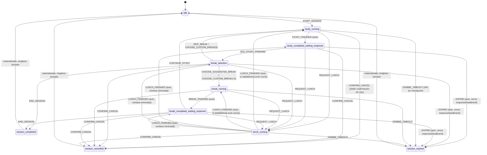

# 03 — Cronómetro de estudio y temporizador inverso: máquina de estados y reglas

## Propósito

Este documento fija, de forma completa e implementable sin preguntas adicionales, la máquina de estados del cronómetro de estudio (los 10 `TimerStateName` as-built) y la del temporizador inverso: todos los eventos, guardas, side effects (incluido qué checkpoint escribe cada transición sobre `ActiveStudySession`/`ActiveInverseSession`), y destinos. Fija también las reglas de negocio que la máquina ejecuta: ventana de respuesta por tamaño de tramo, banco de descanso (con la fórmula única que evita el doble conteo), almuerzo, doble confirmación de cancelación, expiración y sesión zombie, el motor de conteo por timestamps (sin depender de `setInterval` como fuente de verdad) y las notificaciones locales programadas/canceladas por transición. Es **el documento que la sesión `BC Orquestador Productvt` está esperando** para retomar su Fase 4 (núcleo del cronómetro): prioriza completitud e implementabilidad sobre cualquier otra consideración. No redefine tipos ni campos — esos son de `02-DOMINIO.md` (§1–§8), que se cita por sección — sino el comportamiento: qué evento dispara qué transición, con qué guarda y qué escritura.

Quedan fuera de este documento (van en otros): el protocolo de cambio de dominante/espectador y el cálculo de `clockOffset` entre dispositivos (`05-ARQUITECTURA.md`), la viabilidad de alarmas en background y las limitaciones de la versión web (`05-ARQUITECTURA.md`, REV-ALTA-5/REV-ALTA-6), y los agregadores de estadísticas/metas que consumen `effectiveStudySeconds` (`07-CALENDARIO-Y-ESTADISTICAS.md`, `08-METAS.md`).

## Fuentes

Orden de autoridad (si dos fuentes chocan, gana la de arriba; ver también la tabla de Trazabilidad al final):

1. Respuestas literales del creador — anexo de `_brief-orquestador.md` (etiquetas `R1..R24`) y pregunta 25 de `03-requisitos/preguntas-para-el-creador.md` (etiqueta `PREGUNTA-25`, aún sin respuesta directa).
2. `03-requisitos/decisiones-tomadas.md` v2 (etiquetas `D <punto>`).
3. `_brief-orquestador.md` revisado 2026-09-06 (etiquetas `B §n`).
4. Código commiteado en `productvt-beta/src/domain/**` (etiqueta `CODE`): verdad para identificadores; este documento no propone renombres.
5. `03-requisitos/revision-spec-beta.md` (etiquetas `REV-ALTA-n`, `REV-MEDIA-<fila>`): resuelve aquí los hallazgos ALTO y MEDIO de máquina de estados y reglas de negocio (REV-ALTA-1, REV-ALTA-4, REV-MEDIA-5, REV-MEDIA-9, REV-MEDIA-10, REV-MEDIA-17, REV-MEDIA-18, REV-MEDIA-19 — ver §14). Los de viabilidad técnica (REV-ALTA-5, REV-ALTA-6) y los de modelo de datos ya resueltos (REV-MEDIA-1/2/3/4/6/7/8/13) no se repiten.
6. `01-mockups/mobile/cronometro.html` (mockup del cronómetro): fuente del flujo de pantalla (`setup → running → waiting → breakSelect → breakDone/inversoDone/cancelled/expired`) y de los tokens de diseño; su lógica de ventanas/almuerzo es una prueba de concepto simplificada y no vincula donde la superan fuentes de mayor autoridad (p. ej. no modela "personalizado", "saltar" ni "Terminar sesión" como acciones separadas, ni el reinicio de ventana tras almuerzo).
7. `docs/02-DOMINIO.md` (canon ya escrito, mismo nivel de autoridad que el código porque es su copia literal + adiciones ya cerradas): fuente de todas las interfaces, invariantes (`I-1`..`I-20`) y constantes citadas aquí (`LUNCH_DURATION_SECONDS`, `LUNCH_COOLDOWN_CYCLES`, `ZOMBIE_TIMEOUT_SECONDS`, `INVERSE_REMINDER_INTERVAL_SECONDS`, `INVERSE_HARD_CAP_FACTOR`, `resolveCancelledSessionEffectiveSeconds`, `materializeStudySession`, etc.). Este documento no las redefine, solo las usa.
8. Originales v1 (`docs/originales/SPEC-v1.md` §15–§21, `docs/originales/ARCHITECTURE-v1.md` §11–§14): punto de partida, no fuente de verdad. `paused_transient` y los eventos sugeridos en ARCHITECTURE §11.2 quedan descartados/adaptados donde este documento define su propia versión final.

## 1. Visión general de la máquina de estados

Los 10 estados son los as-built (`src/domain/enums/timer-state.ts`, `TimerStateName`, CODE; copiados en `02-DOMINIO.md` §3.1): `idle`, `study_running`, `study_completed_waiting_response`, `break_selection`, `break_running`, `break_completed_waiting_response`, `lunch_running`, `session_completed`, `session_cancelled`, `session_expired`. `paused_transient` (SPEC v1 §15.1) queda fuera del contrato público — ya lo confirma `02-DOMINIO.md` §3.1 — porque el almuerzo (§7) cubre exactamente el caso de "pausar sin matar el bloque" mediante `lunch_running` + `pausedSegment`, sin necesitar un estado transitorio adicional.

Todo estado no terminal (los 7 primeros) es un **estado activo**: existe `users/{uid}/active/session` con `type: 'study'` mientras dure. Los tres terminales (`session_completed`, `session_cancelled`, `session_expired`) nunca se escriben en el singleton — son el resultado conceptual de una transición que en el mismo batch materializa `StudySession` en `sessions/` y borra el singleton (`02-DOMINIO.md` §2.5, §3.4 regla 5). Por eso no aparecen como valor de `currentState` en ningún documento leído de Firestore (invariante I-13): se modelan aquí para razonar sobre la máquina, pero su "llegada" es instantánea con el cierre.

Tres familias de estados activos, por cómo se mide su tiempo (motor, §10):

| Familia | Estados | `responseDeadlineAt` | Puede pausarse por almuerzo |
|---|---|---|---|
| **Corriendo** (cuenta hacia atrás desde un target fijo; puede reanudarse con tiempo restante) | `study_running`, `break_running` | ausente | Sí — guarda `pausedSegment` |
| **Corriendo sin reanudación** (siempre corre el total fijo, 45 min) | `lunch_running` | ausente | No aplica (es la propia pausa) |
| **Esperando respuesta** (tiene un plazo obligatorio; vencerlo expira la sesión) | `study_completed_waiting_response`, `break_selection`, `break_completed_waiting_response` | presente, `= segmentStartedAt + segmentTargetSeconds` | Sí — al volver, la ventana se reinicia completa (§7.3) |



El diagrama omite, por legibilidad, las flechas `ZOMBIE_TIMEOUT` desde los tres estados de espera (también aplica ahí, ver §9.2) y el detalle de que `REQUEST_CANCEL`/`DISMISS_CANCEL` no cambian `currentState` (abren y cierran un panel local; solo `CONFIRM_CANCEL` tras completar la doble espera transiciona — §8). La tabla completa de §4 es la autoridad; el diagrama es una ayuda de lectura.

## 2. Eventos del dominio

Adición propuesta (ningún archivo as-built define hoy este tipo; `02-DOMINIO.md` §3.6 delega la firma de la máquina a este documento). Vive en `src/domain/machines/study-timer-events.ts`. Ningún nombre introduce `Block`/`block` (regla brief §1): los eventos usan el vocabulario de estado ya as-built (`study`, `break`, `lunch`, `cycle` solo donde el código ya lo usa).

```ts
// src/domain/machines/study-timer-events.ts — ADICIÓN (Fase 4: cronómetro)
export type StudyTimerEvent =
  | { type: 'START_SESSION'; payload: StartSessionPayload }
  | { type: 'STUDY_FINISHED' }                                   // auto (motor): remaining <= 0 en study_running
  | { type: 'ACK_STUDY_FINISHED' }                                // usuario: study_completed_waiting_response -> break_selection
  | { type: 'CHOOSE_SUGGESTED_BREAK' }                            // usuario, en break_selection
  | { type: 'CHOOSE_CUSTOM_BREAK'; payload: { chosenSeconds: number } } // usuario, en break_selection
  | { type: 'SKIP_BREAK' }                                        // usuario, en break_selection
  | { type: 'BREAK_FINISHED' }                                    // auto (motor): remaining <= 0 en break_running
  | { type: 'CONTINUE_STUDY' }                                    // usuario: break_completed_waiting_response -> study_running
  | { type: 'END_SESSION' }                                       // usuario, en break_selection o break_completed_waiting_response
  | { type: 'REQUEST_LUNCH' }                                     // usuario, desde cualquier estado activo salvo lunch_running
  | { type: 'LUNCH_FINISHED' }                                    // auto (motor): remaining <= 0 en lunch_running
  | { type: 'REQUEST_CANCEL' }                                    // usuario: abre el panel (no cambia currentState)
  | { type: 'CONFIRM_CANCEL' }                                    // usuario: solo válido tras completar la doble espera (§8)
  | { type: 'DISMISS_CANCEL' }                                    // usuario: cierra el panel sin cancelar (no cambia currentState)
  | { type: 'EXPIRE' }                                            // auto (motor o cualquier lector): responseDeadlineAt vencido
  | { type: 'ZOMBIE_TIMEOUT' }                                    // auto (cualquier lector): now - lastCheckpointAt > 24h
  | { type: 'HYDRATE'; payload: { active: ActiveStudySession } }; // recuperación tras cierre inesperado del dominante

export interface StartSessionPayload {
  name: string;
  categoryId: string;
  presetId: string;               // se congela como presetSnapshot vía buildPresetSnapshot
  deviceInfo: SessionDeviceInfo;  // deviceInfo.platform debe ser 'android' (canBeDominant), ver 02-DOMINIO.md §3.5
}
```

Notas de diseño:

- **`STUDY_FINISHED`, `BREAK_FINISHED`, `LUNCH_FINISHED`, `EXPIRE`, `ZOMBIE_TIMEOUT` son eventos "auto"**: los dispara el motor (§10) al detectar por timestamp que un plazo llegó a cero, no una acción de usuario. `EXPIRE` y `ZOMBIE_TIMEOUT` pueden dispararlos tanto el dispositivo dominante (tick en vivo) como cualquier dispositivo que simplemente lea el singleton y note que el plazo ya pasó (§9.2, §9.3): esto evita que una sesión quede colgada si el dominante se cerró exactamente durante la ventana.
- **No existe un evento `START_NEXT_CYCLE` distinto de `CONTINUE_STUDY`**: iniciar el primer bloque de la sesión (`START_SESSION`) y empezar el siguiente bloque tras un descanso (`CONTINUE_STUDY`) son eventos distintos porque el primero crea el singleton (transacción `create`) y el segundo solo actualiza uno existente (`update`); ambos aterrizan en `study_running` con la misma forma de side effects de "arrancar un bloque" (§4, filas T1 y T11).
- **`CHOOSE_CUSTOM_BREAK` con `chosenSeconds: 0` y `SKIP_BREAK` son eventos distintos que pueden producir el mismo `BreakSegment`** (`breakType: 'skipped'`, `usedSeconds: 0`): la diferencia es que el primero además registra un `CustomBreakSelection` (el usuario abrió el selector y eligió 0) y el segundo no (tocó la ficha "Saltar" directamente) — `02-DOMINIO.md` §1.2, fila "Elección personalizada".
- **No hay evento para "tomar descanso corto" y otro para "tomar descanso largo"**: es un solo evento, `CHOOSE_SUGGESTED_BREAK`, porque el preset ya decide de forma determinística cuál de los dos (o ambos combinados) corresponde según `cycleNumber % cyclesBeforeLongBreak` (§5, §6.1) — no son dos chips independientes con su propio cooldown (a diferencia del mockup de frontend, superado aquí por `02-DOMINIO.md` y la regla operativa de banco de `decisiones-tomadas.md`).
- El temporizador inverso **no reutiliza este tipo**: tiene su propio conjunto de eventos, mucho más simple, en §12.

## 3. Ventana de respuesta por tamaño del tramo

Resuelve **REV-MEDIA-5** (§19.3 de la revisión: no se decía qué ventana aplica a `study_completed_waiting_response` ni a qué estado real se aplica la "ventana genérica de 10 min"). Regla: cada uno de los tres estados de espera (`study_completed_waiting_response`, `break_selection`, `break_completed_waiting_response`) tiene una ventana propia, calculada por una única función determinística a partir del **tramo que acaba de terminar** — nunca por el tipo de estado (R3, D3, B §3.1).

### 3.1 Fórmula

```ts
// src/domain/rules/response-window.ts — ADICIÓN (Fase 4: cronómetro)
export const SHORT_RESPONSE_WINDOW_SECONDS = 30;
export const LONG_RESPONSE_WINDOW_SECONDS = 600;            // 10 min
export const LARGE_SEGMENT_THRESHOLD_SECONDS = 1800;         // 30 min — supuesto brief §10.1, pendiente (ver "Supuestos")

/** Ventana para study_completed_waiting_response, y la que hereda break_selection al entrar (§3.2). */
export function resolveStudyResponseWindowSeconds(input: {
  durationSeconds: number;        // StudySegment.durationSeconds del bloque que terminó
  cycleNumber: number;            // StudySegment.cycleNumber de ese bloque
  cyclesBeforeLongBreak: number;  // presetSnapshot.cyclesBeforeLongBreak
}): number {
  const givesWayToLongBreak = input.cycleNumber % input.cyclesBeforeLongBreak === 0;
  const isLarge = input.durationSeconds > LARGE_SEGMENT_THRESHOLD_SECONDS;
  return isLarge || givesWayToLongBreak ? LONG_RESPONSE_WINDOW_SECONDS : SHORT_RESPONSE_WINDOW_SECONDS;
}

/** Ventana para break_completed_waiting_response. */
export function resolveBreakResponseWindowSeconds(input: {
  breakType: BreakSegmentType;    // el que resultó de resolveBreakType (§6.2) para el descanso que terminó
  usedSeconds: number;            // BreakSegment.usedSeconds del descanso que terminó
}): number {
  const isLong = input.breakType === 'long' || input.usedSeconds > LARGE_SEGMENT_THRESHOLD_SECONDS;
  return isLong ? LONG_RESPONSE_WINDOW_SECONDS : SHORT_RESPONSE_WINDOW_SECONDS;
}
```

`resolveStudyResponseWindowSeconds` combina dos criterios porque las dos fuentes de mayor autoridad usan formulaciones distintas para el mismo caso y ninguna contradice a la otra en la práctica — se unen, no se elige una:

- **R3/D3 (creador, mayor autoridad)**: "las de 30 segundos son a bloques pequeños, la de 10 minutos para aquellos bloques de mayor tamaño **o los descansos largos**" — criterio de tamaño. `decisiones-tomadas.md` punto 3 lo precisa además con un criterio de **posición**: "específicamente el ciclo que da paso al descanso largo" (`cycleNumber % cyclesBeforeLongBreak === 0`), válido incluso cuando ese ciclo dura lo mismo que cualquier otro (25 min en el preset Estándar, que nunca supera el umbral de tamaño por sí solo).
- **B §3.1 (orquestador)**: generaliza a un umbral de tamaño (`> 30 min`) para que presets con bloques grandes por diseño (no atados a la cadencia de descanso largo) también reciban la ventana de 10 min. Queda marcado como supuesto pendiente de confirmar (§10.1 del brief) precisamente el valor del umbral, no la existencia de un criterio de tamaño.

La función aplica ambos con `||`: 10 minutos si el bloque **es grande por tamaño** (`> 1800 s`) **o** si **agota la cadencia hacia el descanso largo**, cualquiera que sea su duración. En el preset Estándar (25 min, `cyclesBeforeLongBreak: 4`) esto da: bloques 1–3 → 30 s; bloque 4 → 10 min (por posición, no por tamaño). En un preset custom de 90 min sin relación con la cadencia, cualquier bloque → 10 min (por tamaño).

### 3.2 A qué estado se aplica cada ventana

| Estado de espera | Tramo relevante | Windows function | Nota |
|---|---|---|---|
| `study_completed_waiting_response` | El `StudySegment` que se acaba de registrar (T2, §4) | `resolveStudyResponseWindowSeconds` | — |
| `break_selection` | El **mismo** `StudySegment` de arriba (no un tramo nuevo) | `resolveStudyResponseWindowSeconds` (mismo resultado, recalculado) | Confirma B §3.1: "el panel de selección de descanso que sigue a ese bloque también usa 10 min". Es una ventana **propia y completa** al entrar (T3, §4) — no continúa la cuenta de `study_completed_waiting_response`; ver nota de diseño abajo. |
| `break_completed_waiting_response` | El `BreakSegment` que se acaba de registrar (T10, §4), ya clasificado por `resolveBreakType` (§6.2) | `resolveBreakResponseWindowSeconds` | Un descanso `custom` de más de 30 min (p. ej. tomar 40 min del banco) también recibe 10 min, aunque `breakType !== 'long'` — es el criterio de tamaño el que decide, no la etiqueta. |

**Nota de diseño — por qué son ventanas independientes y no una sola cuenta que continúa**: `study_completed_waiting_response` y `break_selection` son dos estados formales distintos (as-built, `TimerStateName`) con responsabilidades distintas — el primero es un acuse simple ("¿seguís? abrí el selector de descanso"), el segundo es la decisión real entre 5 salidas (§5). Modelarlos como una sola ventana que se reparte entre ambos complicaría la UI sin ganar nada; en cambio, cada uno abre su **propia ventana completa** de la misma duración calculada arriba. Esto es consistente con cómo el almuerzo reinicia ventanas completas al volver a un estado de espera (§7.3) y evita cualquier ambigüedad de "cuánto le queda" al cruzar de un estado al otro.

### 3.3 Ninguna "ventana genérica de 10 minutos" flotante

REV-MEDIA-5 señalaba que SPEC v1 §19.3 mencionaba una ventana de 10 min "para cualquier otra espera operativa prolongada" sin decir a qué estado real se aplicaba. Ese caso no existe en esta máquina: **solo hay tres estados con `responseDeadlineAt`** (tabla de §3.2) y **ambas duraciones posibles (30 s o 600 s) siempre se derivan de una de las dos funciones de arriba**, nunca de un valor flotante o de un timeout genérico de la UI. Cualquier otra espera (p. ej. el usuario mirando la pantalla de `break_running` sin tocar nada) no es un estado de espera de respuesta — es un estado "corriendo" (§1) sin deadline, que solo termina cuando el tiempo objetivo se agota por sí mismo.

## 4. Tabla completa de transiciones

Autoridad única de la máquina de estados: toda transición que la implementación ejecute debe corresponder a exactamente una fila de esta sección. `now` es el instante corregido con `clockOffset` (§10.2); "checkpoint" significa `update()` del singleton `active/session` con `lastCheckpointAt: serverTimestamp()` salvo que se indique lo contrario (`02-DOMINIO.md` §3.4 reglas 1–6). Los campos no mencionados en una fila no cambian. `presetSnapshot`, `userId`, `sessionId`, `dominantDeviceId`, `deviceInfo`, `startedAt` nunca cambian tras `START_SESSION` y se omiten de las filas.

### 4.1 Núcleo: bloques y descansos

| # | Origen | Evento | Guarda | Acciones y checkpoint | Destino |
|---|---|---|---|---|---|
| T1 | `idle` | `START_SESSION` | No existe `active/session` para el usuario (I-11); `canBeDominant(deviceInfo.platform)` (solo `'android'` en V1); no existe un `ActiveInverseSession` activo (exclusión mutua, §12.4) | Transacción `create`: `presetSnapshot = buildPresetSnapshot(preset)`; `categoryId`, `name`; `cyclesCompleted: 0`, `cyclesSinceLunch: 0`, `lunchUsed: false`, `effectiveStudySeconds: 0`, `bankRemainingSeconds: 0`, `studySegments/breakSegments/lunchSegments/customBreakSelections: []`; `currentState: 'study_running'`; `segmentStartedAt: now`, `segmentTargetSeconds: presetSnapshot.studyDurationMinutes*60`; sin `responseDeadlineAt`. Notif: programa "bloque terminado" (§11). | `study_running` |
| T2 | `study_running` | `STUDY_FINISHED` (auto) | `now ≥ segmentStartedAt + segmentTargetSeconds` (o, si venía de un almuerzo, `now ≥ segmentResumedAt + segmentRemainingAtResumeSeconds`) | Anexa `StudySegment{start: segmentStartedAt, end: now, durationSeconds: segmentTargetSeconds, cycleNumber: cyclesCompleted+1}`; `cyclesCompleted++`, `cyclesSinceLunch++`; `effectiveStudySeconds += durationSeconds`; `windowSeconds = resolveStudyResponseWindowSeconds({durationSeconds, cycleNumber: cyclesCompleted, cyclesBeforeLongBreak: presetSnapshot.cyclesBeforeLongBreak})` (§3); `currentState: 'study_completed_waiting_response'`; `segmentStartedAt: now`, `segmentTargetSeconds: windowSeconds`, `responseDeadlineAt: now + windowSeconds`; limpia `segmentResumedAt`/`segmentRemainingAtResumeSeconds` si venían de un almuerzo. Notif: cancela "bloque terminado" pendiente, dispara sonido/alerta inmediata, programa expiración a `responseDeadlineAt` (§11). | `study_completed_waiting_response` |
| T3 | `study_completed_waiting_response` | `ACK_STUDY_FINISHED` | `now < responseDeadlineAt` | `windowSeconds = resolveStudyResponseWindowSeconds(...)` recalculado con los mismos datos del bloque que ya terminó (mismo resultado que T2, §3.2); `currentState: 'break_selection'`; `segmentStartedAt: now` (ventana propia y completa, no hereda remanente — §3.2), `segmentTargetSeconds: windowSeconds`, `responseDeadlineAt: now + windowSeconds`. Notif: cancela expiración de T2, programa nueva a este `responseDeadlineAt`. | `break_selection` |
| T4 | `break_selection` | `CHOOSE_SUGGESTED_BREAK` | `now < responseDeadlineAt`; `grantedSeconds = computeGrantedBreakSeconds(cyclesCompleted, presetSnapshot)` (§6.1) | Si `grantedSeconds > 0`: `currentState: 'break_running'`; `segmentStartedAt: now`, `segmentTargetSeconds: grantedSeconds`; limpia `responseDeadlineAt`. No se anexa `BreakSegment` todavía (se registra al terminar, T10, con toda la info ya determinística). Notif: programa "descanso terminado" a `now + grantedSeconds`. Si `grantedSeconds === 0` (preset con `shortBreakMinutes: 0` fuera de ciclo de descanso largo): mismo resultado que `SKIP_BREAK` (fila T8) — no existe un `break_running` de 0 segundos. | `break_running` (o `study_running` si `grantedSeconds = 0`) |
| T5 | `break_selection` | `CHOOSE_CUSTOM_BREAK{chosenSeconds}` | `now < responseDeadlineAt`; `availableSeconds = computeAvailableBreakSeconds(bankRemainingSeconds, grantedSeconds)` (§6.1); `validateCustomBreakChoice(chosenSeconds, availableSeconds)` (entero, `0 ≤ chosenSeconds ≤ availableSeconds`) | Anexa `CustomBreakSelection{cycleNumber: cyclesCompleted, availableSeconds, chosenSeconds, selectedAt: now}` (siempre, incluso si `chosenSeconds = 0`). Si `chosenSeconds > 0`: `currentState: 'break_running'`; `segmentStartedAt: now`, `segmentTargetSeconds: chosenSeconds`; limpia `responseDeadlineAt`. Notif: programa "descanso terminado" a `now + chosenSeconds`. Si `chosenSeconds === 0`: mismos efectos que T8 (anexa `BreakSegment` `skipped` de inmediato) además del `CustomBreakSelection`. | `break_running` (o `study_running` si `chosenSeconds = 0`) |
| T6 | `break_selection` | `SKIP_BREAK` | `now < responseDeadlineAt` | `seg = buildBreakSegment({cycleNumber: cyclesCompleted, presetSnapshot, usedSeconds: 0, start: now, end: now})` (§6.2, resuelve a `breakType: 'skipped'`); anexa `seg` a `breakSegments[]`; `bankRemainingSeconds += seg.bankDeltaSeconds` (= `+grantedSeconds`); `currentState: 'study_running'`; `segmentStartedAt: now`, `segmentTargetSeconds: presetSnapshot.studyDurationMinutes*60`; limpia `responseDeadlineAt`. Notif: cancela expiración de T3, programa "bloque terminado" para el próximo ciclo. | `study_running` |
| T7 | `break_selection` | `END_SESSION` | `now < responseDeadlineAt` | `closure = {terminalState: 'session_completed', completionReason: 'ended_by_user', endedAt: now}`; `materializeStudySession(active, closure)` (`02-DOMINIO.md` §3.6); batch `set(sessions/{sessionId})` + `delete(active/session)`. Notif: cancela toda notificación pendiente de esta sesión. | `session_completed` |
| T8 | `break_running` | `BREAK_FINISHED` (auto) | `now ≥ segmentStartedAt + segmentTargetSeconds` | `seg = buildBreakSegment({cycleNumber: cyclesCompleted, presetSnapshot, usedSeconds: segmentTargetSeconds, start: segmentStartedAt, end: now})` (§6.2); anexa `seg`; `bankRemainingSeconds += seg.bankDeltaSeconds`; `windowSeconds = resolveBreakResponseWindowSeconds({breakType: seg.breakType, usedSeconds: seg.usedSeconds})` (§3); `currentState: 'break_completed_waiting_response'`; `segmentStartedAt: now`, `segmentTargetSeconds: windowSeconds`, `responseDeadlineAt: now + windowSeconds`. Notif: cancela "descanso terminado" pendiente, dispara sonido "toca estudiar", programa expiración. | `break_completed_waiting_response` |
| T9 | `break_completed_waiting_response` | `CONTINUE_STUDY` | `now < responseDeadlineAt` | `currentState: 'study_running'`; `segmentStartedAt: now`, `segmentTargetSeconds: presetSnapshot.studyDurationMinutes*60`; limpia `responseDeadlineAt`. Notif: cancela expiración de T8, programa "bloque terminado". | `study_running` |
| T10 | `break_completed_waiting_response` | `END_SESSION` | `now < responseDeadlineAt` | Igual que T7 (`materializeStudySession`, `completionReason: 'ended_by_user'`, batch de cierre). | `session_completed` |

### 4.2 Almuerzo

| # | Origen | Evento | Guarda | Acciones y checkpoint | Destino |
|---|---|---|---|---|---|
| T11 | `study_running` o `break_running` | `REQUEST_LUNCH` | `isLunchAvailable(cyclesSinceLunch, lunchUsed)` (§7.1); no hay `lunch_running` ya en curso (implícito: es el `currentState`) | `remainingSeconds = segmentResumedAt ? segmentRemainingAtResumeSeconds - (now - segmentResumedAt) : segmentTargetSeconds - (now - segmentStartedAt)` (§10.1); `pausedSegment: {startedAt: segmentStartedAt, targetSeconds: segmentTargetSeconds, remainingSeconds}`; `stateBeforeLunch: currentState` (el que tenía antes); `currentState: 'lunch_running'`; `segmentStartedAt: now`, `segmentTargetSeconds: LUNCH_DURATION_SECONDS` (2700); `lunchUsed: true`, `cyclesSinceLunch: 0`. Notif: cancela la notificación del tramo pausado, programa "almuerzo terminado" a `now + 2700`. | `lunch_running` |
| T12 | `study_completed_waiting_response`, `break_selection` o `break_completed_waiting_response` | `REQUEST_LUNCH` | `isLunchAvailable(...)`; `now < responseDeadlineAt` (pedir almuerzo es una respuesta válida dentro de la ventana) | `stateBeforeLunch: currentState`; sin `pausedSegment` (no hay tramo corriendo que pausar — es un estado de espera); `currentState: 'lunch_running'`; `segmentStartedAt: now`, `segmentTargetSeconds: 2700`; limpia `responseDeadlineAt`; `lunchUsed: true`, `cyclesSinceLunch: 0`. Notif: cancela la expiración pendiente del estado de espera, programa "almuerzo terminado". | `lunch_running` |
| T13 | `lunch_running` | `LUNCH_FINISHED` (auto) | `now ≥ segmentStartedAt + 2700` | Anexa `LunchSegment{start: segmentStartedAt, end: now, durationSeconds: 2700, cycleNumberAtStart: cyclesCompleted, returnState: stateBeforeLunch}`; `currentState: stateBeforeLunch`; limpia `stateBeforeLunch`. Si `stateBeforeLunch ∈ {study_running, break_running}`: `segmentResumedAt: now`, `segmentRemainingAtResumeSeconds: pausedSegment.remainingSeconds` (mantiene `segmentStartedAt`/`segmentTargetSeconds` originales para historial); limpia `pausedSegment`. Si `stateBeforeLunch` es un estado de espera: `windowSeconds` recalculado igual que cuando se entró a ese estado (§3.2, mismo tramo de referencia, sin cambios porque el almuerzo no altera el bloque/descanso ya cerrado); `segmentStartedAt: now`, `segmentTargetSeconds: windowSeconds`, `responseDeadlineAt: now + windowSeconds` (ventana reiniciada completa — §7.3). Notif: cancela "almuerzo terminado", reprograma la notificación del estado destino (bloque/descanso corriendo, o expiración de la ventana reiniciada). | `stateBeforeLunch` (uno de los 5 estados activos no-almuerzo) |

### 4.3 Cancelación

| # | Origen | Evento | Guarda | Acciones y checkpoint | Destino |
|---|---|---|---|---|---|
| T14 | Cualquier estado activo (los 6 no-terminales, incluido `lunch_running`) | `REQUEST_CANCEL` | Ninguna | Abre el panel de cancelación en la UI local; arranca el primer conteo de `CANCEL_CONFIRM_WINDOW_SECONDS` (15 s, §8.1). **No** escribe `currentState` ni ningún campo del singleton: no hay checkpoint. La ventana de respuesta del estado de origen (si la hay) **sigue corriendo** en paralelo (D §3.4, brief §3.4). | Mismo estado (panel abierto, solo UI local) |
| T15 | Panel de cancelación abierto | `DISMISS_CANCEL` | Ninguna | Cierra el panel; descarta el progreso del conteo de 15/15 s. Sin checkpoint. | Mismo estado (panel cerrado) |
| T16 | Panel de cancelación abierto, en cualquier estado activo | `CONFIRM_CANCEL` | Se completó la doble espera de 15+15 s (§8.1) **y**, si el estado de origen tenía `responseDeadlineAt`, `now < responseDeadlineAt` en el instante de esta segunda confirmación (si venció antes, ganó `EXPIRE`, fila T18 — §8.2) | `effectiveStudySeconds' = resolveCancelledSessionEffectiveSeconds(studySegments) = sumEffectiveStudySeconds(studySegments)` (`02-DOMINIO.md` §3.6, D1.b/R25 — conserva los bloques previos, igual que T17/T18); `closure = {terminalState: 'session_cancelled', completionReason: 'cancelled_by_user', endedAt: now}`; `materializeStudySession` con ese `effectiveStudySeconds'`; batch `set(sessions/{sessionId})` + `delete(active/session)`. Notif: cancela toda notificación pendiente de la sesión. | `session_cancelled` |

### 4.4 Expiración, zombie y cierre

| # | Origen | Evento | Guarda | Acciones y checkpoint | Destino |
|---|---|---|---|---|---|
| T17 | `study_completed_waiting_response`, `break_selection` o `break_completed_waiting_response` | `EXPIRE` (auto, motor o cualquier lector) | `now ≥ responseDeadlineAt` | `closure = {terminalState: 'session_expired', completionReason: 'expired_no_response', endedAt: responseDeadlineAt}` (el cierre se fecha al vencimiento exacto, no a cuándo un cliente lo detectó); `materializeStudySession` — `effectiveStudySeconds` es la suma de `studySegments[]` ya persistidos (el bloque/descanso/decisión en curso en ese estado de espera **no** llega a registrarse, I-9); batch de cierre. Notif: cancela toda notificación pendiente. | `session_expired` |
| T18 | Cualquier estado activo | `ZOMBIE_TIMEOUT` (auto, cualquier lector) | `now − lastCheckpointAt > ZOMBIE_TIMEOUT_SECONDS` (24 h) | `closure = {terminalState: 'session_expired', completionReason: 'zombie_timeout_24h', endedAt: lastCheckpointAt}`; `materializeStudySession` — mismo tratamiento de `effectiveStudySeconds` que T17 (bloques previos completados intactos, el tramo en curso al momento del último checkpoint se pierde); batch de cierre. No requiere ser dominante (`02-DOMINIO.md` §3.4 regla 6, I-20). | `session_expired` |
| T19 | `session_completed`, `session_cancelled`, `session_expired` | (trivial, sin evento explícito) | El batch de cierre de T7/T10/T16/T17/T18 ya ejecutó `delete(active/session)` | Limpieza puramente local: el store del dispositivo dominante vacía `machineState`/`activeSession`, se limpia `productvt.activeSessionCache`. Ningún cliente vuelve a ver `currentState` en un estado terminal (I-13): al no existir ya el singleton, el siguiente `onSnapshot` de cualquier dispositivo entrega "no hay sesión activa". | `idle` |

Nota sobre `T4`/`T5` (fusionadas en la tabla como una sola fila con rama de guarda): se presentan combinadas porque comparten el mismo evento (`CHOOSE_SUGGESTED_BREAK`/`CHOOSE_CUSTOM_BREAK`) y la única diferencia es el valor de `grantedSeconds`/`chosenSeconds`; separarlas en más filas no añade información nueva a la tabla, pero **sí** están separadas como casos de prueba en §13.

## 5. Selección de descanso: las cinco salidas de `break_selection`

Resuelve **REV-MEDIA-9** (§15.3/§17.3 de la revisión: "`break_selection` solo tiene 2 transiciones definidas pero el panel ofrece 4 acciones"). El panel expone exactamente **cinco** acciones — no cuatro, porque además de las de SPEC v1 §17.3 (tomar sugerido, saltar, personalizado, almuerzo) se agrega "Terminar sesión" (brief §2, D1) — y cada una corresponde a una fila ya fijada en la tabla de §4:

| Acción visible en el panel | Evento (§2) | Fila de §4 | Disponible cuando |
|---|---|---|---|
| "Tomar descanso" (muestra el total ganado, p. ej. "Descansar 5 min" o "Descansar 40 min" en un ciclo de descanso largo) | `CHOOSE_SUGGESTED_BREAK` | T4 | `grantedSeconds = computeGrantedBreakSeconds(cyclesCompleted, presetSnapshot) > 0` (si el preset tiene `shortBreakMinutes: 0` y no es ciclo de descanso largo, el chip no se muestra — no hay nada que sugerir) |
| "Personalizado" (abre el selector de minutos enteros) | `CHOOSE_CUSTOM_BREAK{chosenSeconds}` | T5 | Siempre disponible; el selector limita la entrada a `[0, availableSeconds]` (§6.1) |
| "Saltar" | `SKIP_BREAK` | T6 | Siempre disponible |
| "Almuerzo" | `REQUEST_LUNCH` | T12 (§4.2) | `isLunchAvailable(cyclesSinceLunch, lunchUsed)` (§7.1) |
| "Terminar sesión" | `END_SESSION` | T7 | Siempre disponible; también existe en `break_completed_waiting_response` (T10) — es la única acción de cierre normal fuera de un bloque en curso (R1, D1: "no existe finalizar ahora conservando lo estudiado" a mitad de bloque) |

Notas de UX que se derivan directamente de la tabla de §4 y no admiten otra lectura:

- **"Tomar descanso" nunca pide confirmación adicional**: al tocarlo se ejecuta T4 de inmediato y arranca `break_running`. No hay un paso intermedio de "¿corto o largo?" — el preset ya decidió el monto total (§6.1); si el ciclo da paso a un descanso largo, el chip único ya incluye corto+largo combinados (`grantedSeconds`, ejemplo E4 de §6.3).
- **"Personalizado" es la única acción que dispara `CustomBreakSelection`** (T5), incluso si el usuario termina eligiendo exactamente el monto sugerido o exactamente 0 — la distinción "decisión vs. ejecución" ya está fijada en `02-DOMINIO.md` §1.2 (fila "Elección personalizada") y no se redefine aquí.
- **"Saltar" y "Personalizado con 0"** producen el mismo `BreakSegment` (`breakType: 'skipped'`, T6/T5-rama-0) pero solo el segundo dispara `CustomBreakSelection` — ver nota de diseño de §2.
- **La disponibilidad de "Tomar descanso" y "Almuerzo" es la única lógica de habilitado/deshabilitado del panel**: "Personalizado", "Saltar" y "Terminar sesión" están siempre disponibles mientras `now < responseDeadlineAt`. Esto es más simple que el mockup de frontend (que deshabilitaba "Corto" y "Largo" por separado según cadencias independientes, `shortBreakCadence`/`longBreakCadence` que no existen en el `Preset` as-built — CODE, §6.1) y reemplaza esa lógica.
- **`break_completed_waiting_response` no es un panel de selección**: solo ofrece "Empezar bloque" (`CONTINUE_STUDY`, T9) y "Terminar sesión" (`END_SESSION`, T10) — dos acciones, no cinco. No confundir con `break_selection`.

## 6. Banco de descanso: fórmulas y ejemplos numéricos

Resuelve **REV-ALTA-4** (doble conteo entre SPEC v1 §17.5/§17.6: el descanso ganado parecía sumarse al banco dos veces — al ganarlo y otra vez al no usarlo por completo) y **REV-MEDIA-10** (§17.6/§17.7: sin fórmula general para sumar banco previo + descanso largo, ni `breakType` definido para un descanso largo tomado parcialmente). Regla operativa única (D "Aclaraciones técnicas adicionales", B §3.2): el descanso ganado se sabe una sola vez por bloque completado; el banco solo registra la **diferencia** entre lo ganado y lo usado, nunca "lo ganado" y luego "lo no usado" por separado.

### 6.1 Fórmulas

```ts
// src/domain/rules/break-bank.ts — ADICIÓN (Fase 4: cronómetro)

/** Descanso que otorga completar el bloque `cycleNumber`: corto siempre, + largo si agota la cadencia. */
export function computeGrantedBreakSeconds(cycleNumber: number, presetSnapshot: PresetSnapshot): number {
  const short = presetSnapshot.shortBreakMinutes * 60;
  const givesWayToLongBreak = cycleNumber % presetSnapshot.cyclesBeforeLongBreak === 0;
  const long = givesWayToLongBreak ? presetSnapshot.longBreakMinutes * 60 : 0;
  return short + long;
}

/** disponible = banco previo + lo recién ganado. Nunca se sustituye "lo ganado" por otra cosa. */
export function computeAvailableBreakSeconds(bankRemainingSecondsBefore: number, grantedSeconds: number): number {
  return bankRemainingSecondsBefore + grantedSeconds;
}

export function validateCustomBreakChoice(chosenSeconds: number, availableSeconds: number): boolean {
  return Number.isInteger(chosenSeconds) && chosenSeconds >= 0 && chosenSeconds <= availableSeconds;
}
```

Invariante rectora (= I-4 de `02-DOMINIO.md`): `bankDeltaSeconds = grantedSeconds − usedSeconds`; `bankRemainingSeconds` es la suma acumulada de todos los `bankDeltaSeconds` de la sesión; nunca se le suma `grantedSeconds` de forma independiente. `bankDeltaSeconds` puede ser **negativo** (el usuario gasta más de lo recién ganado, consumiendo banco acumulado — ejemplo E6 de §6.3) pero `bankRemainingSeconds` nunca queda negativo porque `validateCustomBreakChoice` acota `chosenSeconds ≤ availableSeconds = bancoPrevio + ganado`.

### 6.2 Clasificación de `breakType` (determinística, por valor)

```ts
// src/domain/rules/break-bank.ts — continuación

export function resolveBreakType(
  usedSeconds: number,
  grantedSeconds: number,
  cycleNumber: number,
  cyclesBeforeLongBreak: number
): BreakSegmentType {
  if (usedSeconds === 0) return 'skipped';
  const givesWayToLongBreak = cycleNumber % cyclesBeforeLongBreak === 0;
  if (usedSeconds === grantedSeconds) return givesWayToLongBreak ? 'long' : 'short';
  return 'custom'; // incluye un descanso largo tomado PARCIALMENTE — ver nota REV-MEDIA-10 abajo
}

export function buildBreakSegment(params: {
  cycleNumber: number;
  presetSnapshot: PresetSnapshot;
  usedSeconds: number;
  start: string;
  end: string;
}): BreakSegment {
  const grantedSeconds = computeGrantedBreakSeconds(params.cycleNumber, params.presetSnapshot);
  const breakType = resolveBreakType(
    params.usedSeconds, grantedSeconds, params.cycleNumber, params.presetSnapshot.cyclesBeforeLongBreak
  );
  return {
    breakType, grantedSeconds, usedSeconds: params.usedSeconds,
    bankDeltaSeconds: grantedSeconds - params.usedSeconds,
    start: params.start, end: params.end, cycleNumber: params.cycleNumber,
  };
}
```

**Resolución explícita de REV-MEDIA-10** (breakType de un descanso largo tomado parcialmente): la clasificación es por el **total ganado en el ciclo** (`grantedSeconds`, que en un ciclo de descanso largo ya incluye corto+largo combinados), no por si el valor coincide con `longBreakMinutes` en aislado. Un usuario que en un ciclo de descanso largo (ganado total 2400 s) toma exactamente 2100 s (justo el componente "largo", pero no el combinado completo) obtiene `breakType: 'custom'`, no `'long'` — ver ejemplo E5 de §6.3. `'long'` solo se produce cuando `usedSeconds === grantedSeconds` completo en un ciclo que agota la cadencia. Esto es consistente con I-5 de `02-DOMINIO.md` y no la contradice: la precisa.

`isLunchAvailable` (usada en §7, no en el banco): el almuerzo nunca pasa por estas funciones — no consume ni aporta al banco (I-7).

### 6.3 Seis ejemplos numéricos

Preset `Estándar` as-built: `studyDurationMinutes: 25` (1500 s), `shortBreakMinutes: 5` (300 s), `cyclesBeforeLongBreak: 4`, `longBreakMinutes: 35` (2100 s). Los seis ejemplos son una sola sesión continua (bloques 1, 2, 3, 4, 8 y 9 de la misma sesión) para que el banco acumulado de cada fila alimente a la siguiente, mostrando que la fórmula nunca cuenta nada dos veces:

| Ejemplo | Bloque | `grantedSeconds` | Banco previo | `availableSeconds` | Elección del usuario | `usedSeconds` | `bankDeltaSeconds` | Banco nuevo | `breakType` |
|---|---|---|---|---|---|---|---|---|---|
| E1 — Saltar en ciclo regular | 1 | 300 | 0 | 300 | Saltar (T6) | 0 | +300 | **300** | `skipped` |
| E2 — Tomar el sugerido completo | 2 | 300 | 300 | 600 | Tomar descanso (T4) | 300 | 0 | **300** | `short` |
| E3 — Personalizado parcial | 3 | 300 | 300 | 600 | Personalizado, 120 s (T5) | 120 | +180 | **480** | `custom` |
| E4 — Descanso largo completo | 4 (múltiplo de 4) | 2400 (300+2100) | 480 | 2880 | Tomar descanso (T4) | 2400 | 0 | **480** | `long` |
| E5 — Descanso largo parcial (REV-MEDIA-10) | 8 (múltiplo de 4) | 2400 | 480 | 2880 | Personalizado, 2100 s (T5) | 2100 | +300 | **780** | `custom` (no `'long'` — §6.2) |
| E6 — Personalizado agota el banco (delta negativo) | 9 | 300 | 780 | 1080 | Personalizado, 1080 s = todo el disponible (T5) | 1080 | −780 | **0** | `custom` |

Verificación de la fórmula a lo largo de la serie (nunca se suma "lo ganado" y "lo no usado" por separado): `0 → 300 → 300 → 480 → 480 → 780 → 0`. Cada salto es exactamente `bankDeltaSeconds` de esa fila y ninguno reintroduce un `grantedSeconds` ya contabilizado.

## 7. Almuerzo: disponibilidad, pausa y retorno

Resuelve **REV-ALTA-1** (§15.3/§18.3: "el retorno de `lunch_running` no dice a qué estado exacto se vuelve, ni si se puede pedir durante un descanso o un `*_waiting_response`, ni hay límite de usos") y **REV-MEDIA-17** (§18: "sin límite de usos de almuerzo por bloque/día, permite encadenar 45 min sucesivos"). Ambos quedan cerrados con las reglas de esta sección más las filas T11–T13 de §4.2.

### 7.1 Disponibilidad

```ts
// src/domain/rules/lunch.ts — ADICIÓN (Fase 4: cronómetro)
export function isLunchAvailable(cyclesSinceLunch: number, lunchUsed: boolean): boolean {
  return !lunchUsed || cyclesSinceLunch >= LUNCH_COOLDOWN_CYCLES; // LUNCH_COOLDOWN_CYCLES = 3, 02-DOMINIO.md §3.4
}
```

- Disponible **desde el inicio de la sesión** (`lunchUsed === false`) — es el "botón de pánico", debe poder tocarse aun en el primer bloque (R5, B §3.3).
- Tras el primer uso, se rehabilita solo cuando `cyclesSinceLunch ≥ 3`: exactamente 3 bloques **completados** desde el último almuerzo (T2 incrementa `cyclesSinceLunch` en cada bloque; T11/T12 lo reinician a 0 al pedir almuerzo — no al terminarlo, para que el conteo empiece a correr de inmediato).
- **Esto es el límite de usos que pedía REV-MEDIA-17**: no es un límite absoluto por sesión (se puede usar más de una vez si la sesión es larga), pero es imposible encadenar dos almuerzos seguidos — el segundo exige haber completado 3 bloques (75 min como mínimo con el preset Estándar) desde el primero. La segunda cláusula de disponibilidad (`lunchUsed === false` habilita el primer uso sin esperar) es un supuesto del orquestador marcado pendiente de confirmar (§10.2 de "Supuestos", brief §10.2).
- Máximo un almuerzo activo a la vez: mientras `currentState === 'lunch_running'` no existe ninguna acción que dispare otro `REQUEST_LUNCH` (no aparece en el listado de orígenes de T11/T12).

### 7.2 Desde dónde se puede pedir, y qué pasa con el tramo en curso

| Estado de origen | ¿Hay un tramo corriendo que pausar? | Fila de §4 | Qué guarda el checkpoint |
|---|---|---|---|
| `study_running` | Sí — el bloque de estudio en curso | T11 | `pausedSegment` con el `remainingSeconds` exacto del bloque (§10.1); el bloque **no** se pierde ni se registra parcialmente — se retoma tal cual al volver |
| `break_running` | Sí — el descanso en curso | T11 | `pausedSegment` con el `remainingSeconds` del descanso; al volver, sigue corriendo el mismo descanso ya elegido, no se vuelve a preguntar |
| `study_completed_waiting_response` | No — es una espera, no hay tramo corriendo | T12 | Solo `stateBeforeLunch`; sin `pausedSegment` |
| `break_selection` | No | T12 | Solo `stateBeforeLunch`; sin `pausedSegment` |
| `break_completed_waiting_response` | No | T12 | Solo `stateBeforeLunch`; sin `pausedSegment` |
| `lunch_running` | No aplica — no se puede pedir almuerzo durante el almuerzo | — | — |

Esto responde directamente la pregunta que dejaba abierta REV-ALTA-1 ("¿se puede pedir almuerzo durante un descanso en curso o durante un `*_waiting_response`?"): **sí, desde cualquiera de los 5 estados activos que no son el propio almuerzo**, con dos tratamientos distintos (pausa con `pausedSegment` si algo corría; solo memoria de `stateBeforeLunch` si era una espera).

### 7.3 Retorno: `stateBeforeLunch` y reinicio de ventana

`LUNCH_FINISHED` (T13, fila única en §4.2) resuelve el destino leyendo `stateBeforeLunch` — nunca hay ambigüedad porque es un campo persistido, no una inferencia:

- **Si `stateBeforeLunch` era `study_running` o `break_running`** (había `pausedSegment`): se reanuda con el tiempo exacto que quedaba, usando los campos as-built para reanudación (`segmentResumedAt`, `segmentRemainingAtResumeSeconds` — `02-DOMINIO.md` §3.4). El bloque/descanso **no se reinicia ni se acorta**: si quedaban 8 minutos de un bloque de 25 cuando se pidió el almuerzo, quedan exactamente 8 minutos al volver, sin importar cuánto duró el almuerzo (siempre 45 min salvo cierre de sesión durante el almuerzo).
- **Si `stateBeforeLunch` era uno de los tres estados de espera**: la ventana se **reinicia completa** (brief §3.3: "si era un estado de espera, su ventana se reinicia completa") — no se retoma el tiempo que quedaba antes del almuerzo. Esto es intencional y distinto del caso anterior: una ventana de respuesta es un plazo para decidir, no un tramo de trabajo que deba conservarse; darle al usuario la ventana completa de nuevo evita que un almuerzo de 45 min consuma silenciosamente los 30 segundos o 10 minutos que tenía para responder.
- En ambos casos, `returnState` del `LunchSegment` registrado queda igual a `stateBeforeLunch` (I-7: `returnState === stateBeforeLunch` del checkpoint que lo inició), y `cycleNumberAtStart` es `cyclesCompleted` (que no cambia durante el almuerzo, porque ningún bloque avanza mientras está pausado).

### 7.4 Qué no cambia durante el almuerzo

`bankRemainingSeconds`, `studySegments[]`, `breakSegments[]` y `customBreakSelections[]` quedan intactos durante `lunch_running` — el almuerzo no consume ni aporta banco (I-7) y no es tiempo efectivo. `cyclesCompleted` tampoco cambia (no hay bloques dentro del almuerzo). El único campo de conteo que sí cambia al **entrar** al almuerzo es `cyclesSinceLunch` (se reinicia a 0 de inmediato, §7.1).

## 8. Cancelación

Resuelve **REV-MEDIA-18** (§17.8/§19/§20.3: "no se resuelve qué pasa si se abre cancelación durante una ventana `*_waiting_response`"). El efecto sobre `effectiveStudySeconds` fue confirmado directamente por el creador el 2026-09-06 (**pregunta 25**, `03-requisitos/preguntas-para-el-creador.md`; `decisiones-tomadas.md` punto 1.b): cancelar tiene la **misma severidad que expirar** — solo se pierde el bloque/tramo en curso, no la sesión completa.

### 8.1 Doble confirmación (SPEC v1 §20.3, D1, sin cambios de fondo)

```ts
// src/domain/rules/cancellation.ts — ADICIÓN (Fase 4: cronómetro)
export const CANCEL_CONFIRM_WINDOW_SECONDS = 15;
```

Secuencia puramente local (UI + un temporizador de 15 s; no toca Firestore hasta el cierre real):

1. El usuario toca "Cancelar sesión" (`REQUEST_CANCEL`, T14 de §4.3) desde cualquiera de los 6 estados activos, incluido `lunch_running`. Se abre el panel con la `cancellationPhrase` del perfil (editable in situ con el ícono lápiz — `UserProfile.cancellationPhrase`, `02-DOMINIO.md` §2.1) y un botón de confirmar **bloqueado**.
2. A los 15 s el botón se habilita. Primer toque: se **rebloquea** y reinicia otros 15 s (el texto cambia a algo como "¿Seguro? Esperá 15 s…").
3. A los 15 s adicionales el botón se habilita de nuevo. Segundo toque: dispara `CONFIRM_CANCEL` (T16) — recién ahí la sesión se cancela de verdad.
4. En cualquier momento de 1–3, tocar fuera del panel o "Volver" dispara `DISMISS_CANCEL` (T15): el panel se cierra y todo el conteo se descarta; si se reabre, empieza de nuevo desde el paso 1.

Ningún paso de 1 a 3 escribe el singleton: es exactamente lo que dice el brief §3.4 ("mientras el panel de cancelación está abierto, la ventana de respuesta sigue corriendo — no se pausa"). El único checkpoint de esta sección es el de `CONFIRM_CANCEL` (T16), y ese es también el cierre.

### 8.2 Carrera con la ventana de respuesta (resuelve REV-MEDIA-18)

Abrir el panel de cancelación **no pausa nada**: si el estado de origen es uno de los tres estados de espera (`study_completed_waiting_response`, `break_selection`, `break_completed_waiting_response`), su `responseDeadlineAt` sigue corriendo exactamente igual que si el panel estuviera cerrado. Esto produce una carrera intencional entre dos relojes independientes:

- El de la doble confirmación: 15 + 15 = 30 s desde que se abrió el panel.
- El de la ventana de respuesta: lo que quedaba de `responseDeadlineAt − now` en el momento de abrir el panel.

**Regla de precedencia**: si `responseDeadlineAt` se cumple en cualquier instante antes de que el usuario complete el segundo toque de confirmación, `EXPIRE` (T17) se dispara primero y gana — la sesión termina como `session_expired`, no como `session_cancelled`, y el panel de cancelación (si seguía abierto en el dispositivo) se cierra sin efecto. Es deliberado: la ventana de respuesta es un plazo duro del motor (§10), no una decisión que el usuario controle abriendo un panel.

Caso límite explícito: una ventana de 30 s (bloque pequeño, §3) y una cancelación que tarda exactamente 30 s (15+15) están prácticamente empatadas — en la práctica `EXPIRE` gana por el margen de red/tick del motor, porque el segundo toque del usuario nunca llega exactamente en `t=30.000s`. No es un error: cancelar una sesión con una ventana de 30 s casi siempre expira primero si el usuario tarda el mínimo posible en confirmar; para bloques con ventana de 10 minutos, la cancelación de 30 s siempre gana con margen amplio. Se incluye como caso de prueba explícito en §13.5.

Durante `study_running`, `break_running` y `lunch_running` no hay `responseDeadlineAt`, así que no hay carrera: la cancelación siempre se ejecuta si el usuario completa los 30 s (salvo que el propio tramo termine antes por su cuenta — p. ej. un bloque de 25 min no puede terminar en 30 s, pero un almuerzo tampoco, así que en la práctica esto solo sería relevante con presets de duración menor a 30 s, que no tiene sentido de producto y no se contempla).

### 8.3 Efecto sobre `effectiveStudySeconds` (CONFIRMADO por el creador, pregunta 25, 2026-09-06 — corrige la versión anterior de este documento)

```ts
// src/domain/rules/session-effective-seconds.ts — ya especificada en 02-DOMINIO.md §3.6, se cita aquí sin redefinir
export function resolveCancelledSessionEffectiveSeconds(studySegments: readonly StudySegment[]): number;
```

**Regla vigente (misma severidad que la expiración, D1.b)**: `resolveCancelledSessionEffectiveSeconds` devuelve la suma de `studySegments[]` ya persistidos — el bloque/tramo que estaba en curso en el momento de `CONFIRM_CANCEL` se pierde (nunca llegó a anexarse a `studySegments[]`, así que no hace falta descontarlo explícitamente), pero **los bloques previos ya completados en la misma sesión conservan su tiempo efectivo**, igual que en T17/T18 (§9.2/§9.3):

```ts
export function resolveCancelledSessionEffectiveSeconds(studySegments: readonly StudySegment[]): number {
  return sumEffectiveStudySeconds(studySegments);
}
```

`breakSegments[]` y `lunchSegments[]` se conservan íntegros en el documento materializado como histórico/auditoría (I-8) igual que antes — lo único que cambia respecto a la versión anterior de esta sección es que `effectiveStudySeconds` ya no es incondicionalmente `0`. La función sigue existiendo como punto de aislamiento único (nunca se inline el cálculo en la fila T16 ni en ningún otro lado) por si una futura versión quisiera diferenciar cancelación de expiración de nuevo — hoy son idénticas a propósito.

**Fricción de cancelación (resuelto por Front End, productvt-9b, 2026-09-06 — decisiones-tomadas.md punto 1.b)**: la doble confirmación de 15+15 s de §8.1 **no cambia** pese a la severidad reducida — cancelar a mitad de bloque sigue siendo una decisión activa e impulsiva en el momento exacto de la tentación (a diferencia de expirar, que es negligencia pasiva), y ese momento merece igual fricción, no menos. Lo que sí cambia es el *tono* del feedback: se elimina cualquier elemento punitivo impuesto por la app (animación triste, copy de culpa escrito por el equipo — ver `06-DISENO-UI.md` para el tratamiento visual concreto); la `cancellationPhrase` personalizable (`UserProfile.cancellationPhrase`, §8.1) sigue siendo el mecanismo de peso emocional, porque es un compromiso que la persona se escribió a sí misma, no la app regañando — funciona igual de bien con costo bajo que con costo alto.

### 8.4 Temporizador inverso: cancelación distinta, ver §12

La doble confirmación de 15+15 s **no aplica** al temporizador inverso — es ocio, no disciplina de estudio. Su cancelación es un toque + confirmación simple (§12.5); no hay carrera con ninguna ventana porque el inverso no tiene estados de espera.

## 9. Expiración y sesión zombie

### 9.1 Expiración por ventana vencida (`EXPIRE`, fila T17)

Solo puede ocurrir desde los tres estados de espera (`study_completed_waiting_response`, `break_selection`, `break_completed_waiting_response`) — son los únicos con `responseDeadlineAt` (§3.2). Efecto (R2, D2, ya fijado en `02-DOMINIO.md` §1.2 e I-9, se cita sin redefinir): se pierde únicamente el tramo que estaba en curso de decidirse (el bloque o descanso que llevó a este estado de espera **ya se había registrado** en la transición anterior — T2 o T8 — así que "perder el tramo en curso" en este punto significa exactamente "no se llega a tomar ninguna decisión sobre el próximo descanso o bloque", no perder el que ya terminó). `effectiveStudySeconds` final es la suma de `studySegments[]` ya persistidos; la sesión cuenta en estadísticas con `status: 'expired'`.

### 9.2 Detección por cualquier lector, no solo el dominante

`EXPIRE` es un evento "auto" (§2): el motor del dispositivo dominante lo dispara en su propio tick (§10) al notar `now ≥ responseDeadlineAt`. Pero además, **cualquier dispositivo que lea el singleton** (dominante recién reabierto, espectador, o el propio `ActiveSessionRecoveryService` al arrancar la app) debe comparar `now` contra `responseDeadlineAt` antes de mostrar el estado como vigente, y ejecutar el cierre de T17 si ya venció — igual que la resolución perezosa del zombie (§9.3). Esto evita que una sesión quede "congelada" en un estado de espera ya vencido si el dominante cerró la app exactamente durante la ventana y nunca llegó a ejecutar su propio tick de cierre: el próximo dispositivo que abra la app (dominante u otro) la cierra al instante, sin esperar 24 h.

### 9.3 Sesión zombie: 24 horas sin checkpoint (`ZOMBIE_TIMEOUT`, fila T18)

```ts
export const ZOMBIE_TIMEOUT_SECONDS = 24 * 60 * 60; // 02-DOMINIO.md §3.4, D16, R16

export function isZombie(active: ActiveSession, nowIso: string): boolean {
  return (Date.parse(nowIso) - Date.parse(active.lastCheckpointAt)) / 1000 > ZOMBIE_TIMEOUT_SECONDS;
}
```

- Aplica desde **cualquier estado activo** (los 6, no solo los de espera) — a diferencia de `EXPIRE`, que solo aplica a los 3 estados con `responseDeadlineAt`. Un `study_running` o un `lunch_running` sin ningún checkpoint nuevo en 24 h también es zombie: el dispositivo dominante se quedó sin batería, se desinstaló la app, o simplemente nunca más se volvió a abrir.
- Resolución perezosa (D16): no hay Cloud Functions (plan Spark) para cerrarla proactivamente. El **próximo cliente que lea** `active/session` (dominante, espectador, o incluso web en modo espectador — `02-DOMINIO.md` §7, fila "Cerrar zombie") y calcule `isZombie(...) === true` ejecuta el cierre de T18 y borra el singleton. No exige ser dominante (I-20, regla de seguridad §5.3 de `02-DOMINIO.md`: `allow delete: if isOwner(uid) && docId == 'session'`).
- `completionReason: 'zombie_timeout_24h'` (distinto de `'expired_no_response'`) para diferenciar en auditoría/estadísticas de abandono una sesión que expiró por no responder a tiempo de una que simplemente quedó huérfana.
- `effectiveStudySeconds` conserva los bloques completados antes del último checkpoint — misma regla que la expiración por ventana (I-9, I-20): un zombie **nunca** aplica la regla de cancelación (§8.3); siempre conserva el histórico, sin importar la respuesta futura a la pregunta 25 (esa pregunta solo afecta `CONFIRM_CANCEL`, un evento explícito del usuario).
- El temporizador inverso zombie se cierra distinto: `completed`/`autoFinished: true` con `endedAt = min(now, startedAt + 2·targetDurationSeconds)` (no `expired` — el inverso no tiene ese estado; §12.3).

### 9.4 Por qué 24 h y no un valor más corto

Es la cifra literal del creador (R16: "probablemente muere luego de 24 horas", con incertidumbre reconocida) y ya es la constante as-built en `02-DOMINIO.md`. No se reduce aquí: una sesión de estudio real (con el dispositivo en un bolsillo, sin red, durante una noche) puede fácilmente pasar 8–10 h sin que el usuario la retome; 24 h da margen amplio sin arriesgar que una sesión "normal" se cierre sola.

## 10. Motor por timestamps

El motor (`timer-engine`, ARCHITECTURE v1 §11.3, adoptado sin cambios de fondo) **nunca** usa `setInterval`/tiempo acumulado como fuente de verdad — solo como disparador de refresco visual (cada ~250–500 ms) y de reevaluación de guardas. La verdad siempre se deriva de la resta de dos timestamps. Esto es lo que permite que un espectador calcule el reloj sin recibir ticks del dominante (`02-DOMINIO.md` §2.5) y que reabrir la app tras un cierre reconstruya el tiempo exacto sin depender de haber estado corriendo en segundo plano.

### 10.1 Fórmula de `remaining` (tramos que corren)

```ts
// src/domain/rules/timer-engine.ts — ADICIÓN (Fase 4: cronómetro)
export function computeRemainingSeconds(active: ActiveStudySession, nowMs: number): number {
  const { currentState, segmentStartedAt, segmentTargetSeconds, segmentResumedAt, segmentRemainingAtResumeSeconds, responseDeadlineAt } = active;

  if (responseDeadlineAt) {
    // study_completed_waiting_response, break_selection, break_completed_waiting_response
    return Math.max(0, (Date.parse(responseDeadlineAt) - nowMs) / 1000);
  }
  if (segmentResumedAt && segmentRemainingAtResumeSeconds !== undefined) {
    // study_running o break_running reanudado tras un almuerzo (§7.3)
    return Math.max(0, segmentRemainingAtResumeSeconds - (nowMs - Date.parse(segmentResumedAt)) / 1000);
  }
  // study_running, break_running o lunch_running sin reanudación
  return Math.max(0, segmentTargetSeconds - (nowMs - Date.parse(segmentStartedAt)) / 1000);
}
```

`nowMs` **nunca** es `Date.now()` crudo — es `Date.now() + clockOffsetMs` (§10.2). El motor llama a esta función en cada refresco de UI y en cada evaluación de guarda; cuando el resultado llega a `0`, dispara el evento "auto" correspondiente (`STUDY_FINISHED`, `BREAK_FINISHED`, `LUNCH_FINISHED` o `EXPIRE`, según `currentState` — tabla de interpolación ya fijada en `02-DOMINIO.md` §3.4).

### 10.2 `clockOffset`: por qué y cómo se calcula

Los relojes de los dispositivos no son confiables (pueden estar desincronizados varios segundos, y un espectador puede estar en un huso horario o con hora manual distinta). `clockOffset` corrige ambos lados hacia el reloj del servidor de Firestore sin necesitar una llamada de red dedicada — se aprovecha cada checkpoint confirmado:

```ts
// El dominante recalcula tras cada checkpoint que el propio dispositivo confirmó
clockOffsetMs = Date.parse(lastCheckpointAt_servidor) - localTimestampMsDeEseCheckpoint;

// El espectador lo estima al recibir un snapshot ya confirmado por el servidor
// (nunca uno optimista/local): metadata.hasPendingWrites === false && metadata.fromCache === false
clockOffsetMs = Date.parse(snapshot.lastCheckpointAt) - Date.now();

// Uso en cualquier fórmula de este documento
nowMs = Date.now() + clockOffsetMs;
```

`clockOffsetMs` se persiste en `productvt.clockOffsetMs` (`02-DOMINIO.md` §6.4) y se recalcula en cada checkpoint confirmado — no una sola vez al arrancar — para que una deriva del reloj del dispositivo a lo largo de una sesión larga no acumule error. Ejemplo numérico: el reloj del dispositivo está 3 s adelantado; el servidor resuelve `lastCheckpointAt` en el instante real `t`, pero el dispositivo lo registró localmente como `t + 3000 ms`; `clockOffsetMs = t − (t + 3000) = −3000`. A partir de ahí, `nowMs = Date.now() − 3000` corrige cada cálculo de `remaining` en ese dispositivo. El protocolo completo de qué dispositivo escribe cada checkpoint (dominante vs. espectador) es de `05-ARQUITECTURA.md`; aquí solo la fórmula.

### 10.3 `effectiveStudySeconds` en vivo (para el HUD del cronómetro)

Durante `study_running`, la UI debe mostrar el tiempo de estudio efectivo acumulado (SPEC v1 §16.3): es simplemente `effectiveStudySeconds` del singleton (los bloques ya completados) **más** el progreso del bloque en curso, que no se persiste hasta que termina:

```ts
export function computeLiveEffectiveStudySeconds(active: ActiveStudySession, nowMs: number): number {
  if (active.currentState !== 'study_running') return active.effectiveStudySeconds;
  const elapsedInCurrentBlock = active.segmentTargetSeconds - computeRemainingSeconds(active, nowMs);
  return active.effectiveStudySeconds + elapsedInCurrentBlock;
}
```

Fuera de `study_running` (incluido `lunch_running` con `stateBeforeLunch: 'study_running'`, donde el bloque está pausado) el valor mostrado es `effectiveStudySeconds` tal cual, sin sumar nada del tramo en curso — un descanso, un almuerzo o una espera nunca aportan a este número (I-1).

### 10.4 El engine no depende de que la app esté en primer plano para ser correcto

Como toda fórmula parte de timestamps persistidos (`segmentStartedAt`, `responseDeadlineAt`, `lastCheckpointAt`), reabrir la app tras minutos u horas en segundo plano no requiere "recuperar" nada más que releer el singleton y volver a evaluar `computeRemainingSeconds`/`isZombie`/comparar contra `responseDeadlineAt`: si el resultado ya cruzó un umbral mientras la app no corría, el evento "auto" correspondiente se dispara de inmediato al leer (§9.2). La confiabilidad de que la **alarma suene** exactamente a tiempo aunque la app esté cerrada depende de las notificaciones locales programadas por adelantado (§11), no de este motor — el motor es quien decide qué pasó cuando la app vuelve a primer plano; la notificación es quien avisa aunque no haya vuelto.

## 11. Notificaciones locales

Solo el dispositivo dominante programa notificaciones (`expo-notifications`, `02-DOMINIO.md` §6 del brief; matriz de degradación por plataforma en `05-ARQUITECTURA.md`). Cada notificación programada lleva un identificador determinístico `` `${sessionId}:${propósito}` `` para poder cancelarla sin tener que enumerar pendientes; programar una nueva con el mismo propósito primero cancela la anterior. Regla general: **cada transición que entra a un estado con un plazo (tramo corriendo o ventana de respuesta) programa exactamente una notificación de fin de ese plazo; cada transición que sale de ese estado cancela esa notificación**, la haya disparado el usuario o el propio motor.

| Estado que empieza (fila de §4) | Notificación programada | Dispara en | Se cancela al salir por |
|---|---|---|---|
| `study_running` (T1, T9) | "Bloque terminado" (sonido `studyFinishedSoundId`) | `segmentStartedAt + segmentTargetSeconds` (o, si reanudado tras almuerzo, `segmentResumedAt + segmentRemainingAtResumeSeconds`) | `STUDY_FINISHED` (T2) o `REQUEST_LUNCH` (T11, se reprograma al volver) |
| `study_completed_waiting_response` (T2) | "¿Seguís?" + recordatorio de expiración a `responseDeadlineAt` | `responseDeadlineAt` | `ACK_STUDY_FINISHED` (T3), `REQUEST_LUNCH` (T12), `EXPIRE` (T17, ya sonó) |
| `break_selection` (T3) | Recordatorio de expiración a `responseDeadlineAt` (sin alarma de "bloque terminado" — ya sonó en T2) | `responseDeadlineAt` | Cualquiera de T4–T7, `REQUEST_LUNCH` (T12), `EXPIRE` (T17) |
| `break_running` (T4, T5) | "Descanso terminado" (sonido `breakFinishedSoundId`) | `segmentStartedAt + segmentTargetSeconds` | `BREAK_FINISHED` (T8) o `REQUEST_LUNCH` (T11, se reprograma al volver) |
| `break_completed_waiting_response` (T8) | "Toca estudiar" (alarma) + recordatorio de expiración a `responseDeadlineAt` | `responseDeadlineAt` | `CONTINUE_STUDY` (T9), `END_SESSION` (T10), `REQUEST_LUNCH` (T12), `EXPIRE` (T17) |
| `lunch_running` (T11, T12) | "Almuerzo terminado" | `segmentStartedAt + 2700` | `LUNCH_FINISHED` (T13) |
| Cualquier estado activo con panel de cancelación abierto | Ninguna adicional — la notificación del estado de origen sigue vigente sin cambios (§8.2) | — | — |
| Cierre de la sesión (T7, T10, T16, T17, T18) | — | — | **Todas** las notificaciones pendientes de ese `sessionId` se cancelan en el mismo paso que el batch de cierre |

Notas:

- La notificación de "bloque terminado"/"descanso terminado" **no exige respuesta** (es informativa: avisa que empezó una ventana); el sonido/alarma de "toca estudiar" al terminar un descanso (SPEC v1 §17.8) es la misma familia pero con tono distinguible (`breakFinishedSoundId` vs. el sonido de recordatorio de expiración, configurable en `UserSettings.soundPreferences`, `02-DOMINIO.md` §3.2).
- El "recordatorio de expiración" en los tres estados de espera es una notificación **adicional** a la de fin de tramo, programada exactamente en `responseDeadlineAt`: sirve para que el usuario reciba una alerta si no volvió a abrir la app durante la ventana entera (30 s o 10 min), no solo al empezarla.
- Reprogramar tras un almuerzo (T13): la notificación del estado destino se calcula igual que si se entrara a ese estado por primera vez (mismo `segmentTargetSeconds`/`responseDeadlineAt` recién escritos en T13), así que es literalmente "programar de nuevo", sin lógica especial.
- Todas las funciones de este documento son puras (`src/domain/**`); la programación/cancelación real de notificaciones vive en `src/infrastructure/notifications/` (adaptador nativo + `.web.ts` que es un no-op, `02-DOMINIO.md` §7) y se invoca desde el coordinador de sesión (`StudySessionCoordinator`, brief §7), nunca desde la UI directamente (ARCHITECTURE v1 §11.6, adoptado).

## 12. Temporizador inverso

Mucho más simple que el de estudio (ARCHITECTURE v1 §14.3: "un módulo timer unificado, pero con dos engines separados", adoptado). No reutiliza `TimerStateName` — ese tipo es, por as-built, el contrato específico de la sesión de estudio (`02-DOMINIO.md` §3.1) — ni tiene estados de espera con `responseDeadlineAt`: solo hay una fase activa ("corriendo") entre el alta y el cierre.

### 12.1 Fases (conceptuales, no un enum nuevo)

```mermaid
stateDiagram-v2
    [*] --> idle
    idle --> inverse_running: START_INVERSE
    inverse_running --> inverse_running: TARGET_REACHED (auto, en T; no cierra, solo notifica)
    inverse_running --> inverse_closed: FINISH_INVERSE (usuario, manual)
    inverse_running --> inverse_closed: HARD_CAP_REACHED (auto, en 2T)
    inverse_running --> inverse_closed: CONFIRM_CANCEL_INVERSE (usuario, simple)
    inverse_closed --> idle: materializado, singleton borrado
```



`inverse_running` no es un valor persistido de ningún campo — es simplemente "existe `active/session` con `type: 'inverse'`" (igual que en estudio, la existencia del singleton discriminado es la señal, `02-DOMINIO.md` §2.5). `inverse_closed` tampoco se persiste: es el instante de materializar `InverseSession` con el `status` correspondiente (`completed`, `cancelled`) y borrar el singleton. `'interrupted'` (`InverseSessionStatus` as-built) queda reservado — ningún flujo de V1 lo produce (`02-DOMINIO.md` §8, REV-MEDIA-8).

### 12.2 Eventos

```ts
// src/domain/machines/inverse-timer-events.ts — ADICIÓN (Fase inverso)
export type InverseTimerEvent =
  | { type: 'START_INVERSE'; payload: { name: string; categoryId: string; targetDurationSeconds: number; deviceInfo: SessionDeviceInfo } }
  | { type: 'FINISH_INVERSE' }              // usuario: cierre manual antes del tope
  | { type: 'HARD_CAP_REACHED' }            // auto (motor): elapsed >= 2 * targetDurationSeconds
  | { type: 'REQUEST_CANCEL_INVERSE' }      // usuario: abre confirmación simple (no doble)
  | { type: 'CONFIRM_CANCEL_INVERSE' }      // usuario: confirma, un solo toque
  | { type: 'DISMISS_CANCEL_INVERSE' }      // usuario: cierra sin cancelar
  | { type: 'ZOMBIE_TIMEOUT' };             // auto (cualquier lector): now - lastCheckpointAt > 24h
```

`START_INVERSE` crea el singleton con `type: 'inverse'`, `targetDurationSeconds`, `remindersTriggered: 0`, `startedAt: now`. No hay evento para "alcanzar el objetivo" que cambie de estado — es una notificación, no una transición (§12.3).

### 12.3 Tope duro `2·T`, notificaciones y `autoFinished`

```ts
export const INVERSE_REMINDER_INTERVAL_SECONDS = 900;  // 15 min, 02-DOMINIO.md §3.4
export const INVERSE_HARD_CAP_FACTOR = 2;               // tope = factor * targetDurationSeconds

export function computeInverseElapsedSeconds(active: ActiveInverseSession, nowMs: number): number {
  return (nowMs - Date.parse(active.startedAt)) / 1000; // motor por timestamps, igual que §10 — nunca setInterval como verdad
}

export function computeRemindersDue(elapsedSeconds: number): number {
  return Math.floor(elapsedSeconds / INVERSE_REMINDER_INTERVAL_SECONDS);
}
```

- El temporizador **sigue corriendo** al llegar a `T` (`targetDurationSeconds`) — R4, D4: no se autodetiene. Al cruzar `T` se dispara una notificación distinta ("meta alcanzada") y la UI resalta el botón "Finalizar", pero no hay transición de estado ni escritura obligatoria del singleton en ese instante (es un evento puramente de UI/notificación, no de la máquina).
- Recordatorios cada 15 min (`INVERSE_REMINDER_INTERVAL_SECONDS`) **no piden respuesta** (R21.5, D): cada vez que `computeRemindersDue(elapsed) > remindersTriggered`, se programa/dispara el recordatorio y se actualiza `remindersTriggered` en el próximo checkpoint (no es necesario un checkpoint por cada recordatorio individual; puede acumularse y escribirse junto con el próximo evento relevante, o periódicamente — detalle de implementación de `StudySessionCoordinator`/su equivalente para inverso).
- **Tope duro `2·T`** (R4, D4): al alcanzarlo, `HARD_CAP_REACHED` cierra automáticamente con `autoFinished: true`, `endedAt = startedAt + 2·targetDurationSeconds`, `totalElapsedSeconds = 2·targetDurationSeconds` (nunca más — I-17). Se guarda igual que un cierre manual, solo que con `autoFinished: true` en vez de `false`.
- Cierre manual (`FINISH_INVERSE`): `endedAt = now`, `totalElapsedSeconds = computeInverseElapsedSeconds(active, now)`, `autoFinished: false`, `status: 'completed'`.
- Notificación de cierre en `2·T`: además de la de "meta alcanzada" en `T`, se programa una tercera notificación de "tiempo libre registrado" (cierre) exactamente en `startedAt + 2·targetDurationSeconds`, que es la que efectivamente dispara `HARD_CAP_REACHED` si el usuario no cerró antes manualmente.

### 12.4 Exclusión mutua con la sesión de estudio (resuelve la duda de REV-MEDIA-19)

No requiere ninguna lógica adicional: `users/{uid}/active/session` es **un solo documento** discriminado por `type` (`ActiveStudySession | ActiveInverseSession`, `02-DOMINIO.md` §2.5). `START_SESSION` (estudio, T1 de §4.1) y `START_INVERSE` (arriba) usan la **misma** transacción "crear solo si no existe" (I-11): si ya hay un singleton de cualquiera de los dos tipos, la transacción del otro falla. Esto es exactamente la exclusión mutua que brief §3.5 marcaba como supuesto pendiente (§10.3 de "Supuestos"): no puede correr un temporizador inverso mientras hay una sesión de estudio activa del mismo usuario, ni viceversa, porque ambos compiten por el mismo documento. No hace falta una bandera ni una consulta adicional — es una consecuencia directa del modelo de datos ya fijado, no una regla nueva que este documento inventa.

### 12.5 Cancelación simple (no doble confirmación)

- `REQUEST_CANCEL_INVERSE` abre una confirmación de **un solo paso** ("¿Terminar sin guardar como completado?" / similar) — sin los 15+15 s de la cancelación de estudio (§8.1): es ocio, no hay "gravedad emocional" que dar (brief §3.5, R2 sección "Bloque inverso").
- `CONFIRM_CANCEL_INVERSE`: cierra con `status: 'cancelled'`, `endedAt: now`, `totalElapsedSeconds` = lo transcurrido hasta ese momento. **No cuenta en estadísticas de ocio** (I-17: `status === 'cancelled'` se excluye de los agregadores — detalle del agregador en `07-CALENDARIO-Y-ESTADISTICAS.md`).
- `DISMISS_CANCEL_INVERSE`: cierra el diálogo, el temporizador sigue corriendo sin cambios.
- Zombie del inverso (`ZOMBIE_TIMEOUT`): mismo umbral de 24 h que estudio (§9.3), pero cierra como `completed`/`autoFinished: true` con `endedAt = min(now, startedAt + 2·targetDurationSeconds)` — nunca como `cancelled` ni con un `status` de "expirado" (ese valor no existe en `InverseSessionStatus`).

## 13. Matriz de pruebas del dominio

Casos de test unitario puro (Vitest/Jest, `src/domain/**`, sin React ni Firebase — brief §7). Cada caso referencia la fila de §4 o la fórmula de §3/§6/§7/§10/§12 que verifica, y el invariante de `02-DOMINIO.md` §4 cuando aplica. Total: 32 casos, todos con entrada/setup y resultado esperado concretos (ninguno es un placeholder).

### 13.1 Transiciones y máquina de estados (§4)

| # | Caso | Entrada / setup | Resultado esperado |
|---|---|---|---|
| P1 | `START_SESSION` crea el singleton completo | Sin `active/session` previo; preset Estándar | `currentState: 'study_running'`, `cyclesCompleted: 0`, `bankRemainingSeconds: 0`, `segmentTargetSeconds: 1500` (T1) |
| P2 | `STUDY_FINISHED` registra el primer bloque | `study_running`, `segmentTargetSeconds: 1500`, `now = segmentStartedAt + 1500s` | `studySegments.length === 1`, `cyclesCompleted === 1`, `effectiveStudySeconds === 1500`, `currentState: 'study_completed_waiting_response'`, `responseDeadlineAt = now + 30s` (T2, I-1, I-2) |
| P3 | `ACK_STUDY_FINISHED` abre `break_selection` con ventana propia | Continúa de P2 | `currentState: 'break_selection'`, `segmentStartedAt` = nuevo `now`, `responseDeadlineAt = now + 30s` (misma duración, ventana reiniciada — T3, §3.2) |
| P4 | `CHOOSE_SUGGESTED_BREAK` en ciclo regular | `break_selection`, `cyclesCompleted: 1`, preset Estándar | `currentState: 'break_running'`, `segmentTargetSeconds: 300` (T4) |
| P5 | `CHOOSE_SUGGESTED_BREAK` degenera a `SKIP_BREAK` si `grantedSeconds = 0` | Preset custom `shortBreakMinutes: 0`, ciclo no múltiplo de `cyclesBeforeLongBreak` | `currentState: 'study_running'` directo, `breakSegments` anexa `{breakType: 'skipped', usedSeconds: 0}` (T4, nota) |
| P6 | `CHOOSE_CUSTOM_BREAK{0}` anexa `CustomBreakSelection` y también `BreakSegment` skipped | `break_selection`, `bankRemainingSeconds: 480`, `grantedSeconds: 300` | `customBreakSelections` anexa `{availableSeconds: 780, chosenSeconds: 0}`; `breakSegments` anexa `{breakType: 'skipped'}`; `currentState: 'study_running'` (T5-rama-0) |
| P7 | `SKIP_BREAK` sin `CustomBreakSelection` | `break_selection`, mismo setup que P6 pero vía "Saltar" | `breakSegments` anexa `{breakType: 'skipped'}`; `customBreakSelections` **no** cambia (T6) |
| P8 | `END_SESSION` desde `break_selection` cierra sin penalización | `break_selection`, `cyclesCompleted: 4`, `effectiveStudySeconds: 6000` | `status: 'completed'`, `completionReason: 'ended_by_user'`, `effectiveStudySeconds: 6000` sin cambios (T7) |
| P9 | `BREAK_FINISHED` clasifica y abre ventana según el descanso | `break_running`, `segmentTargetSeconds: 300` (corto), `now` cumple el plazo | `breakSegments` anexa `{breakType: 'short', usedSeconds: 300}`; `currentState: 'break_completed_waiting_response'`, `responseDeadlineAt = now + 30s` (T8, §3.1) |
| P10 | `CONTINUE_STUDY` arranca el siguiente bloque | `break_completed_waiting_response`, dentro de la ventana | `currentState: 'study_running'`, `segmentTargetSeconds: 1500`, `responseDeadlineAt` ausente (T9) |
| P11 | `END_SESSION` desde `break_completed_waiting_response` | Igual que P8 pero desde este estado | Mismo resultado que P8 (T10) |
| P12 | Materialización trivial a `idle` tras cualquier cierre | Cualquiera de T7/T10/T16/T17/T18 ya ejecutado | El siguiente `onSnapshot` de cualquier dispositivo no encuentra `active/session` (I-13, T19) |

### 13.2 Ventanas de respuesta (§3)

| # | Caso | Entrada | Resultado esperado |
|---|---|---|---|
| P13 | Bloque pequeño, ciclo regular → 30 s | `durationSeconds: 1500`, `cycleNumber: 2`, `cyclesBeforeLongBreak: 4` | `resolveStudyResponseWindowSeconds(...) === 30` |
| P14 | Bloque pequeño pero agota la cadencia → 10 min (posición, no tamaño) | `durationSeconds: 1500`, `cycleNumber: 4`, `cyclesBeforeLongBreak: 4` | `=== 600` (resuelve REV-MEDIA-5 / decisiones-tomadas punto 3) |
| P15 | Bloque grande por tamaño, no atado a cadencia → 10 min | `durationSeconds: 5400` (90 min), `cycleNumber: 1`, `cyclesBeforeLongBreak: 6` | `=== 600` (criterio de tamaño, brief §3.1) |
| P16 | Descanso corto → 30 s | `breakType: 'short'`, `usedSeconds: 300` | `resolveBreakResponseWindowSeconds(...) === 30` |
| P17 | Descanso largo → 10 min | `breakType: 'long'`, `usedSeconds: 2400` | `=== 600` |
| P18 | Descanso `custom` grande (> 30 min) sin ser `'long'` → 10 min igual | `breakType: 'custom'`, `usedSeconds: 2100` (35 min elegidos a mano, ejemplo E5) | `=== 600` (el tamaño manda, no la etiqueta) |

### 13.3 Banco de descanso (§6)

| # | Caso | Entrada | Resultado esperado |
|---|---|---|---|
| P19 | E1–E6 completos como una sola prueba parametrizada | Secuencia de §6.3 | Banco tras cada paso: `300, 300, 480, 480, 780, 0`; `breakType` de cada uno según la tabla de §6.3 (I-4) |
| P20 | `resolveBreakType` clasifica un largo parcial como `custom`, no `'long'` | `usedSeconds: 2100`, `grantedSeconds: 2400`, `cycleNumber: 4`, `cyclesBeforeLongBreak: 4` | `=== 'custom'` (resuelve REV-MEDIA-10 explícitamente) |
| P21 | `validateCustomBreakChoice` rechaza valores fuera de rango o no enteros | `chosenSeconds: -1`, `chosenSeconds: 1080.5`, `chosenSeconds: 1081` con `availableSeconds: 1080` | Los tres devuelven `false` |
| P22 | `bankDeltaSeconds` negativo nunca deja `bankRemainingSeconds` por debajo de 0 | `bankRemainingSeconds: 780`, `grantedSeconds: 300`, `chosenSeconds: 1080` (= disponible exacto) | `bankRemainingSeconds' === 0`, nunca negativo (I-4) |

### 13.4 Almuerzo (§7)

| # | Caso | Entrada | Resultado esperado |
|---|---|---|---|
| P23 | Disponible desde el primer bloque | `cyclesSinceLunch: 0`, `lunchUsed: false` | `isLunchAvailable(...) === true` |
| P24 | No disponible antes de completar el cooldown | `cyclesSinceLunch: 2`, `lunchUsed: true` | `=== false` |
| P25 | Disponible de nuevo al llegar exactamente a 3 | `cyclesSinceLunch: 3`, `lunchUsed: true` | `=== true` |
| P26 | Pausa desde `study_running` conserva el remanente exacto | `study_running`, `segmentTargetSeconds: 1500`, transcurridos 620 s al pedir almuerzo | `pausedSegment.remainingSeconds === 880`; tras `LUNCH_FINISHED`, `segmentRemainingAtResumeSeconds === 880` (T11, T13) |
| P27 | Sin `pausedSegment` al pedir desde un estado de espera | `break_selection`, `REQUEST_LUNCH` | `pausedSegment` ausente; `stateBeforeLunch: 'break_selection'` (T12) |
| P28 | Ventana reiniciada completa al volver de un almuerzo pedido en `break_completed_waiting_response` | `stateBeforeLunch: 'break_completed_waiting_response'`, ventana original de 30 s ya con 20 s consumidos antes del almuerzo | Al volver (T13), `responseDeadlineAt = now + 30s` (los 30 s completos, no los 10 s que quedaban — §7.3) |
| P29 | Segundo almuerzo antes del cooldown es rechazado | `lunchUsed: true`, `cyclesSinceLunch: 1` | La guarda de T11/T12 falla; el panel no ofrece "Almuerzo" (§7.1) |

### 13.5 Cancelación (§8)

| # | Caso | Entrada | Resultado esperado |
|---|---|---|---|
| P30 | Doble confirmación completa cancela conservando bloques previos | `cyclesCompleted: 3`, `effectiveStudySeconds: 4500` (3 × 1500 s), secuencia 15+15 s completada en `study_running` (sin ventana, cuarto bloque en curso descartado) | `status: 'cancelled'`, `effectiveStudySeconds: 4500` (regla vigente D1.b — igual que P33, no 0); `studySegments` conserva las 3 entradas ya completadas como histórico y como fuente de estadísticas |
| P31 | `DISMISS_CANCEL` en cualquier punto no cancela nada | Panel abierto a los 10 s del primer conteo, se descarta | `currentState` sin cambios; ningún checkpoint escrito |
| P32 | `EXPIRE` gana si vence antes del segundo `CONFIRM_CANCEL` | `study_completed_waiting_response`, ventana de 30 s, panel de cancelación abierto en `t=5s`, `responseDeadlineAt` en `t=30s` (antes de que el segundo confirm pueda llegar a `t=30s`) | `status: 'expired'`, `completionReason: 'expired_no_response'` — no `'cancelled'` (§8.2) |

### 13.6 Expiración y zombie (§9)

| # | Caso | Entrada | Resultado esperado |
|---|---|---|---|
| P33 | `EXPIRE` en `break_selection` conserva bloques previos | `cyclesCompleted: 2`, `effectiveStudySeconds: 3000`, `responseDeadlineAt` vencido | `status: 'expired'`, `effectiveStudySeconds: 3000` (no 0 — I-9) |
| P34 | `isZombie` es `false` justo antes de las 24 h | `lastCheckpointAt = now − 86399s` | `isZombie(...) === false` |
| P35 | `isZombie` es `true` justo después de las 24 h | `lastCheckpointAt = now − 86401s` | `=== true`, cualquier lector cierra como `expired`/`zombie_timeout_24h` (T18) |
| P36 | Zombie en `lunch_running` también cierra (no solo estados de espera) | `currentState: 'lunch_running'`, `lastCheckpointAt = now − 90000s` | `status: 'expired'`, `completionReason: 'zombie_timeout_24h'`, bloques previos intactos (§9.3) |

### 13.7 Temporizador inverso (§12)

| # | Caso | Entrada | Resultado esperado |
|---|---|---|---|
| P37 | Recordatorios acumulan cada 15 min sin exigir respuesta | `elapsedSeconds: 2000` | `computeRemindersDue(2000) === 2` (a los 900 y 1800 s) |
| P38 | Alcanzar `T` no cierra la sesión | `targetDurationSeconds: 1800`, `elapsedSeconds: 1800` | El singleton sigue existiendo, `status` no cambia; solo se dispara la notificación "meta alcanzada" |
| P39 | Tope duro `2·T` autocierra | `targetDurationSeconds: 1800`, `elapsedSeconds: 3600` | `HARD_CAP_REACHED`, `autoFinished: true`, `totalElapsedSeconds: 3600` (I-17) |
| P40 | `CONFIRM_CANCEL_INVERSE` no exige doble confirmación y no cuenta en estadísticas | Un solo toque de confirmación | `status: 'cancelled'`; el agregador de ocio lo excluye (I-17) |
| P41 | Exclusión mutua: `START_INVERSE` falla si hay una sesión de estudio activa | `active/session` existente con `type: 'study'` | La transacción `create` de `START_INVERSE` falla (§12.4, I-11) |

### 13.8 Materialización (mapa terminal → `status`/`completionReason`, `02-DOMINIO.md` §3.3)

| # | Caso | Entrada | Resultado esperado |
|---|---|---|---|
| P42 | `materializeStudySession` mapea cada `terminalState` a su `status`/`completionReason` | Los 4 pares de la tabla de `02-DOMINIO.md` §3.3 (`session_completed`→`completed`/`ended_by_user`, etc.) | Coincide exactamente con esa tabla, sin excepciones nuevas |

Total: **42 casos** (P1–P42), muy por encima del mínimo de 25 pedido, organizados en 8 categorías que cubren cada regla de negocio fijada en este documento.

## 14. Resolución de hallazgos de la revisión externa

Solo los hallazgos ALTO y MEDIO de `revision-spec-beta.md` que son de **máquina de estados o reglas de negocio** (asignados a este documento por `02-DOMINIO.md` §8, que ya resolvió los de modelo de datos). Los de viabilidad técnica (REV-ALTA-5, REV-ALTA-6: alarmas en background, límites de la web) y de proceso (mezcla de capas spec-kit) van en `05-ARQUITECTURA.md`, no aquí.

| Hallazgo | Resolución | Dónde en este documento |
|---|---|---|
| **REV-ALTA-1** — Retorno de `lunch_running` sin definir; sin límite de usos (§15.3/§18.3) | Tabla completa origen→destino vía `stateBeforeLunch` (persistido, nunca inferido); dos tratamientos según si había un tramo corriendo (`pausedSegment` con reanudación exacta) o una espera (ventana reiniciada completa); disponible desde los 5 estados activos no-almuerzo, incluidos `*_waiting_response` y `break_running`; límite de usos = cooldown de 3 bloques, no un tope absoluto. | §7 completa; filas T11–T13 de §4.2; casos P26–P29 de §13.4 |
| **REV-ALTA-4** — Doble conteo del banco entre SPEC v1 §17.5/§17.6 | Fórmula única `bankDeltaSeconds = grantedSeconds − usedSeconds`; el descanso ganado se calcula una sola vez por bloque (`computeGrantedBreakSeconds`); nunca se suma "lo ganado" y luego "lo no usado" por separado. Seis ejemplos numéricos encadenados que verifican la fórmula sin ningún doble conteo. | §6.1, §6.3 (E1–E6); I-4 de `02-DOMINIO.md`; caso P19 de §13.3 |
| **REV-MEDIA-5** — Ventana de `study_completed_waiting_response` sin definir; "ventana genérica de 10 min" sin estado real (§19.3) | `resolveStudyResponseWindowSeconds` se aplica explícitamente a `study_completed_waiting_response` y (recalculada) a `break_selection`; `resolveBreakResponseWindowSeconds` a `break_completed_waiting_response`. No existe ninguna ventana "genérica" fuera de estos tres estados — tabla cerrada de §3.2. | §3 completa; casos P13–P18 de §13.2 |
| **REV-MEDIA-9** — `break_selection` con solo 2 transiciones definidas pero 4 acciones en el panel (§15.3/§17.3) | Cinco salidas explícitas y enumeradas: tomar sugerido, personalizado, saltar, almuerzo, terminar sesión (se agrega la quinta respecto de SPEC v1 por brief §2/D1). Cada una mapeada 1:1 a una fila de §4. | §5 completa; filas T4–T7 y T12 de §4 |
| **REV-MEDIA-10** — Sin fórmula general banco previo + descanso largo; sin `breakType` para un largo tomado parcialmente (§17.6/§17.7) | `computeAvailableBreakSeconds = bankRemainingSeconds + computeGrantedBreakSeconds(...)`, fórmula única para cualquier ciclo (regular o de descanso largo). `resolveBreakType` clasifica por el total ganado del ciclo: un largo tomado parcialmente es `'custom'`, nunca `'long'` — ejemplo E5 explícito. | §6.1, §6.2, ejemplo E5 de §6.3; caso P20 de §13.3 |
| **REV-MEDIA-17** — Sin límite de usos de almuerzo por bloque/día, permite encadenar 45 min sucesivos (§18) | `isLunchAvailable` exige `cyclesSinceLunch ≥ 3` tras el primer uso (`lunchUsed === true`); es imposible encadenar dos almuerzos sin al menos 3 bloques completos entre medio. | §7.1; caso P29 de §13.4 |
| **REV-MEDIA-18** — Sin definir qué pasa si se abre cancelación durante un `*_waiting_response` (§17.8/§19/§20.3) | La ventana de respuesta sigue corriendo sin pausarse mientras el panel de cancelación está abierto; regla de precedencia explícita: `EXPIRE` gana si vence antes de que el usuario complete la doble confirmación. Caso límite de empate (ventana de 30 s vs. confirmación de 15+15 s) documentado como comportamiento esperado. | §8.2; caso P32 de §13.5 |
| **REV-MEDIA-19** — Sin aclarar si el inverso puede correr junto a una sesión de estudio activa, ni el flujo de conflicto multi-dispositivo (§31.3/§21) | La exclusión mutua es una consecuencia directa del singleton único discriminado por `type` (`active/session`): ambas transacciones de creación compiten por el mismo documento inexistente; no hace falta lógica adicional. El flujo de conflicto multi-dispositivo para el rol dominante/espectador (no para exclusión estudio/ocio) es de `05-ARQUITECTURA.md`. | §12.4; caso P41 de §13.7 |

Hallazgos MEDIA de esta lista que **no** están en la tabla de arriba porque `02-DOMINIO.md` §8 ya los resolvió como modelo de datos (se citan, no se repiten): REV-MEDIA-1 (glosario), REV-MEDIA-2 (nombres de campo), REV-MEDIA-3 (`InvisibleEvent`), REV-MEDIA-4 (`InverseSession.targetDurationSeconds`), REV-MEDIA-6 (almuerzo modelado dos veces), REV-MEDIA-7 (`CustomBreakSelection`), REV-MEDIA-8 (cancelación del inverso, `interrupted` reservado — aunque este documento también lo confirma en §12.5 de forma consistente), REV-MEDIA-13 (semana/zona horaria). REV-ALTA-3 (sesión única entre dispositivos) también ya resuelto en `02-DOMINIO.md` §2.5/§5.3 vía el mismo singleton que usa §12.4 aquí.

## Supuestos pendientes de confirmar

Solo los supuestos de `_brief-orquestador.md` §10 que afectan a la **máquina de estados o las reglas de negocio** de este documento. El resto de la lista de brief §10 (galaxia, desktop=PWA, "tú" vs. "vos", web dominante) es de otros documentos y no se repite aquí.

| # | Supuesto (brief §10) | Default asumido en este documento | Si el creador decide distinto |
|---|---|---|---|
| 1 | **Umbral de 30 min para elegir ventana de 30 s vs. 10 min** (§10.1) | `LARGE_SEGMENT_THRESHOLD_SECONDS = 1800` (§3.1), combinado con el criterio de posición de `decisiones-tomadas.md` (agota la cadencia de descanso largo). Compatible con el mockup de frontend (25 min→30 s, 50/90 min→10 min). | Cambia una sola constante en `response-window.ts`; ninguna tabla de §3, §4 ni §13 cambia de estructura, solo el resultado numérico para presets con bloques entre el umbral viejo y el nuevo. |
| 2 | **Almuerzo disponible desde el inicio de la sesión y luego cada 3 bloques** (§10.2) | `isLunchAvailable` con la cláusula `!lunchUsed \|\| cyclesSinceLunch ≥ 3` (§7.1). | Si el creador exige esperar 3 bloques también para el primer uso, se elimina la cláusula `!lunchUsed` de `isLunchAvailable` — un cambio de una línea, sin tocar `LUNCH_COOLDOWN_CYCLES` ni ninguna transición de §4. |
| 3 | **Tope del inverso = `2·T`** (§10.3; R4 dice literalmente "un bloque más desde el punto actual", que aquí se interpreta como duplicar el objetivo, no sumar un bloque de estudio fijo) | `INVERSE_HARD_CAP_FACTOR = 2` (§12.3): el tope siempre es proporcional a `T`, nunca un valor fijo de minutos. | Si el creador quiere un margen fijo (p. ej. "+25 min" literal, el tamaño de un bloque de estudio) en vez de proporcional, cambia la fórmula de `HARD_CAP_REACHED` en §12.3 de `2 * targetDurationSeconds` a `targetDurationSeconds + FIXED_MARGIN_SECONDS`; el resto de §12 (recordatorios, notificaciones, `autoFinished`) no cambia. |
| 4 | **Exclusión mutua entre temporizador inverso y sesión de estudio** (§10.4) | Se cumple automáticamente por el singleton único discriminado (§12.4) — no es una regla que dependa de confirmación para funcionar, pero el creador no ha confirmado que sea el comportamiento deseado (podría querer permitir ambos en paralelo). | Si el creador prefiere permitir ambos a la vez, dejarían de compartir el mismo documento singleton: `active/session` tendría que admitir dos documentos (o el inverso viviría en una ruta separada, p. ej. `active/inverseSession`), lo que sí es un cambio de esquema — afectaría `02-DOMINIO.md` §2.5, no solo este documento. |

**Resuelto (ya no es un supuesto)**: el alcance de la cancelación (pregunta 25, antes fila 5 de esta tabla) fue confirmado por el creador el 2026-09-06 — ver §8.3. Queda un supuesto de UX derivado, no de negocio, en §8.3 ("Pendiente para Front End": si la fricción de doble confirmación sigue teniendo sentido con la severidad reducida) — ese uno sí sigue abierto, pero no cambia ninguna regla de este documento hasta que Front End decida algo.

## Trazabilidad

| Sección de este documento | Regla / decisión | Fuente(s) |
|---|---|---|
| §1 — Visión general de la máquina de estados | 10 estados as-built; `paused_transient` descartado; 3 familias de estados por cómo se mide el tiempo | CODE (`timer-state.ts`), B §1, `02-DOMINIO.md` §2.5/§3.1/§3.4 |
| §2 — Eventos del dominio | `StudyTimerEvent`, sin `Block`/`block` como identificador nuevo | B §1, ARCHITECTURE-v1 §11.2 (adaptado) |
| §3 — Ventana de respuesta por tamaño del tramo | Fórmula única, combina criterio de tamaño (brief) y de posición (decisiones-tomadas); resuelve REV-MEDIA-5 | R3, D3, B §3.1, B §10.1, REV-MEDIA-5, `02-DOMINIO.md` §1.2 (fila "Ventana de respuesta") |
| §4 — Tabla completa de transiciones | 19 filas (T1–T19) que cubren los 10 estados y los 17 eventos de §2 | CODE, B §2/§3, D1/D2/D5, `02-DOMINIO.md` §2.5/§3.4/§3.6 |
| §5 — Cinco salidas de `break_selection` | Tomar sugerido, personalizado, saltar, almuerzo, terminar sesión; resuelve REV-MEDIA-9 | SPEC-v1 §17.3, B §2, D1, REV-MEDIA-9 |
| §6 — Banco de descanso: fórmulas y ejemplos | `bankDeltaSeconds = grantedSeconds − usedSeconds`, sin doble conteo; `breakType` por valor; resuelve REV-ALTA-4 y REV-MEDIA-10 | D "Aclaraciones técnicas adicionales" (banco), B §3.2, REV-ALTA-4, REV-MEDIA-10, `02-DOMINIO.md` I-4/I-5/I-6 |
| §7 — Almuerzo: disponibilidad, pausa y retorno | `isLunchAvailable`, `pausedSegment`/reanudación, ventana reiniciada en estados de espera; resuelve REV-ALTA-1 y REV-MEDIA-17 | R5, D5, B §3.3, B §10.2, REV-ALTA-1, REV-MEDIA-17, `02-DOMINIO.md` I-7 |
| §8 — Cancelación | Doble confirmación 15+15 s; ventana sigue corriendo; `EXPIRE` precede a `CONFIRM_CANCEL`; `resolveCancelledSessionEffectiveSeconds` conserva bloques previos (pregunta 25, confirmada); resuelve REV-MEDIA-18 | SPEC-v1 §20 (frase/doble confirmación, sin cambios), D1.b, R25, REV-MEDIA-18, `02-DOMINIO.md` I-8/§3.6 |
| §9 — Expiración y sesión zombie | `EXPIRE` detectable por cualquier lector; `isZombie` a las 24 h; `completionReason` distingue ambos caminos | R2, D2, R16, D16, `02-DOMINIO.md` I-9/I-20/§3.4 |
| §10 — Motor por timestamps | `computeRemainingSeconds`, `clockOffset`, `computeLiveEffectiveStudySeconds`; sin `setInterval` como fuente de verdad | ARCHITECTURE-v1 §11.3, `02-DOMINIO.md` §3.4 (tabla de interpolación), §6.1 (`clockOffset`) |
| §11 — Notificaciones locales | Una notificación programada por estado con plazo, cancelada al salir; recordatorio de expiración adicional | ARCHITECTURE-v1 §11.6, B §6, `02-DOMINIO.md` §3.2 (`UserSettings.soundPreferences`) |
| §12 — Temporizador inverso | Fases conceptuales (no reutiliza `TimerStateName`); tope `2·T`; exclusión mutua gratuita por el singleton; cancelación simple; resuelve la duda de REV-MEDIA-19 | R4, D4, B §3.5, B §10.3, B §10.4, REV-MEDIA-19, REV-MEDIA-8, `02-DOMINIO.md` I-17/§2.5/§2.4 |
| §13 — Matriz de pruebas del dominio | 42 casos (P1–P42) sobre las 8 categorías de reglas de este documento | CODE (Vitest/Jest, brief §7), todas las secciones anteriores |
| §14 — Resolución de hallazgos de la revisión externa | Tabla hallazgo → resolución → ubicación, para los de FSM/reglas de negocio no resueltos en `02-DOMINIO.md` | REV-ALTA-1, REV-ALTA-4, REV-MEDIA-5, REV-MEDIA-9, REV-MEDIA-10, REV-MEDIA-17, REV-MEDIA-18, REV-MEDIA-19 |
| Supuestos pendientes de confirmar | Umbral de 30 min, disponibilidad de almuerzo, tope del inverso, exclusión mutua inverso/estudio | B §10.1, B §10.2, B §10.3, B §10.4 |
