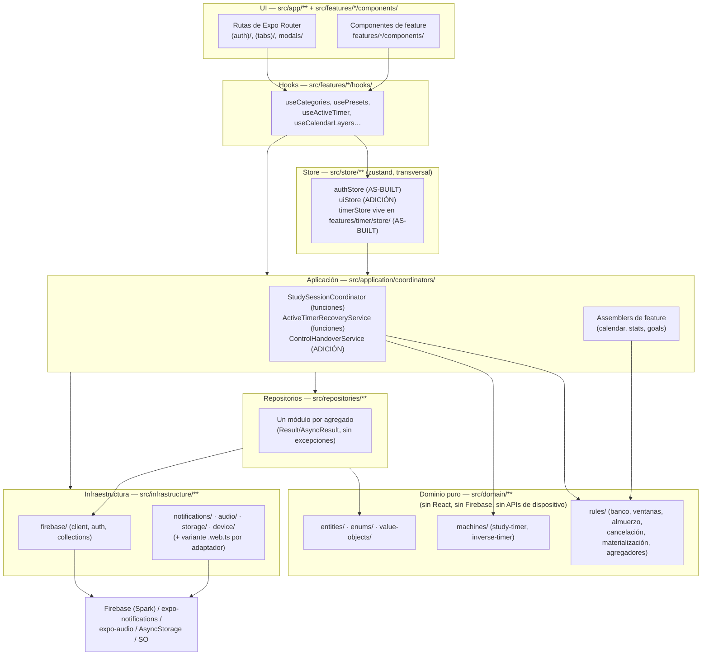
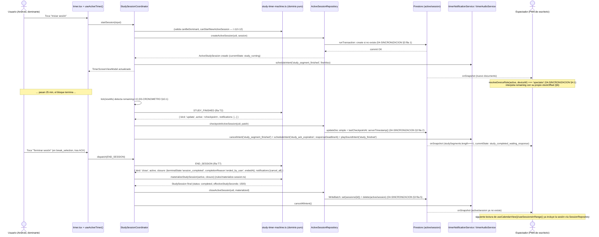

# 05 — Arquitectura técnica v2

## Propósito

Este documento reemplaza a `docs/originales/ARCHITECTURE-v1.md` como canon técnico de arquitectura. Fija lo que `02-DOMINIO.md`, `03-CRONOMETRO.md` y `04-SINCRONIZACION.md` dejan explícitamente para aquí y no redefinen: los principios de construcción del código, el árbol de carpetas definitivo de `productvt-beta/src`, las firmas completas de todos los repositorios (incluido `CalendarLayerRepository`, requerimiento nuevo del creador — brief §12), los coordinadores de `application/coordinators/`, los contratos de hooks y view models (incluido `CalendarViewModel` con capas activas), el flujo de datos de una sesión de estudio completa de punta a punta, la matriz de degradación funcional por plataforma (adoptando y ajustando la ya redactada por `productvt-7b`), el inventario de dependencias con su versión exacta y su razón de ser, el catálogo de errores tipados, la estrategia de testing con Vitest y la tabla de mapeo español/código específica de esta capa. Resuelve explícitamente **REV-ALTA-5** (viabilidad de alarmas en background en Android) y **REV-ALTA-6** (riesgos técnicos de la versión web) de `03-requisitos/revision-spec-beta.md`, que los cuatro documentos anteriores remiten aquí sin excepción, más **REV-MEDIA-15** (Android 12+/Doze/optimización de batería), la única fila MEDIA de esa misma revisión que sigue siendo de viabilidad técnica pura y sin resolución explícita en otro documento.

No repite el modelo de datos, la máquina de estados ni el protocolo de sincronización entre dispositivos — esos ya están completos en `02-DOMINIO.md`, `03-CRONOMETRO.md` y `04-SINCRONIZACION.md` respectivamente, y este documento los cita por sección cada vez que una decisión de arquitectura depende de ellos. Tampoco redefine los algoritmos de calendario/estadísticas/metas (`07-CALENDARIO-ESTADISTICAS-METAS.md`, todavía en redacción) ni el sistema de diseño visual completo (`06-DISENO-UI.md`, no escrito aún): donde esta arquitectura necesita una pieza de esos documentos (el `AssetRegistry`, el algoritmo de agregación de una capa de calendario) la señala como dependencia futura sin inventar su contenido. El destinatario es la sesión `BC Orquestador Productvt`, que ya tiene 4 de 11 fases commiteadas (la última, `01019c7`, el núcleo del cronómetro de estudio y temporizador inverso de la Fase 4a) y está en Fase 4b (sincronización multi-dispositivo): este documento describe la arquitectura **objetivo** completa, marcando con `AS-BUILT` lo ya commiteado (vía `Glob`/lectura directa de `productvt-beta/src`) y con `ADICIÓN` lo que falta, siguiendo el mismo lenguaje que `02-DOMINIO.md` §3.3.

## Fuentes

Orden de autoridad (si dos fuentes chocan, gana la de arriba; ver también la tabla de Trazabilidad al final):

1. Respuestas literales del creador — anexo de `_brief-orquestador.md` (etiquetas `R1`..`R25`).
2. `03-requisitos/decisiones-tomadas.md` v2 (etiquetas `D <sección/punto>`), en particular la sección "Arquitectura de código" (delegación total al orquestador, puntos 8–10) y "Confiabilidad técnica — sin costo monetario adicional" (puntos 17–18).
3. `_brief-orquestador.md` revisado 2026-09-06 (etiquetas `B §n`), en particular §6 ("Stack y plataformas"), §7 ("Arquitectura de código") y §12 ("Calendario por capas").
4. Código commiteado **y en curso** en `productvt-beta/src/**` (etiqueta `CODE`): verdad para nombres de tipos, campos, archivos y patrones ya escritos — explorado con `Glob`/`Read` directo, no de memoria. A la fecha de este documento: 4 de 11 fases commiteadas (fundación, autenticación, categorías/presets/ajustes, y `01019c7` — núcleo del cronómetro de estudio y temporizador inverso, Fase 4a: `src/domain/machines/**`, `src/domain/rules/**`, `src/domain/entities/active-session.ts`, `src/domain/entities/device-identity.ts`, `src/application/coordinators/{StudySessionCoordinator,InverseSessionCoordinator,ActiveTimerRecoveryService}.ts`, `src/features/timer/**`, `src/infrastructure/device/**`, `src/infrastructure/storage/keys.ts`, `src/i18n/**`), con la Fase 4b (sincronización multi-dispositivo: cesión de control, `clockOffset`) todavía sin código propio (`ControlHandoverService.ts` no existe todavía en `src/application/coordinators/`).
5. `docs/02-DOMINIO.md`, `docs/03-CRONOMETRO.md`, `docs/04-SINCRONIZACION.md` (ya escritos y completos): fuente de todo el modelo de datos, invariantes, máquina de estados y protocolo de sincronización que esta arquitectura organiza en capas y carpetas. Se citan por sección, nunca se repiten. `04-SINCRONIZACION.md` en particular ya deja dicho en su propia introducción: *"si más adelante se escribe `05-ARQUITECTURA.md`, debe citar este documento en vez de duplicar su contenido"* — regla que este documento respeta al pie de la letra en la sección 5.
6. `03-requisitos/revision-spec-beta.md` (etiquetas `REV-ALTA-n`, `REV-MEDIA-<fila>`, numeradas en el mismo orden que ya usan `01-SPEC.md`/`02-DOMINIO.md`/`03-CRONOMETRO.md`/`04-SINCRONIZACION.md`): este documento resuelve aquí, por asignación explícita de los cuatro documentos anteriores, los hallazgos de **viabilidad técnica pura** (REV-ALTA-5, REV-ALTA-6, REV-MEDIA-15) que ningún otro documento resuelve todavía.
7. `03-requisitos/matriz-degradacion-plataformas.md`: matriz de degradación de notificaciones/audio/background por plataforma, ya redactada por `productvt-7b` como contribución directa para esta sección — se adopta como base de la sección 6, ajustada donde hace falta integrarla con el resto de esta arquitectura, sin reescribirla desde cero.
8. `03-requisitos/nueva-funcionalidad-calendario-por-capas.md` (requerimiento original, con sus 4 preguntas ya resueltas en `_brief-orquestador.md` §12) y `01-mockups/mobile/cronometro.html`, `01-mockups/desktop/galaxia-metas.html`, `03-requisitos/nueva-funcionalidad-galaxia-tienda.md` + `01-mockups/desktop/decisiones-visuales-galaxia.md`: insumo de producto/UX para `CalendarLayerRepository`/`CalendarViewModel` (sección 4.3) y para los ganchos de galaxia ya fijados en `02-DOMINIO.md` §2.6/§3.5, respectivamente.
9. Originales v1 (`docs/originales/ARCHITECTURE-v1.md`, rangos §5 "Estructura sugerida de carpetas", §11 "Arquitectura del cronómetro de estudio", §12 "Lógica del banco de descanso" (líneas 562–848), §21–24 "Store global, hooks, servicios de aplicación, infraestructura Firebase" (líneas 1159–1301) y §27–31 "Errores, testing, fases, contratos entre capas, view models" (líneas 1355–1536)): punto de partida, no fuente de verdad — este documento adopta su estructura general donde sigue siendo válida (capas, separación store/hooks/coordinators, tipos de error) y la corrige donde el as-built o las decisiones del creador ya la superaron (sin `screens/`, sin `paused_transient`, con el modelo dominante/espectador en vez de "reconciliación genérica multi-dispositivo").

## 1. Principios de arquitectura

Delegación total del creador sobre arquitectura de código (R8–R13, R15, R17, R18, R21: *"ni idea, solucionalo para que tenga coherencia y adáptalo para que sea óptimo... priorizar estabilidad y funcionalidad sin sumar costo monetario adicional"*). Estos ocho principios son la interpretación de esa delegación y gobiernan cualquier decisión de esta arquitectura que no esté ya fijada por 02/03/04:

1. **El código as-built es la verdad para nombres, siempre.** Ante cualquier duda de identificador, gana lo ya commiteado en `productvt-beta/src` sobre cualquier documento (regla de gobierno del brief, §0). Este documento no propone renombres de lo ya escrito; donde algo todavía no existe, usa el nombre que `02-DOMINIO.md`/`03-CRONOMETRO.md`/`04-SINCRONIZACION.md` ya fijaron como adición.
2. **Dominio puro, sin excepciones.** Todo lo que vive en `src/domain/**` (entidades, enums, value objects, máquinas de estado, reglas de banco/ventanas/almuerzo/cancelación, agregadores) no importa React, Firebase ni ninguna API de dispositivo (`expo-notifications`, `expo-audio`, `AsyncStorage`, etc.). Es 100 % testeable con Vitest en entorno `node` sin mocks de plataforma — así ya lo confirma `vitest.config.ts` as-built (`environment: 'node'`, `include: ['src/domain/**/*.test.ts']`). El tiempo nunca se lee de `Date.now()` dentro del dominio: toda función que lo necesita lo recibe como parámetro (`nowIso`/`nowMs`), como ya hace `study-timer-machine.ts` as-built.
3. **Repositorio obligatorio para todo agregado, sin excepciones** (D9, brief §7). Ningún componente, hook, service o coordinador importa `firebase/firestore` directo: todo pasa por `src/repositories/**`, que a su vez es el único consumidor (junto con `src/infrastructure/firebase/collections.ts`) de referencias crudas de Firestore. `collections.ts` es el único archivo que construye rutas con `collection()`/`doc()` por nombre de colección — ya as-built.
4. **Un solo punto de inicialización de infraestructura por adaptador.** `src/infrastructure/firebase/client.ts` es el único lugar que llama `initializeApp`/`initializeAuth`/`getFirestore` (ya as-built, con manejo explícito de Fast Refresh); el mismo principio aplica a `notifications/`, `audio/`, `storage/` y `device/` cuando se construyan: un único módulo por adaptador, con una interfaz nativa y una variante `.web.ts` detrás de la misma firma (sección 3.3).
5. **Sin carpeta `screens/`.** Toda UI vive en `src/app/**` (rutas de Expo Router, ya as-built con los grupos `(auth)` y `(tabs)`) más `src/features/<feature>/components/` (D10, brief §7). Los "assemblers" de calendario/estadísticas/metas viven en `src/features/<feature>/services/`, no en `application/` (D8, corrige `ARCHITECTURE-v1.md` §23.3/§23.4, que los llamaba `StatsAssemblerService`/`CalendarAssemblerService` como servicios de aplicación genéricos).
6. **`application/coordinators/` existe y orquesta, no decide.** Contiene la lógica que conecta la máquina de estados pura (`domain/machines/**`) con los repositorios, la infraestructura de notificaciones/audio y el store — nunca reglas de negocio nuevas (esas ya están cerradas en 02/03/04). `application/use-cases/` queda vacío en V1: ningún flujo de esta app necesita todavía una orquestación multi-agregado que no encaje en un coordinador o en un service de feature: se puebla solo si una fase futura lo justifica, no por simetría con `ARCHITECTURE-v1.md` §5.
7. **Rebanada vertical, no capas horizontales** (R20, B §9: *"construir algo completo, funcional... en el menor tiempo posible"*). El orden de fases prioriza un flujo end-to-end compilable y usable en dispositivo real por encima de terminar una capa entera antes de tocar la siguiente — ya así lo ejecuta `08-PLAN-IMPLEMENTACION.md`. Esta arquitectura describe el objetivo completo; ninguna fase necesita construir las once carpetas de golpe.
8. **Costo cero es un criterio de arquitectura, no una nota al pie** (D17–D19, brief §6). Ninguna capa de este documento puede requerir Cloud Functions, Cloud Storage de pago, EAS Build en la nube ni un SDK con cuota paga por defecto. Cada vez que una decisión de esta arquitectura tiene una alternativa más simple pero paga (p. ej. Web Push con Service Worker, verificación de app OAuth), se documenta la alternativa gratuita elegida y por qué alcanza (sección 6).

## 2. Capas de la arquitectura

Cinco capas con una sola dirección de dependencia permitida (de arriba hacia abajo); ninguna capa inferior importa una superior. El **store** (zustand) es transversal: lo alimentan los coordinadores/repositorios y lo leen los hooks, pero no contiene lógica de negocio propia.



Reglas de esta gráfica, verificables por lectura de imports:

- **UI → Hooks**: ningún componente de `app/**` o `features/*/components/` llama a un repositorio, coordinador o `firebase/firestore` directo — siempre a través de un hook de `features/*/hooks/`.
- **Hooks → Store / Aplicación**: un hook puede leer el store (zustand) directamente y/o invocar un coordinador o un service de feature; nunca reimplementa una regla de negocio que ya vive en `domain/rules/**`.
- **Aplicación → Dominio + Repositorios + Infraestructura**: los coordinadores y los services de feature son los únicos que ven las tres cosas a la vez — reciben el resultado puro de una función de dominio, lo persisten con un repositorio y ejecutan el efecto de infraestructura correspondiente (notificación, sonido).
- **Repositorios → Dominio (solo tipos) + `infrastructure/firebase`**: un repositorio importa las interfaces de `domain/entities/**` para tipar lo que lee/escribe, y usa exclusivamente los helpers de `infrastructure/firebase/collections.ts` para construir referencias — nunca `collection()`/`doc()` sueltos.
- **Dominio no importa nada de las capas de arriba.** Esta es la única regla de esta sección que ya tiene verificación automática as-built: ningún archivo de `src/domain/**` importa `react`, `react-native`, `firebase/*` ni `expo-*` (verificable con `grep -rl "from 'firebase\|from 'expo-\|from 'react" src/domain`, que hoy devuelve vacío).

## 3. Árbol de carpetas definitivo

Corrige `ARCHITECTURE-v1.md` §5 en tres puntos: sin `screens/` (principio 5); `application/coordinators/` con contenido real, no solo `mappers/dto/` genéricos; y `repositories/` con el agregado completo que 02/03/04 ya cerraron, incluido `CalendarLayerRepository` (brief §12). `AS-BUILT` marca lo ya commiteado o presente en el árbol de trabajo (verificado con `Glob` sobre `productvt-beta/src`); `ADICIÓN` marca lo que una fase futura debe crear, con el nombre y la ruta que 02/03/04 ya fijaron — este documento no inventa nombres nuevos donde esos tres ya decidieron uno.

```text
productvt-beta/
  src/
    app/                              # Expo Router — ÚNICA capa de pantallas, sin screens/
      _layout.tsx                     # AS-BUILT — AuthGate (useRequireAuth)
      (auth)/
        _layout.tsx                   # AS-BUILT
        login.tsx                     # AS-BUILT
        register.tsx                  # AS-BUILT
      (tabs)/
        _layout.tsx                   # AS-BUILT (Fase 2, HISTÓRICO) — 4 tabs: Cronómetro, Calendario, Estadísticas, Configuración.
                                       # Anterior a la decisión del creador de 5 pestañas (brief §12.5, 2026-09-06): Inicio,
                                       # Cronómetro, Calendario, Estadísticas, Tienda — Configuración deja de ser pestaña.
                                       # ADICIÓN pendiente: agregar index.tsx/shop.tsx a <Tabs> y sacar el <Tabs.Screen name="settings">.
        index.tsx                     # ADICIÓN (brief §12.5) — "Inicio": hub tipo Clash Royale (racha/amigos arriba-izq.,
                                       # moneda/cofre arriba-der., galaxia de metas embebida como contenido principal, botón
                                       # grande "Crear" que abre modals/create-menu.tsx, botón mini de Configuración)
        timer.tsx                     # AS-BUILT (placeholder) → Fase 4
        calendar.tsx                  # AS-BUILT (placeholder) → Fase 7
        stats.tsx                     # AS-BUILT (placeholder) → Fase 8
        shop.tsx                      # ADICIÓN (V1.1, brief §12.5) — "Tienda": pestaña propia, separada de Inicio
        settings.tsx                  # AS-BUILT (completo, Fase 3) — reubicación pendiente: brief §12.5 confirma que
                                       # Configuración deja de ser pestaña y pasa a pantalla/modal accesible desde el botón
                                       # mini de index.tsx; el archivo no se mueve de `(tabs)/` hasta que exista index.tsx,
                                       # para no dejar una ruta huérfana mientras tanto
      modals/                         # ADICIÓN — ya listados en constants/routes.ts (AS-BUILT)
        create-invisible-event.tsx    # ADICIÓN, Fase 7
        edit-category.tsx             # ADICIÓN, Fase 3 (brecha pendiente, ver sección 11)
        edit-preset.tsx               # ADICIÓN, Fase 3 (brecha pendiente)
        cancel-session.tsx            # ADICIÓN, Fase 4
        break-selector.tsx            # ADICIÓN, Fase 4
        weekly-goal.tsx                # ADICIÓN, Fase 9
        calendar-layer.tsx             # ADICIÓN, Fase 7 — crear/editar CalendarLayer (brief §12)
        create-menu.tsx                # ADICIÓN (brief §12.5) — popup "Crear meta / Iniciar bloque" disparado desde el
                                        # botón grande de index.tsx

    features/
      auth/{components,hooks,schemas}/          # AS-BUILT completo (Fase 2)
      categories/{components,domain,hooks,schemas,services}/   # AS-BUILT (Fase 3)
      presets/{components,domain,hooks,schemas,services}/      # AS-BUILT (Fase 3)
      settings/{components,domain,hooks,services}/             # AS-BUILT (Fase 3)
      timer/{components,hooks,services}/        # ADICIÓN, Fase 4 — timerNotificationService.ts,
                                                 # timerAudioService.ts (invocan intents de
                                                 # domain/machines/notification-intents.ts, 03-CRONOMETRO §11)
      sessions/{components,hooks,services}/      # ADICIÓN, Fase 5 — historial, detalle de sesión
      inverse/{components,hooks,services}/       # ADICIÓN, Fase 6 — temporizador inverso
      calendar/{components,hooks,services}/      # ADICIÓN, Fase 7 — incluye useCalendarLayers,
                                                 # calendarAssembler.ts (algoritmo en 07-CALENDARIO-…)
      stats/{components,hooks,services}/         # ADICIÓN, Fase 8 — statsAssembler.ts (ídem)
      goals/{components,hooks,services}/         # ADICIÓN, Fase 9 — goalsAssembler.ts (ídem)

    domain/                            # ver 3.1
    application/coordinators/          # ver 3.4 (application/use-cases/ queda vacío, principio 6)
    repositories/                      # ver 3.2
    infrastructure/                    # ver 3.3
    store/                             # ver 3.5
    theme/                             # ver 3.6
    i18n/                              # ver 3.7
    hooks/                             # AS-BUILT — use-color-scheme(.web).ts, use-theme.ts
    components/                        # AS-BUILT — themed-text.tsx, themed-view.tsx, animated-icon(.web).tsx
    constants/                         # AS-BUILT — theme.ts (tokens actuales, ver 3.6), routes.ts
    types/
      common.ts                        # AS-BUILT — ID, ISODateString, Result/AsyncResult, ok/err
```

Nota sobre la carpeta `hooks/` de nivel raíz (distinta de `features/*/hooks/`): as-built solo contiene hooks transversales sin agregado propio (`use-theme`, `use-color-scheme`), no hooks de negocio — esos siempre viven dentro de su `features/<feature>/hooks/`, sin excepción, para que ningún hook de un agregado quede fuera de su feature.

### 3.1 `domain/`

```text
domain/
  entities/
    active-session.ts        # AS-BUILT (Fase 4a) — ActiveSession, DeviceId, DeviceRole, ControlRequest, PausedSegment
    category.ts               # AS-BUILT — sin parentId todavía (ADICIÓN pendiente, sección 11)
    device-identity.ts        # AS-BUILT (Fase 4a) — DeviceIdentity, canBeDominant, resolveDeviceRole
    inverse-session.ts        # AS-BUILT (con autoFinished/deviceInfo agregados en Fase 4a, en el árbol de trabajo)
    invisible-event.ts        # AS-BUILT
    preset.ts                 # AS-BUILT
    study-session.ts          # AS-BUILT (con deviceId/ended_by_user agregados en Fase 4a)
    user-profile.ts           # AS-BUILT
    weekly-goal.ts             # AS-BUILT — sin name/parentGoalId/skinId/layerVisible todavía (ADICIÓN, Fase 9)
    calendar-layer.ts          # ADICIÓN (Fase 7) — CalendarLayer (02-DOMINIO.md §3.3, brief §12)
    galaxy-layout.ts           # ADICIÓN (V1.1) — GalaxyLayout, GalaxyViewLayout, GalaxyPosition
    inventory-item.ts          # ADICIÓN (V1.1) — InventoryItem, InventoryItemKind, InventoryAcquisitionSource
  enums/
    category-type.ts           # AS-BUILT
    timer-state.ts              # AS-BUILT — los 10 TimerStateName
  value-objects/
    duration-seconds.ts         # AS-BUILT
    week-key.ts                  # AS-BUILT
    month-key.ts                 # AS-BUILT
    preset-snapshot.ts            # AS-BUILT
    category-snapshot.ts          # AS-BUILT
    day-key.ts                     # ADICIÓN (fase calendario) — DayKey, buildDayKey
  machines/
    study-timer-events.ts          # AS-BUILT (árbol de trabajo, Fase 4a) — StudyTimerEvent
    study-timer-machine.ts          # AS-BUILT (ídem) — implementa T1–T19 de 03-CRONOMETRO.md §4
    study-timer-machine.test.ts      # AS-BUILT (ídem)
    inverse-timer-events.ts           # AS-BUILT (ídem)
    inverse-timer-machine.ts           # AS-BUILT (ídem)
    notification-intents.ts             # AS-BUILT (ídem) — NotificationIntent, datos puros, sin efectos
  rules/
    active-session-guard.ts            # AS-BUILT — canStartNewActiveSession (I-11)
    break-bank.ts                       # AS-BUILT — computeGrantedBreakSeconds, resolveBreakType…
    cancellation.ts                      # AS-BUILT — CANCEL_CONFIRM_WINDOW_SECONDS
    inverse-timer.ts                      # AS-BUILT
    lunch.ts                               # AS-BUILT — isLunchAvailable
    materialize-session.ts                  # AS-BUILT — materializeStudySession, isZombie
    response-window.ts                       # AS-BUILT — resolveStudy/BreakResponseWindowSeconds
    session-effective-seconds.ts              # AS-BUILT — sumEffectiveStudySeconds, resolveCancelledSessionEffectiveSeconds
    timer-engine.ts                            # AS-BUILT — computeRemainingSeconds (sin clockOffset todavía, Fase 4b)
    category-rules.ts                           # ADICIÓN (fase categorías) — canAssignParent
    goal-rules.ts                                 # ADICIÓN (fase metas) — canAssignParentGoal
    time-attribution.ts                            # ADICIÓN (fase estadísticas) — weekKeyOfStudySegment, dayKeyOfStudySegment
    close-lazy-session.ts                           # ADICIÓN (Fase 4b) — closeLazySessionIfDue (04-SINCRONIZACION.md §7.2)
  time/
    zoned.ts                                         # ADICIÓN — toZonedWallClock (02-DOMINIO.md §3.6)
  migrations/
    <entidad>.ts                                      # ADICIÓN, perezosa — una función pura por migración (02-DOMINIO.md §6.5)
  versioning.ts                                        # ADICIÓN — SCHEMA_VERSION, Versioned, migrateDocument
  __tests__/
    fixtures.ts                                        # AS-BUILT — fixtures compartidos entre *.test.ts
```

Ningún archivo de `domain/**` tiene autorización para importar otro de `application/`, `repositories/`, `infrastructure/`, `store/`, `features/*` o `app/*` — es la regla no negociable de la sección 2. `close-lazy-session.ts` vive en `domain/rules/` y no en `application/coordinators/` porque su lógica (releer, verificar condición, decidir cierre) es pura una vez que recibe el documento ya leído; es `ActiveTimerRecoveryService` (3.4) quien la invoca contra Firestore de verdad, exactamente como ya lo firma `04-SINCRONIZACION.md` §7.2 (`src/domain/coordinators/close-lazy-session.ts` en ese documento — este documento fija su ubicación definitiva en `domain/rules/`, junto al resto de reglas puras del motor, no en una carpeta `domain/coordinators/` que no existe en ningún otro lugar del árbol; es una precisión de ruta, no un cambio de comportamiento).

### 3.2 `repositories/`

Un módulo por agregado, sin excepciones (D9, principio 3). Todos siguen el mismo patrón as-built (`categoryRepository.ts`, `presetRepository.ts`, `settingsRepository.ts`, `userRepository.ts`): funciones exportadas (no clases, salvo la clase de error), `AsyncResult<T, XRepositoryError>` como tipo de retorno, una `nowIso()` local para `createdAt`/`updatedAt`, y una función `subscribeX` con `onSnapshot` que devuelve `Unsubscribe` donde la feature necesita datos en vivo. Firmas completas (as-built citado literal; adición con la firma que ya fija 02/03/04):

```ts
// repositories/user/userRepository.ts — AS-BUILT
export class UserRepositoryError extends Error {}
export function detectDeviceTimezone(): string;
export function getUserProfile(uid: string): AsyncResult<UserProfile | null, UserRepositoryError>;
export function createUserProfile(uid: string, email: string, displayName?: string): AsyncResult<UserProfile, UserRepositoryError>;
export function updateUserProfile(uid: string, patch: Partial<Pick<UserProfile, 'displayName' | 'timezone' | 'cancellationPhrase'>>): AsyncResult<void, UserRepositoryError>;
export function ensureUserProfileAndSettings(uid: string, email: string, displayName?: string): AsyncResult<{ profile: UserProfile; settings: UserSettings }, UserRepositoryError>;

// repositories/settings/settingsRepository.ts — AS-BUILT
export class SettingsRepositoryError extends Error {}
export function defaultSoundPreferences(): SoundPreferences;
export function defaultVisualPreferences(): VisualPreferences;
export function getUserSettings(uid: string): AsyncResult<UserSettings | null, SettingsRepositoryError>;
export function createDefaultUserSettings(uid: string): AsyncResult<UserSettings, SettingsRepositoryError>;
export function ensureUserSettings(uid: string): AsyncResult<UserSettings, SettingsRepositoryError>;
export function updateUserSettings(uid: string, patch: Partial<Pick<UserSettings, 'soundPreferences' | 'visualPreferences' | 'notificationsEnabled'>>): AsyncResult<void, SettingsRepositoryError>;

// repositories/categories/categoryRepository.ts — AS-BUILT
export class CategoryRepositoryError extends Error {}
export interface CategoryInput { type: CategoryType; name: string; color: string; imageUrl?: string; }
export function listCategories(uid: string, type: CategoryType): AsyncResult<Category[], CategoryRepositoryError>;
export function getCategory(uid: string, categoryId: string): AsyncResult<Category | null, CategoryRepositoryError>;
export function subscribeCategories(uid: string, type: CategoryType, onData: (categories: Category[]) => void, onError: (error: CategoryRepositoryError) => void): Unsubscribe;
export function createCategory(uid: string, input: CategoryInput): AsyncResult<Category, CategoryRepositoryError>;
export function updateCategory(uid: string, categoryId: string, patch: Partial<Pick<Category, 'name' | 'color' | 'icon' | 'imageUrl'>>): AsyncResult<void, CategoryRepositoryError>;
export function setCategoryArchived(uid: string, categoryId: string, isArchived: boolean): AsyncResult<void, CategoryRepositoryError>;
// ADICIÓN (fase categorías, subcategorías de un nivel — brief §4): agrega `parentId?: string` a
// CategoryInput y al patch de updateCategory; la propagación de `color` a hijos en el mismo batch
// (02-DOMINIO.md I-14) se ejecuta aquí con un `writeBatch`, no con updateDoc suelto.

// repositories/presets/presetRepository.ts — AS-BUILT
export class PresetRepositoryError extends Error {}
export interface PresetInput { name: string; studyDurationMinutes: number; shortBreakMinutes: number; cyclesBeforeLongBreak: number; longBreakMinutes: number; imageUrl?: string; }
export function listPresets(uid: string): AsyncResult<Preset[], PresetRepositoryError>;
export function getPreset(uid: string, presetId: string): AsyncResult<Preset | null, PresetRepositoryError>;
export function subscribePresets(uid: string, onData: (presets: Preset[]) => void, onError: (error: PresetRepositoryError) => void): Unsubscribe;
export function createPreset(uid: string, input: PresetInput): AsyncResult<Preset, PresetRepositoryError>;
export function updatePreset(uid: string, presetId: string, patch: Partial<PresetInput>): AsyncResult<void, PresetRepositoryError>;
export function deletePreset(uid: string, presetId: string): AsyncResult<void, PresetRepositoryError>;
export function ensureStandardPresetExists(uid: string): AsyncResult<Preset, PresetRepositoryError>; // sembrado en registro, ya consumido por authStore.ts as-built

// repositories/active-session/activeSessionRepository.ts — ADICIÓN (Fase 4a/4b)
export class ActiveSessionRepositoryError extends Error {}
export function getActiveSession(uid: string): AsyncResult<ActiveSession | null, ActiveSessionRepositoryError>; // getDoc simple
export function subscribeActiveSession(uid: string, onData: (active: ActiveSession | null) => void, onError: (error: ActiveSessionRepositoryError) => void): Unsubscribe;
export function createActiveSession(uid: string, session: ActiveStudySession | ActiveInverseSession): AsyncResult<void, ActiveSessionRepositoryError>; // runTransaction: falla si ya existe (04-SINCRONIZACION.md §3 fila 1)
export function checkpointActiveSession(uid: string, patch: Partial<ActiveSession>): AsyncResult<void, ActiveSessionRepositoryError>; // updateDoc simple + lastCheckpointAt: serverTimestamp() (§3 fila 2)
export function requestControl(uid: string, request: ControlRequest): AsyncResult<void, ActiveSessionRepositoryError>; // updateDoc solo controlRequest (§3 fila 3)
export function withdrawControlRequest(uid: string): AsyncResult<void, ActiveSessionRepositoryError>; // "No" del dominante (§5.4)
export function takeOverControl(uid: string, newDominantDeviceId: DeviceId): AsyncResult<void, ActiveSessionRepositoryError>; // runTransaction validTakeover() (§3 fila 4)
export function closeActiveSession(uid: string, materialized: StudySession | InverseSession): AsyncResult<void, ActiveSessionRepositoryError>; // WriteBatch set+delete (§3 fila 5)
export function closeLazyIfDue(uid: string, expectedSessionId: string, computeClosure: LazyCloseComputer, nowMs: number): AsyncResult<LazyCloseResult, ActiveSessionRepositoryError>; // envuelve closeLazySessionIfDue (§3 fila 6, §7.2)

// repositories/sessions/sessionRepository.ts — ADICIÓN (Fase 5)
export class SessionRepositoryError extends Error {}
export function getSession(uid: string, sessionId: string): AsyncResult<StudySession | null, SessionRepositoryError>;
export function listStudySessionsInRange(uid: string, fromIso: string, toIso: string): AsyncResult<StudySession[], SessionRepositoryError>; // where type=='study' + startedAt en rango, 02-DOMINIO.md §5.2
export function listStudySessionsByCategory(uid: string, categoryId: string, fromIso: string, toIso: string): AsyncResult<StudySession[], SessionRepositoryError>; // índice (type,categoryId,startedAt)
// create()/update() no se exponen: una StudySession solo se escribe una vez, al materializar, siempre
// a través de ActiveSessionRepository.closeActiveSession/closeLazyIfDue (02-DOMINIO.md §2.3).

// repositories/sessions/inverseSessionRepository.ts — ADICIÓN (Fase 6, misma colección `sessions/`)
export class InverseSessionRepositoryError extends Error {}
export function getInverseSession(uid: string, sessionId: string): AsyncResult<InverseSession | null, InverseSessionRepositoryError>;
export function listInverseSessionsInRange(uid: string, fromIso: string, toIso: string): AsyncResult<InverseSession[], InverseSessionRepositoryError>;
// Mismo principio que sessionRepository: solo lectura directa; la escritura pasa por ActiveSessionRepository.

// repositories/events/eventRepository.ts — ADICIÓN (Fase 7)
export class EventRepositoryError extends Error {}
export interface InvisibleEventInput { name: string; categoryId: string; startAt: string; endAt: string; recurrence?: WeeklyRecurrence; notes?: string; }
export function listEventsInRange(uid: string, fromIso: string, toIso: string): AsyncResult<InvisibleEvent[], EventRepositoryError>; // where isDeleted==false, 02-DOMINIO.md §5.2
export function listRecurringEvents(uid: string): AsyncResult<InvisibleEvent[], EventRepositoryError>; // where isDeleted==false, recurrence.frequency=='weekly'
export function subscribeEventsInRange(uid: string, fromIso: string, toIso: string, onData: (events: InvisibleEvent[]) => void, onError: (error: EventRepositoryError) => void): Unsubscribe;
export function createEvent(uid: string, input: InvisibleEventInput): AsyncResult<InvisibleEvent, EventRepositoryError>; // siempre isDeleted:false explícito (02-DOMINIO.md §5.2)
export function updateEvent(uid: string, eventId: string, patch: Partial<InvisibleEventInput>): AsyncResult<void, EventRepositoryError>;
export function softDeleteEvent(uid: string, eventId: string): AsyncResult<void, EventRepositoryError>; // isDeleted: true, nunca deleteDoc

// repositories/goals/goalRepository.ts — ADICIÓN (Fase 9)
export class GoalRepositoryError extends Error {}
export interface WeeklyGoalInput { name: string; weekKey: WeekKey; categoryId: string; targetSeconds: number; parentGoalId?: string; skinId?: string; }
export function listGoalsForWeek(uid: string, weekKey: WeekKey): AsyncResult<WeeklyGoal[], GoalRepositoryError>;
export function listChildGoals(uid: string, parentGoalId: string): AsyncResult<WeeklyGoal[], GoalRepositoryError>; // V1.1, where parentGoalId==g
export function subscribeGoalsForWeek(uid: string, weekKey: WeekKey, onData: (goals: WeeklyGoal[]) => void, onError: (error: GoalRepositoryError) => void): Unsubscribe;
export function createGoal(uid: string, input: WeeklyGoalInput): AsyncResult<WeeklyGoal, GoalRepositoryError>;
export function updateGoalProgress(uid: string, goalId: string, achievedSeconds: number, status: WeeklyGoalStatus): AsyncResult<void, GoalRepositoryError>; // escrito por el agregador de 07-CALENDARIO-…, nunca por UI directa
export function setGoalLayerVisible(uid: string, goalId: string, layerVisible: boolean): AsyncResult<void, GoalRepositoryError>; // ADICIÓN calendario por capas — brief §12, toggle de la capa virtual

// repositories/calendar-layers/calendarLayerRepository.ts — ADICIÓN (Fase 7, requerimiento nuevo — brief §12)
export class CalendarLayerRepositoryError extends Error {}
export interface CalendarLayerInput { name: string; categoryIds: string[]; }
export function listCalendarLayers(uid: string): AsyncResult<CalendarLayer[], CalendarLayerRepositoryError>;
export function subscribeCalendarLayers(uid: string, onData: (layers: CalendarLayer[]) => void, onError: (error: CalendarLayerRepositoryError) => void): Unsubscribe; // CRUD normal sin arbitraje, D14
export function createCalendarLayer(uid: string, input: CalendarLayerInput): AsyncResult<CalendarLayer, CalendarLayerRepositoryError>; // isVisible: true por defecto
export function updateCalendarLayer(uid: string, layerId: string, patch: Partial<CalendarLayerInput>): AsyncResult<void, CalendarLayerRepositoryError>;
export function setCalendarLayerVisible(uid: string, layerId: string, isVisible: boolean): AsyncResult<void, CalendarLayerRepositoryError>;
export function deleteCalendarLayer(uid: string, layerId: string): AsyncResult<void, CalendarLayerRepositoryError>; // borrado físico: una capa personalizada no es histórico referenciado (a diferencia de Category, I-14)

// repositories/galaxy/galaxyLayoutRepository.ts — ADICIÓN (V1.1)
export class GalaxyLayoutRepositoryError extends Error {}
export function getGalaxyLayout(uid: string): AsyncResult<GalaxyLayout | null, GalaxyLayoutRepositoryError>;
export function upsertGalaxyLayout(uid: string, patch: Partial<Pick<GalaxyLayout, 'root' | 'subgalaxies'>>): AsyncResult<void, GalaxyLayoutRepositoryError>;

// repositories/inventory/inventoryRepository.ts — ADICIÓN (V1.1)
export class InventoryRepositoryError extends Error {}
export function listInventory(uid: string): AsyncResult<InventoryItem[], InventoryRepositoryError>;
export function grantInventoryItem(uid: string, item: InventoryItem): AsyncResult<void, InventoryRepositoryError>; // set idempotente por id===assetId
```

`SessionRepository`/`InverseSessionRepository` comparten la colección `sessions/` (helpers `sessionsCollection`/`sessionDocRef` de `collections.ts`, ya as-built, tipados como `SessionDocument = StudySession | InverseSession`) pero son dos módulos separados, como ya los nombra literalmente el brief §7 — cada uno filtra por su propio `type` y expone solo las consultas de lectura que su feature necesita; la única escritura de `sessions/{id}` en toda la app pasa por `ActiveSessionRepository` en el momento de materializar (02-DOMINIO.md §2.3, §2.5), nunca por un `create`/`update` de estos dos repositorios de solo lectura.

### 3.3 `infrastructure/`

```text
infrastructure/
  firebase/
    client.ts                  # AS-BUILT — único initializeApp/initializeAuth/getFirestore
    auth.ts                     # AS-BUILT — login/registro/Google/logout, FirebaseUser recortado
    collections.ts                # AS-BUILT — único archivo con collection()/doc() crudos
  notifications/                  # ADICIÓN (Fase 4)
    notificationService.ts         # expo-notifications: schedule/cancel por NotificationIntent (03-CRONOMETRO §11)
    notificationService.web.ts      # no-op: la web nunca es dominante, nunca programa alarmas (02-DOMINIO.md §7)
  audio/                            # ADICIÓN (Fase 4)
    audioService.ts                  # expo-audio: reproduce SoundEffect según UserSettings.soundPreferences
    audioService.web.ts               # reproduce vía <audio>/Web Audio si hay gesto reciente; degrada en silencio si no (sección 6)
  storage/
    keys.ts                            # AS-BUILT — STORAGE_KEYS centralizadas
  device/
    deviceIdentity.ts                   # AS-BUILT — getOrCreateDeviceIdentity() (uuid v4, AsyncStorage)
```

Cada adaptador con variante de plataforma sigue el mismo patrón que Expo/Metro ya resuelve para `hooks/use-color-scheme(.web).ts` y `components/animated-icon(.web).tsx` (as-built): un archivo `<nombre>.ts`/`.tsx` para nativo y `<nombre>.web.ts`/`.web.tsx` para web, ambos exportando exactamente la misma firma pública — el bundler elige el archivo correcto por plataforma sin que el resto de la app haga ningún `if (Platform.OS === 'web')` disperso. `firebase/client.ts` no necesita variante `.web.ts`: el SDK de Firebase JS ya es multiplataforma (la única rama por plataforma que tiene, `browserLocalPersistence` vs. `getReactNativePersistence`, ya vive dentro del mismo archivo as-built con un `Platform.select` inline, precisamente porque es una sola línea y no justifica partir el archivo). `storage/keys.ts` y `device/deviceIdentity.ts` tampoco necesitan variante web: `@react-native-async-storage/async-storage` ya resuelve `localStorage` por debajo en web (comentario as-built de `keys.ts`), y `deviceIdentity.ts` ya reconoce `Platform.OS === 'web'` internamente para dar un `deviceName` legible sin partir el archivo.

### 3.4 `application/coordinators/`

```text
application/
  coordinators/
    StudySessionCoordinator.ts          # AS-BUILT (Fase 4a, commit 01019c7) — módulo de funciones (startStudySession, dispatchStudyTimerEvent)
    ActiveTimerRecoveryService.ts        # AS-BUILT (Fase 4a) — recoverActiveSessionIfStale; nombre y forma as-built (no el citado literal de 04-SINCRONIZACION.md §8)
    InverseSessionCoordinator.ts          # AS-BUILT (Fase 4a) — módulo de funciones (startInverseSession, dispatchInverseTimerEvent)
    ControlHandoverService.ts              # ADICIÓN (Fase 4b) — 04-SINCRONIZACION.md §5; commit 01019c7 fija el dominante fijo sin cesión de control, con TODOs explícitos de una línea para esta pieza
  use-cases/                                # vacío en V1 (principio 6)
```

**Corrección as-built (Principio 1 — "el código as-built es la verdad para nombres, siempre... este documento no propone renombres de lo ya escrito")**: el commit `01019c7` ("núcleo del cronómetro de estudio y temporizador inverso, Fase 4a") ya construyó `StudySessionCoordinator.ts` e `InverseSessionCoordinator.ts` como **módulos de funciones exportadas**, no como clases — no hay `new StudySessionCoordinator()` en ningún punto de la app; el detalle exacto de cada función as-built vive en la sección 4.1. El servicio de recuperación se llama **`ActiveTimerRecoveryService.ts`**, con la función `recoverActiveSessionIfStale` y un `RecoveryOutcome` discriminado por `outcome: 'none' | 'active' | 'closed_study' | 'closed_inverse'` — distinto del nombre/forma citados literal de `04-SINCRONIZACION.md` §8 (`ActiveSessionRecoveryService`/`recoverActiveSession`/`{kind: 'idle' | 'closed_lazily' | 'hydrated'}`), que ese documento fijó antes de que este código existiera. Por la regla de gobierno del brief ("donde el código ya commiteado sea sano y solo difiera en nombres o forma de guardar, el canon adopta lo construido — no se renombra código por estética"), este documento adopta el nombre y la forma as-built en vez de forzar un renombre a lo que `04-SINCRONIZACION.md` anticipó sin conocer el código real; la única pieza que sí falta de verdad (protocolo de cesión de control/`clockOffset`) queda como **ADICIÓN, Fase 4b**, tal como el propio commit la marca. Las firmas as-built completas están en la sección 4.1; el nombre de archivo PascalCase.ts de los tres módulos ya construidos fija, por consistencia, el mismo patrón para `ControlHandoverService.ts` cuando se construya (sección 10).

### 3.5 `store/`

```text
store/
  auth/
    authStore.ts               # AS-BUILT — zustand: status, user, profile, settings, isSubmitting, actionError
  ui/
    uiStore.ts                   # ADICIÓN — vista de calendario activa, tab visitada, estado de paneles transitorios no persistidos
```

**Corrección as-built (Principio 1)**: `timerStore.ts` **no** vive en `store/timer/` — el commit `01019c7` ya lo construyó en `src/features/timer/store/timerStore.ts`, junto al resto de la feature del cronómetro, no en el `store/` de nivel raíz que este documento fijaba como objetivo. Este documento adopta esa ubicación as-built (regla de gobierno del brief) en vez de proponer moverlo:

```text
features/timer/store/
  timerStore.ts                # AS-BUILT (Fase 4a) — { device, active, isHydrating, error } + initialize/setActive/setError/reset
```

`timerStore` es un store fino, sin campo `role` propio todavía (comentario as-built explícito: "LÍMITE DE FASE 4a, no 4b" — la resolución de rol dominante/espectador vía `resolveDeviceRole` ya existe en `domain/entities/device-identity.ts` pero ningún hook la usa aún) y no duplica ninguna regla de `domain/machines/study-timer-machine.ts`: solo cachea el último `ActiveSession` recibido por `onSnapshot` (`subscribeActiveSession`) y dispara `recoverActiveSessionIfStale` al hidratar y en cada vuelta a primer plano (`AppState`). El cálculo en vivo de `computeRemainingSeconds`/`computeLiveEffectiveStudySeconds` (03-CRONOMETRO.md §10) **no** lo expone el store — vive dentro del hook `useActiveTimer()` (sección 4.2), que lo recalcula en cada tick de refresco visual con su propio `setInterval(TICK_MS = 500)` + `useState` (as-built), y además dispara el evento "auto" correspondiente (`STUDY_FINISHED`/`BREAK_FINISHED`/`LUNCH_FINISHED`/`EXPIRE`) contra `StudySessionCoordinator` cuando este dispositivo es el dominante y `remaining` llega a 0 — no existe un método `tick(nowMs)` de un coordinador que haga este trabajo (ver corrección de §4.1). `uiStore` es deliberadamente pequeño: `ARCHITECTURE-v1.md` §21.3 ya advertía no meter ahí listas históricas grandes ni cálculos de estadísticas cacheados — esos viven en hooks locales por pantalla (sección 4.2), no en un store global.

### 3.6 `theme/`

`constants/theme.ts` as-built hoy es un stub funcional (`Colors.light/dark`, `Fonts`, `Spacing`, `CategoryPalette`, `StatusColors`, `Radii`) pensado para arrancar rápido en la Fase 1, no el sistema de tokens + skins completo que pide el brief §8 (*"theme provider con tokens... y skins como conjuntos de tokens + registro de assets"*, skin base "Papel" con la paleta exacta del mockup de frontend). Este documento fija dónde vive esa evolución sin descartar lo as-built:

```text
theme/                                # ADICIÓN (fase de pulido, o antes si una fase de UI temprana lo necesita)
  tokens.ts                            # tipo Theme{colors, typography, spacing, radii, shadows, motion}; contrato único
  ThemeProvider.tsx                     # React Context: resuelve claro/oscuro/sistema + skin activo, expone useTheme()
  assetRegistry.ts                       # AssetRegistry — registro de imágenes/ilustraciones por categoría/preset/estado/celebración (dueño real: 06-DISENO-UI.md; este archivo solo declara el contrato TypeScript)
  skins/
    papel.ts                              # skin base — tokens del mockup 01-mockups/mobile/cronometro.html:
                                           # papel #EFEDE5, papel elevado #FAF9F3, tinta #20241E, atenuado #6E7368,
                                           # acento #3A6B54, descanso #2E7B84, almuerzo #B9812E, aviso #C0672B,
                                           # peligro #9C4A3A, con variante oscura (brief §8)
```

`constants/theme.ts` y `hooks/use-theme.ts` as-built no se borran de golpe: `ThemeProvider`/`useTheme` de `theme/` los reemplaza como fuente de verdad cuando esa fase se construya, y el `hooks/use-theme.ts` as-built puede quedar como un re-export delgado hacia `theme/` para no romper los imports ya escritos en `(tabs)/_layout.tsx` (as-built) — el mismo patrón de compatibilidad que ya usa `user-profile.ts` as-built para `DEFAULT_CANCELLATION_PHRASE` (re-exportada desde `src/i18n/es.ts`). Contenido completo del sistema de skins, tipografías (`expo-font`: Fraunces/Archivo/IBM Plex Mono) y componentes formalizados del mockup (`RolePill`, `ProgressRing`, `ChoiceChip`, `BottomSheet`, `StateLabel`, `CategoryChip`) es responsabilidad de `06-DISENO-UI.md` (no escrito aún) — esta sección solo fija la carpeta y el contrato mínimo que esa fase completa.

### 3.7 `i18n/`

`src/i18n/es.ts` ya existe en el árbol de trabajo (Fase 4a) con el patrón que rige toda la app: una única tabla de strings en español neutro con "tú" (`DEFAULT_CANCELLATION_PHRASE`, `timerCopy.*`), consumida por componentes en vez de literales sueltos — así resuelve RNF-12 (`01-SPEC.md` §8.5) sin depender de una librería de i18n (no hay más de un idioma en V1, así que `i18next`/`react-intl` sería una dependencia sin uso real, principio 8). Cada fase que agrega copys nuevos amplía este mismo archivo con su propia sub-tabla (`categoryCopy`, `calendarCopy`, `goalsCopy`, siguiendo el patrón ya as-built de `timerCopy`), nunca un archivo de strings por feature: un único punto de verdad para poder auditar/cambiar todo el copy de la app de una sola vez.

### 3.8 Tests

No existe una carpeta `tests/` separada — el as-built ya fijó el patrón (`vitest.config.ts`, `study-timer-machine.test.ts` junto a su fuente) y este documento lo adopta tal cual (regla de gobierno: el código ya commiteado gana sobre una convención genérica). Detalle completo en la sección 9.

## 4. Contratos entre capas

Corrige y precisa `ARCHITECTURE-v1.md` §30 ("Contratos entre capas"): la UI nunca dispara una acción de negocio directo sobre el dominio — siempre a través de un hook, que a su vez llama a un coordinador (para el cronómetro) o a un service de feature (para todo lo demás, CRUD sin arbitraje). El coordinador transforma el input de UI, llama a la función pura de `domain/machines|rules/**` correspondiente, y ejecuta el resultado (`kind: 'update' | 'close' | 'noop' | 'rejected'`, ya as-built en `StudyTimerTransitionResult`) contra el repositorio y la infraestructura. Ningún coordinador ni service reimplementa una guarda o una fórmula que ya vive en el dominio — solo orquesta.

### 4.1 Coordinadores de aplicación

**Corrección as-built (Principio 1)**: la versión anterior de esta sección describía los tres coordinadores ya construidos como clases con métodos `startSession`/`dispatch`/`tick`. El commit `01019c7` (Fase 4a) los construyó como **módulos de funciones exportadas**, sin protocolo de cesión de control ni `clockOffset` todavía (TODOs de una línea marcados en el propio código, Fase 4b). Firmas as-built literales:

```ts
// application/coordinators/StudySessionCoordinator.ts — AS-BUILT (Fase 4a, commit 01019c7)
export class StudySessionCoordinatorError extends Error {}

/** Genera sessionId, valida canBeDominant + canStartNewActiveSession (I-11), resuelve el preset,
 *  ejecuta ActiveSessionRepository.createActiveSession (transacción) y aplica las notificaciones. */
export async function startStudySession(
  params: StartStudySessionParams // { uid, name, categoryId, presetId, device, soundEnabled, volume }
): AsyncResult<ActiveStudySession, StudySessionCoordinatorError>;

export type StudyTimerDispatchOutcome =
  | { outcome: 'updated'; active: ActiveStudySession }
  | { outcome: 'closed'; closedSession: StudySession }
  | { outcome: 'noop' }
  | { outcome: 'rejected'; reason: string };

/** Aplica UN StudyTimerEvent: llama a transitionStudyTimer (study-timer-machine.ts) con
 *  nowIso = Date.now() (sin clockOffset todavía, Fase 4b); según el resultado ejecuta
 *  checkpointActiveSession o materializeStudySession + closeActiveSession; aplica cada
 *  NotificationIntent contra timerNotificationService/timerAudioService. */
export async function dispatchStudyTimerEvent(
  params: DispatchStudyTimerEventParams // { uid, active, event, soundEnabled, volume }
): AsyncResult<StudyTimerDispatchOutcome, StudySessionCoordinatorError | ActiveSessionRepositoryError>;

// No hay un método `tick(nowMs)` de este módulo: el motor por timestamps (03-CRONOMETRO.md §10) vive
// dentro del hook `useActiveTimer()` (secciones 3.5/4.2) — su propio `setInterval`/`useState` que
// llama a `dispatchStudyTimerEvent` directamente cuando `remaining<=0` y el dispositivo es dominante.

// application/coordinators/InverseSessionCoordinator.ts — AS-BUILT (Fase 4a), mismo patrón funcional
export class InverseSessionCoordinatorError extends Error {}
export type InverseTimerDispatchOutcome =
  | { outcome: 'closed'; closedSession: InverseSession }
  | { outcome: 'noop' }
  | { outcome: 'rejected'; reason: string };
export async function startInverseSession(params: StartInverseSessionParams): AsyncResult<ActiveInverseSession, InverseSessionCoordinatorError>;
export async function dispatchInverseTimerEvent(
  uid: string, active: ActiveInverseSession, event: InverseTimerEvent
): AsyncResult<InverseTimerDispatchOutcome, InverseSessionCoordinatorError | ActiveSessionRepositoryError>;
// Igual que arriba: el tick vive en el hook useInverseTimer(), no en un método de este módulo.

// application/coordinators/ActiveTimerRecoveryService.ts — AS-BUILT (Fase 4a)
// Nombre y forma AS-BUILT — distintos de los que 04-SINCRONIZACION.md §8 fijó por anticipado
// (ActiveSessionRecoveryService/recoverActiveSession/{kind:'idle'|'closed_lazily'|'hydrated'}), que
// ese documento escribió antes de que este código existiera; el algoritmo (releer el singleton,
// comparar contra responseDeadlineAt/lastCheckpointAt, cerrar si corresponde) es el mismo que
// describe, solo con esta forma real (regla de gobierno del brief: el canon adopta lo construido).
export class ActiveTimerRecoveryServiceError extends Error {}
export type RecoveryOutcome =
  | { outcome: 'none' }
  | { outcome: 'active'; active: ActiveSession }
  | { outcome: 'closed_study'; closedSession: StudySession }
  | { outcome: 'closed_inverse'; closedSession: InverseSession };
export async function recoverActiveSessionIfStale(
  uid: string
): AsyncResult<RecoveryOutcome, ActiveTimerRecoveryServiceError | ActiveSessionRepositoryError | StudySessionCoordinatorError | InverseSessionCoordinatorError>;
// Invocado por timerStore.initialize() (features/timer/store/timerStore.ts, AS-BUILT) al hidratar y
// en cada AppState 'active' (vuelta a primer plano); reconexión de red explícita queda para Fase 4b.

// application/coordinators/ControlHandoverService.ts — ADICIÓN (Fase 4b)
// Envuelve el protocolo de solicitud/toma de control completo de 04-SINCRONIZACION.md §5 — se cita,
// no se redefine. Sin código propio todavía: se propone como módulo de funciones, por consistencia
// con el patrón as-built de sus tres archivos hermanos de arriba, no como clase con métodos.
export class ControlHandoverError extends Error {}
/** Espectador Android toca un control deshabilitado: requestControl(uid, {requesterDeviceId, requesterPlatform: 'android', requestedAt}) — 04-SINCRONIZACION.md §5.2. */
export async function requestControl(uid: string, device: DeviceIdentity): AsyncResult<void, ControlHandoverError>;
/** Confirma "Sí" en cualquiera de los dos dispositivos que ven el diálogo: takeOverControl (runTransaction validTakeover(), §5.3). */
export async function confirmTakeover(uid: string, requesterDeviceId: DeviceId): AsyncResult<'accepted' | 'already_resolved', ControlHandoverError>;
/** El dominante actual confirma "No": withdrawControlRequest (§5.4). */
export async function rejectRequest(uid: string): AsyncResult<void, ControlHandoverError>;
```

`dispatchStudyTimerEvent` es deliberadamente el único punto de la app que escribe en `ActiveSessionRepository` para transiciones de la máquina de estados — ni un hook ni un componente llaman a `checkpointActiveSession`/`closeActiveSession` directo, exactamente como `study-timer-machine.ts` as-built ya documenta en su comentario de cabecera (*"`StudySessionCoordinator` (capa de aplicación) es quien... persiste el resultado contra `ActiveSessionRepository`/`SessionRepository`, y ejecuta las `NotificationIntent[]` devueltas"*).

### 4.2 Hooks por feature

Cada `features/<feature>/hooks/` expone solo lo que su propia UI necesita, nunca una API genérica de CRUD reexportada del repositorio sin valor agregado (evita el antipatrón de un hook que es un simple passthrough). Lista por feature, adoptando y corrigiendo `ARCHITECTURE-v1.md` §22 (sin `useConfirmResume`/`useLunchAction` como hooks separados: son acciones del mismo `useActiveTimer`, no hooks propios — un hook por pantalla/agregado, no uno por botón):

| Feature | Hooks | Estado |
|---|---|---|
| `auth` | `useAuthUser()`, `useRequireAuth()`, `useGoogleSignIn()` | AS-BUILT |
| `categories` | `useCategories(type)`, `useCreateCategory()`, `useUpdateCategory()` | AS-BUILT (falta `useCategoryTree(type)` para subcategorías, ADICIÓN junto con `parentId`) |
| `presets` | `usePresets()`, `useCreatePreset()`, `useUpdatePreset()` | AS-BUILT |
| `settings` | `useUserSettings()` | AS-BUILT |
| `timer` | `useActiveTimer()` (suscribe `timerStore`, expone `dispatch` del coordinador y el `TimerScreenViewModel` de 4.3), `useCancelSessionPanel()` (temporizador local de 15+15 s, §8.1 de 03-CRONOMETRO.md, puramente de UI) | ADICIÓN, Fase 4 |
| `inverse` | `useInverseTimer()` | ADICIÓN, Fase 6 |
| `sessions` | `useSessionsInRange(range)`, `useSessionDetails(sessionId)` | ADICIÓN, Fase 5 |
| `calendar` | `useCalendarView(range, viewType)` (arma `CalendarViewModel`, 4.3), `useCalendarLayers()` (suscribe `CalendarLayerRepository` + capas virtuales de `WeeklyGoal.layerVisible`, brief §12) | ADICIÓN, Fase 7 |
| `stats` | `useStatsDashboard(period)`, `useStudyBreakdown(period)`, `useInverseBreakdown(period)` | ADICIÓN, Fase 8 |
| `goals` | `useWeeklyGoals(weekKey)`, `useGoalProgress(weekKey)` | ADICIÓN, Fase 9 |

### 4.3 View models

Los view models son el contrato entre los assemblers/coordinadores y los componentes: normalizan datos de múltiples agregados en una forma lista para pintar, sin que el componente tenga que combinar `Category` + `StudySession` + `WeeklyGoal` por su cuenta. Adoptan y corrigen `ARCHITECTURE-v1.md` §31 con los nombres as-built.

```ts
// features/timer — TimerScreenViewModel (ADICIÓN, Fase 4)
export interface TimerScreenViewModel {
  sessionName: string;
  categoryName: string;   // resuelto en vivo por categoryId, nunca categoryNameSnapshot (I-15)
  categoryColor: string;  // ídem, color vivo (R6)
  currentState: TimerStateName;
  role: DeviceRole | null;             // null si no hay sesión activa
  remainingSeconds: number;             // computeRemainingSeconds, 03-CRONOMETRO.md §10.1
  liveEffectiveStudySeconds: number;    // computeLiveEffectiveStudySeconds, §10.3
  cyclesCompleted: number;
  bankRemainingSeconds: number;
  responseDeadlineAt?: string;
  availableActions: StudyTimerEvent['type'][]; // qué botones se habilitan para este currentState + role
}

// features/stats — StatsDashboardViewModel (ADICIÓN, Fase 8; algoritmo en 07-CALENDARIO-ESTADISTICAS-METAS.md)
export interface CategoryBreakdownItem { categoryId: string; categoryName: string; categoryColor: string; seconds: number; percentage: number; }
export interface StatsDashboardViewModel {
  period: { fromIso: string; toIso: string };
  totalStudySeconds: number;
  totalInverseSeconds: number;
  studyBreakdown: CategoryBreakdownItem[];
  inverseBreakdown: CategoryBreakdownItem[];
  goalsProgress: { goalId: string; name: string; targetSeconds: number; achievedSeconds: number; status: WeeklyGoalStatus }[];
}

// features/calendar — CalendarViewModel (ADICIÓN, Fase 7)
// Resuelve el requerimiento nuevo de "calendario por capas" (brief §12). Los tipos de ítem, de capa
// y de vista, y el ALGORITMO de agregación/filtrado (`assembleCalendarLayers`, `resolveGoalLayers`,
// `resolveCustomLayers`) YA ESTÁN FIJADOS en 07-CALENDARIO-ESTADISTICAS-METAS.md §1.2/§1.3/§1.5
// (`domain/rules/calendar-layers.ts`, `domain/entities/user-profile.ts`) — se citan literales aquí,
// no se redefinen con otro nombre/forma. Esta sección solo agrega el CONTRATO de pantalla
// (`CalendarViewModel`) que envuelve esos tipos para que la UI de calendario los consuma, porque eso
// sí es competencia de esta arquitectura (contrato entre capas de código), no un algoritmo de negocio.

// Citado literal de 07-CALENDARIO-ESTADISTICAS-METAS.md §1.2/§1.3 (domain/rules/calendar-layers.ts):
export type CalendarLayerId = `goal:${string}` | `custom:${string}`; // goalLayerId(categoryId) | customLayerId(layerId)
export interface CalendarLayerDescriptor {
  layerId: CalendarLayerId;
  kind: 'goal' | 'custom';
  name: string;                    // WeeklyGoal.name (capa de meta) o CalendarLayer.name (personalizada)
  categoryIds: readonly string[];  // 1 elemento en una capa de meta; 1+ en una personalizada
  isVisible: boolean;
}
export type CalendarItemType = 'study' | 'inverse' | 'invisible';
export interface CalendarItemViewModel {
  id: string;
  type: CalendarItemType;
  title: string;
  startAt: string;
  endAt: string;
  categoryId: string;
  categoryName: string;        // SIEMPRE vigente (I-15), nunca categoryNameSnapshot
  color: string;                // SIEMPRE vigente de la categoría, NUNCA de una capa (brief §12, D6)
  layerIds: CalendarLayerId[];  // capas VISIBLES a las que pertenece; [] si ninguna capa reclama su categoría (07 §1.1)
  metadata?: Record<string, unknown>;
}
// Citado literal de 07 §1.5 (domain/entities/user-profile.ts):
export type CalendarViewMode = 'year' | 'month' | 'week' | '3day' | 'day'; // 5 niveles de zoom, brief §12

// Contrato de pantalla — adición propia de esta arquitectura (no está en 07):
export interface CalendarViewModel {
  viewType: CalendarViewMode;         // UserSettings.defaultCalendarView (07 §1.5), ausente ⇒ 'week'
  range: { fromIso: string; toIso: string };
  layers: CalendarLayerDescriptor[];  // TODAS las capas del usuario (resolveGoalLayers + resolveCustomLayers, 07 §1.2), con su isVisible actual — la UI dibuja los checkboxes
  items: CalendarItemViewModel[];     // ya filtrados por assembleCalendarLayers (07 §1.3)
}

// features/goals — GoalsViewModel (ADICIÓN, Fase 9)
export interface GoalsViewModel {
  weekKey: WeekKey;
  goals: { goalId: string; name: string; categoryId: string; categoryColor: string; targetSeconds: number; achievedSeconds: number; status: WeeklyGoalStatus; parentGoalId?: string }[];
  monthHasStar: boolean; // R7, D7 — regla de estrella mensual, calculada en 07-CALENDARIO-ESTADISTICAS-METAS.md
}
```

Nota sobre `CalendarLayerDescriptor.layerId`/`.isVisible` para una capa de meta: el identificador es `goalLayerId(categoryId)` = `` `goal:${categoryId}` `` (07-CALENDARIO-ESTADISTICAS-METAS.md §1.2) — **una capa de meta se identifica por `categoryId`, nunca por `WeeklyGoal.id`** (que es un documento distinto cada semana). Esto es lo que le permite mostrar histórico completo (brief §12 punto 1): la capa conserva su identidad y su `isVisible` a través de todas las semanas, incluidas las que no tienen `WeeklyGoal` vigente. La fuente de `.isVisible` es `WeeklyGoal.layerVisible?: boolean` (`02-DOMINIO.md` §3.3, ausente ⇒ `true`) tomada de la `WeeklyGoal` de `weekKey` más reciente para ese `categoryId` (07 §1.2, `resolveGoalLayers`); toggle desde la UI llama a `GoalRepository.setGoalLayerVisible` sobre esa misma meta (3.2), nunca a `CalendarLayerRepository` — una capa de meta no tiene documento `CalendarLayer` propio, sigue siendo virtual incluso después de que el usuario la oculte.

## 5. Flujo de datos de una sesión completa

Traza una sesión de estudio de un solo bloque, desde que el usuario toca "Iniciar" en Android (dominante) hasta que un espectador (PWA de escritorio) ve el cierre, pasando por un checkpoint intermedio. Cada paso cita la fila/sección exacta de `03-CRONOMETRO.md` o `04-SINCRONIZACION.md` que lo fija — este diagrama no inventa ningún comportamiento nuevo, solo ubica en qué **archivo** de la arquitectura ocurre cada paso de lo que esos dos documentos ya especifican.



Notas de trazabilidad del diagrama:

- El paso "`runTransaction: create`" y el "`WriteBatch` set+delete" son exactamente las filas 1 y 5 de la tabla de `04-SINCRONIZACION.md` §3 — este documento no redefine qué primitiva de Firestore usa cada escritura, solo la ubica dentro de `ActiveSessionRepository` (sección 3.2).
- `DOM-->>CO: { kind, active, notifications }` es literal el tipo `StudyTimerTransitionResult` ya as-built en `study-timer-machine.ts` (Fase 4a) — el coordinador no inspecciona campos sueltos, hace `switch` sobre `kind`.
- El espectador (`W`) nunca recibe un mensaje directo de `CO`: todo lo que sabe llega por su propio `onSnapshot`, tal como fija el modelo mental de `04-SINCRONIZACION.md` §1 ("Firestore es el árbitro, no un dispositivo"). Este diagrama dibuja las flechas `FS-->>W` para que quede visualmente explícito que son eventos de suscripción, no llamadas del dominante.
- Si en cualquier punto un segundo dispositivo Android (espectador) tocara un control, la secuencia se ramifica exactamente al diagrama de `04-SINCRONIZACION.md` §5.2 (`ControlHandoverService`, sección 4.1 de este documento) — no se repite aquí.
- Si el usuario no confirma la ventana de respuesta a tiempo, la rama es la de `EXPIRE` (fila T17 de `03-CRONOMETRO.md` §4.4), que en este diagrama reemplaza el paso "Toca «Terminar sesión»" por un tick del motor que detecta `now ≥ responseDeadlineAt` — mismo mecanismo de `CO.tick()`, distinto evento.

## 6. Estrategia de plataformas y matriz de degradación

Esta sección adopta como base la matriz ya redactada por `productvt-7b` en `03-requisitos/matriz-degradacion-plataformas.md` (contribución directa para este documento, citada explícitamente ahí como fuente 7 de autoridad) y la ajusta solo para integrarla con el resto de esta arquitectura (nombres de archivo de `infrastructure/`, cita del motor por timestamps ya fijado en `03-CRONOMETRO.md` §10) — no se reescribe desde cero. Resuelve explícitamente **REV-ALTA-5** (viabilidad de alarmas en background en Android) y **REV-ALTA-6** (riesgos técnicos de la versión web), remitidos aquí sin excepción por `02-DOMINIO.md` §8, `03-CRONOMETRO.md` §14 y `04-SINCRONIZACION.md` §15.

### 6.1 Por qué la matriz es más corta de lo que el hallazgo original hacía temer

La razón, ya explicada por `productvt-7b` y que este documento confirma como decisión de arquitectura: el motor por timestamps (`domain/rules/timer-engine.ts`, `computeRemainingSeconds`/`computeLiveEffectiveStudySeconds`, `03-CRONOMETRO.md` §10) nunca depende de que `setInterval` siga corriendo en segundo plano ni de que una pestaña web mantenga el foco — todo se reconstruye por resta de timestamps al releer el documento. Esto convierte casi todos los riesgos clásicos de "background poco confiable" (§6/§19.3/§28 de `revision-spec-beta.md`) en irrelevantes para el **dato**: ningún cliente necesita mantener un reloj vivo en segundo plano, solo recalcularlo al volver a mirar (`ActiveTimerRecoveryService`, sección 4.1). El único riesgo real que sobrevive es que la **alarma** (la notificación/sonido que despierta al usuario) llegue a tiempo — y ese riesgo sí depende de la plataforma, por eso la matriz existe.

### 6.2 Matriz de degradación funcional

| Mecanismo | Android (development build local) | Web (navegador) | Desktop-PWA instalada |
|---|---|---|---|
| Notificación local programada | **Alta, con matices.** `expo-notifications` con development build (Expo Go no soporta background confiable); pedir exención de optimización de batería al primer uso (`09-SETUP-Y-OPERACION.md` §7). En Android 12+, si `expo-notifications` no expone alarma exacta de precisión, se acepta el margen del scheduler estándar antes que sumar un módulo nativo extra (costo cero, principio 8). | **No disponible en V1.** Requeriría Service Worker con Web Push, fuera del alcance gratuito simple de Firebase Hosting. Sin impacto real: la web nunca es dominante (`canBeDominant('web') === false`, `domain/entities/device-identity.ts`), así que nunca necesita alarmar nada. | Igual que web: la PWA instalada sigue siendo `platform: 'web'` a ojos de `canBeDominant` — mismo resultado, mismo motivo. |
| Audio de alarma | **Alta.** `expo-audio` (`infrastructure/audio/audioService.ts`) no depende de gesto de usuario reciente con development build; suena igual con la app en background si la notificación la dispara. | **No garantizado.** Los navegadores bloquean autoplay sin gesto reciente (`audioService.web.ts` degrada intentando reproducir y capturando el rechazo en silencio, sin lanzar error). Sin impacto real: la web es espectadora de solo lectura del `onSnapshot`, nunca reproduce las alarmas del cronómetro que le pertenecen al dominante. | Igual que web. |
| Timer en segundo plano (cálculo del tiempo transcurrido) | **Alta, por diseño.** El motor (`domain/rules/timer-engine.ts`) no depende de `setInterval` corriendo en background: se calcula por diferencia de timestamps al volver a foreground o al recibir la notificación. | **Se ve afectado pero no importa.** Los navegadores throttlean `setInterval`/`setTimeout` en pestañas no enfocadas; el reloj mostrado se **interpola** desde `segmentStartedAt`/`segmentTargetSeconds` del documento remoto (mismo motor por timestamps, `04-SINCRONIZACION.md` §4.3), no desde un `setInterval` propio. | Igual que web. |
| Materializar `sessions/{id}` al cerrar | Sí, como dominante, en cualquier cierre (normal o perezoso). | Solo en cierre perezoso (zombie/ventana vencida) — nunca en cierre normal, porque la web nunca acciona transiciones (`04-SINCRONIZACION.md` §7, `allow delete` sin exigir ser dominante). | Igual que web. |
| CRUD de categorías, presets, eventos, metas, ajustes, calendario por capas | Sí, completo. | Sí, completo — sin ninguna degradación (D14, brief §6). | Sí, completo. |
| Riesgo residual | **Medio.** Doze mode / app-killers agresivos de algunos fabricantes (Xiaomi, Huawei, algunos Samsung) pueden retrasar o descartar la notificación pese a la exención de batería. Mitigación: ninguna adicional en V1 más allá de pedir la exención — riesgo de plataforma aceptado, no bloqueante, porque el motor por timestamps igual reconstruye el tiempo real al reabrir. | **Ninguno relevante para V1.** Todo riesgo típico de "temporizador vivo en navegador" deja de aplicar porque el diseño nunca depende de que el navegador mantenga el tiempo real. | Ninguno relevante, mismo motivo que web. |

### 6.3 `canBeDominant` como frontera única de la degradación

Nota de nombre: el encargo de esta pasada se refiere a esta función como `canDeviceBeDominant`; `04-SINCRONIZACION.md` §5.1 ya aclaró que ese es un nombre descriptivo del propio encargo, no el nombre as-built — el código commiteado (`domain/entities/device-identity.ts`, Fase 4a) ya la llama `canBeDominant`, y por la regla de gobierno del brief (el código gana sobre cualquier nombre propuesto en un documento) este documento usa ese nombre, sin introducir un segundo identificador para la misma función.

Toda la matriz de arriba se reduce, en código, a una sola función ya as-built (`domain/entities/device-identity.ts`, citada literal de `04-SINCRONIZACION.md` §5.1):

```ts
export function canBeDominant(platform: DeviceIdentity['platform']): boolean; // V1: platform === 'android'
```

Ningún archivo de `infrastructure/notifications/`, `infrastructure/audio/` ni ningún coordinador necesita un `if (Platform.OS === 'web')` disperso para saber si debe programar una alarma real: `StudySessionCoordinator` (sección 4.1) solo llama a `timerNotificationService`/`timerAudioService` cuando el propio dispositivo es el dominante, y `resolveDeviceRole` (`04-SINCRONIZACION.md` §4.1) ya decide eso a partir del mismo documento que todos leen. Esta es la razón de arquitectura, no solo de producto, por la que la variante `.web.ts` de `notificationService`/`audioService` (sección 3.3) puede ser un no-op sin condicionales: si el dispositivo es web, `role` nunca es `'dominant'`, y el coordinador nunca llega a invocar esos módulos para programar nada — la variante web solo necesita existir por si algún flujo futuro (V1.1, sección 6.5) la invoca igual.

### 6.4 El calendario es la excepción: primario en ambas plataformas

A diferencia del cronómetro (Android dominante, resto espectador), el **calendario es de uso primario en Android y en web/desktop por igual** — requerimiento explícito del brief §12: *"a diferencia del cronómetro..., el calendario es de uso primario en ambas plataformas (desktop y celular) — responsive real, no solo 'que quepa'"*. Esto no es una excepción a la matriz de arriba sino su confirmación: el calendario nunca toca `active/session` ni ningún mecanismo de notificación/audio/background — es CRUD y consultas de lectura sobre `sessions/`, `events/`, `goals/` y `calendarLayers/` (sección 3.2), exactamente la fila "CRUD... calendario por capas" de la tabla 6.2, que ya muestra "Sí, completo" en las tres columnas. Consecuencias de arquitectura:

- `features/calendar/` no importa `infrastructure/notifications/` ni `infrastructure/audio/` en ningún archivo — no tiene ninguna razón para hacerlo.
- El layout responsive de `(tabs)/calendar.tsx` (tabs inferiores en teléfono, barra lateral + columnas en tablet/desktop-web, brief §8) es un problema de `06-DISENO-UI.md`, no de esta arquitectura — aquí solo se deja constancia de que ninguna decisión de plataforma de esta sección restringe qué vista de calendario (año/mes/semana/3 días/día, brief §12) está disponible en qué plataforma: las cinco están disponibles en las tres columnas de la tabla 6.2 por igual.
- `useCalendarView`/`useCalendarLayers` (sección 4.2) no verifican `canBeDominant` en ningún punto: es la única familia de hooks de esta app cuya disponibilidad no depende del rol de dispositivo.

### 6.5 Camino a "web dominante" (V1.1/V1.5, no implementado en V1)

Ya documentado en profundidad en `02-DOMINIO.md` §7 y `04-SINCRONIZACION.md` §14 — se cita, no se repite: el cambio de **mecanismo** es nulo (transacciones, `onSnapshot`, `clockOffset`, cierre perezoso funcionan igual contra cualquier plataforma), el cambio de **política** son dos condiciones de `firestore.rules` más `canBeDominant` aceptando `'web'` cuando `display-mode: standalone`. Lo que sí cambiaría en esta arquitectura, y que ningún otro documento cubre por ser puramente de infraestructura de plataforma: `infrastructure/notifications/notificationService.web.ts` dejaría de ser un no-op y necesitaría un Service Worker con Web Push (fuera de costo cero simple hoy, principio 8) y `infrastructure/audio/audioService.web.ts` tendría que degradar con elegancia ante la política de autoplay usando la Page Visibility API (`visibilitychange`) para al menos advertir cuando la pestaña pierde foco — ninguno de los dos cambios se implementa en V1, quedan como el trabajo concreto de esta capa cuando esa versión futura se confirme.

## 7. Dependencias

Todas las versiones son las ya commiteadas en `productvt-beta/package.json` (`CODE`, verdad para versiones exactas). Ninguna dependencia nueva de esta arquitectura se agrega sin verificar antes que existe un equivalente ya instalado — regla de costo cero y de "sin librerías innecesarias" (principio 8, `01-SPEC.md` RNF-07).

### 7.1 Runtime y plataforma

| Dependencia | Versión | Razón |
|---|---|---|
| `expo` | `~57.0.20` | SDK base (Expo Router, dev client, todos los módulos `expo-*` de esta tabla). |
| `expo-router` | `~57.0.19` | Enrutamiento por convención de carpetas (`src/app/**`) — reemplaza cualquier configuración manual de navegación. |
| `expo-dev-client` | `~57.0.18` | Habilita el **development build local** (D17: nunca EAS Build en la nube) — imprescindible desde la Fase 2 por notificaciones locales confiables y `expo-document-picker`/audio personalizado. |
| `react` / `react-dom` | `19.2.3` | Versión exigida por Expo SDK 57. |
| `react-native` | `0.86.3` | Ídem. |
| `react-native-web` | `~0.21.0` | Renderiza la misma UI en la PWA espectadora (§6) sin duplicar componentes. |
| `typescript` | `~6.0.3` | Modo estricto ya activo en `tsconfig.json` (as-built) — condición para que el dominio puro (principio 2) sea seguro sin tests exhaustivos de tipos. |
| `zustand` | `^5.0.15` | Store transversal (sección 3.5) — elegido sobre Redux/Context por ser mínimo y sin boilerplate; ya as-built en `authStore.ts`. |
| `zod` | `^4.5.4` | Validación de esquemas en el borde de UI (formularios) y en la migración perezosa de documentos (`02-DOMINIO.md` §6.5) — nunca dentro del dominio puro. |
| `date-fns` | `^4.4.0` | `buildWeekKey`/`isValidWeekKey` (ISO week-year) y el resto de utilidades de fecha del dominio — evita reimplementar cálculo de semana ISO a mano. |
| `react-hook-form` + `@hookform/resolvers` | `^7.87.0` / `^5.9.1` | Formularios de categorías/presets/ajustes (as-built) y de todo formulario futuro (evento invisible, meta, capa de calendario). |

### 7.2 Firebase y persistencia

| Dependencia | Versión | Razón |
|---|---|---|
| `firebase` | `^12.18.0` | Único SDK de backend — Auth + Firestore, plan **Spark** (gratis, sin tarjeta). Nunca se agrega `firebase-admin` (requiere entorno de servidor que este proyecto no tiene) ni `@react-native-firebase/*` (SDK nativo alternativo, redundante con el JS SDK ya elegido y sin necesidad de sus capacidades nativas extra). |
| `@react-native-async-storage/async-storage` | `2.2.0` | Persistencia local (`DeviceIdentity`, `activeSessionCache`, `clockOffsetMs`, sonido propio, última ruta — `infrastructure/storage/keys.ts`) y persistencia de sesión de Firebase Auth en nativo (`getReactNativePersistence`). En web, la misma API resuelve sobre `localStorage` sin código adicional. |
| `expo-crypto` | `~57.0.2` | `randomUUID()` para `id` de documento y `DeviceId` — evita una dependencia de uuid genérica (`uuid` de npm) cuando Expo ya expone el generador nativo. |
| `expo-device` | `~57.0.1` | `Device.deviceName` para `SessionDeviceInfo.deviceName`/`DeviceIdentity.deviceName` (diagnóstico, nunca lógica de negocio). |
| `expo-constants` | `~57.0.17` | `Constants.expoConfig?.version` para `appVersion` en `DeviceIdentity`/`SessionDeviceInfo`. |

### 7.3 Notificaciones, audio y archivos

| Dependencia | Versión | Razón |
|---|---|---|
| `expo-notifications` | `~57.0.17` | Notificaciones locales programadas del cronómetro (sección 6.2) — nunca push remoto (evita infraestructura de servidor pagada). |
| `expo-audio` | `~57.0.4` | Reproducción de sonidos (`SoundEffect`, `domain/machines/notification-intents.ts`). Se usa **`expo-audio`, no `expo-av`** (D "Confiabilidad técnica"): `expo-av` está en camino de deprecación en el ecosistema Expo y `expo-audio` es su reemplazo soportado en SDK 57. |
| `expo-document-picker` | `~57.0.1` | Selección de audio propio por dispositivo (D18: preferencia local, no sincronizada — evita Firebase Storage de pago). |
| `expo-font` | `~57.0.3` | Carga de tipografías del skin "Papel" (Fraunces/Archivo/IBM Plex Mono, brief §8) vía Google Fonts, sin costo. |
| `expo-image` | `~57.0.4` | Renderizado eficiente de `Category.imageUrl`/`Preset.imageUrl` cuando esa personalización se active (V1.1+) y de assets del `AssetRegistry` (skins/fondos, `06-DISENO-UI.md`). |

### 7.4 Animación, gestos y UI

| Dependencia | Versión | Razón |
|---|---|---|
| `react-native-reanimated` | `4.5.1` | Anillo de progreso del cronómetro (mockup `01-mockups/mobile/cronometro.html`) y, en V1.1, arrastre de planetas en la Galaxia de metas (`10-GALAXIA-Y-TIENDA.md` §12) — ya as-built como dependencia, sin motor de física externo adicional. |
| `react-native-worklets` | `0.10.1` | Requerido por Reanimated 4.x para ejecutar animaciones en el hilo de UI. |
| `react-native-gesture-handler` | `~2.32.0` | Gestos de arrastre de la Galaxia (V1.1) y de cualquier interacción táctil compleja del cronómetro. |
| `react-native-screens` / `react-native-safe-area-context` | `~4.26.0` / `~5.7.0` | Requeridas por Expo Router para navegación nativa performante. |
| `@expo/ui`, `expo-symbols`, `expo-glass-effect`, `expo-system-ui`, `expo-splash-screen`, `expo-status-bar` | `~57.0.x` (as-built) | Componentes/efectos de UI nativos de Expo SDK 57 ya presentes en el andamiaje inicial (Fase 1). Ninguno introduce costo ni dependencia de servicio externo. |

### 7.5 Autenticación

| Dependencia | Versión | Razón |
|---|---|---|
| `@react-native-google-signin/google-signin` | `^16.1.5` | Google Sign-In nativo en Android (intercambia idToken con Firebase Auth, `authStore.signInWithGoogleIdToken`). En web se usa el popup nativo de `firebase/auth` (`signInWithPopup`/`signInWithRedirect`), sin esta librería — ya as-built en `store/auth/authStore.ts`. |

### 7.6 Testing

| Dependencia | Versión | Razón |
|---|---|---|
| `vitest` | `^5.0.0` | Único runner de tests — solo dominio puro (`environment: 'node'`, sección 9), sin `jest-expo` ni entorno de React Native: el dominio no importa React ni Firebase, así que no necesita un entorno que simule ninguno de los dos. |

### 7.7 Prohibiciones explícitas de costo (principio 8)

| Nunca se agrega | Por qué |
|---|---|
| `firebase-admin`, Cloud Functions, cualquier SDK que requiera un backend propio | Plan Spark no permite desplegar Cloud Functions sin plan Blaze (pago por uso); toda la exclusión mutua ya se resuelve con transacciones de cliente + `firestore.rules` (`04-SINCRONIZACION.md`). |
| `firebase/storage` (Cloud Storage for Firebase) | No hay subida de archivos de usuario en V1 (RNF-07); el audio propio es local (D18). |
| Cualquier librería de Web Push / Service Worker de terceros | La web nunca es dominante en V1 (sección 6); no hay alarma que empujar. |
| EAS Build / EAS Submit en la nube | D17: development build **local** únicamente (`npx expo run:android`). |
| `expo-av` | Reemplazado por `expo-audio` (D "Confiabilidad técnica"), en camino de deprecación upstream. |
| Un ORM/capa de mapeo genérica sobre Firestore | Los repositorios (sección 3.2) ya son la capa de mapeo; una capa adicional duplicaría responsabilidad sin necesidad. |
| `i18next`/`react-intl` u otra librería de internacionalización | Un solo idioma en V1 (español neutro); `src/i18n/es.ts` (sección 3.7) ya resuelve el único caso de uso real sin dependencia externa. |
| Un motor de física externo para la Galaxia (V1.1) | `react-native-reanimated` + `react-native-gesture-handler`, ya instalados, alcanzan para un layout radial determinista con arrastre libre (`10-GALAXIA-Y-TIENDA.md` §7). |

## 8. Errores tipados

Corrige `ARCHITECTURE-v1.md` §27 con el patrón ya as-built (tres niveles, ninguno usa `throw` como flujo de control normal — principio de *"errores de dominio tipados, no strings sueltos"*, §27.2 de ese documento, confirmado y precisado aquí):

### 8.1 Nivel repositorio: una clase de error por agregado

Ya as-built en los cuatro repositorios existentes (`CategoryRepositoryError`, `PresetRepositoryError`, `SettingsRepositoryError`, `UserRepositoryError`): cada una extiende `Error` sin campos adicionales, con un mensaje ya en español construido en el punto de captura (`` `No se pudo actualizar la categoría: ${String(error)}` ``). Toda función de repositorio devuelve `AsyncResult<T, XRepositoryError>` (`types/common.ts`, as-built) en vez de dejar propagar la excepción cruda de Firestore — así el nivel de arriba (coordinador, service de feature, hook) nunca necesita un `try/catch` genérico. Cada repositorio nuevo de la sección 3.2 sigue exactamente este patrón: `SessionRepositoryError`, `EventRepositoryError`, `GoalRepositoryError`, `CalendarLayerRepositoryError`, `ActiveSessionRepositoryError`, etc.

### 8.2 Nivel infraestructura: error enriquecido cuando el código de la falla importa

Cuando el llamador necesita **discriminar** por qué falló (no solo mostrar un mensaje), el error lleva un campo `code` — patrón ya as-built en `infrastructure/firebase/auth.ts`:

```ts
// infrastructure/firebase/auth.ts — AS-BUILT
export class AuthError extends Error {
  readonly code: string; // código crudo de Firebase ('auth/wrong-password', etc.)
}
```

`ActiveSessionRepositoryError` (ADICIÓN, sección 3.2) sigue el mismo patrón por una razón concreta de `04-SINCRONIZACION.md` §9.2: `runTransaction` se **rechaza** sin red (no se encola como `updateDoc`), así que `StudySessionCoordinator`/`ControlHandoverService` necesitan distinguir "sin conexión, reintentar al reconectar" de un error real de reglas de seguridad — nunca de "otro dispositivo ganó la carrera", que **no** es un error sino un valor de retorno normal (`'already_closed'`, ver 8.3):

```ts
// repositories/active-session/activeSessionRepository.ts — ADICIÓN
export type ActiveSessionErrorCode = 'offline' | 'permission-denied' | 'unknown';
export class ActiveSessionRepositoryError extends Error {
  readonly code: ActiveSessionErrorCode;
}
```

### 8.3 Nivel dominio: resultado discriminado, nunca una excepción

El dominio puro (principio 2) no lanza errores para un caso de negocio esperado — una guarda no cumplida es un **valor de retorno**, no una excepción, exactamente como ya lo as-built `StudyTimerTransitionResult` (`domain/machines/study-timer-machine.ts`):

```ts
export type StudyTimerTransitionResult =
  | { kind: 'update'; active: ActiveStudySession; notifications: NotificationIntent[] }
  | { kind: 'close'; active: ActiveStudySession; closure: StudySessionClosure; notifications: NotificationIntent[] }
  | { kind: 'noop' }
  | { kind: 'rejected'; reason: string }; // guarda no cumplida — no es un throw
```

El mismo patrón aplica a `LazyCloseResult` (`04-SINCRONIZACION.md` §7.2: `'closed' | 'already_closed' | 'not_yet_due'`) y a `RecoveryOutcome` (§8: `'idle' | 'closed_lazily' | 'hydrated'`) — ninguno de los tres es una jerarquía de excepciones, son uniones discriminadas que el coordinador consume con `switch`. Un `throw` real en esta capa solo es aceptable para un **bug de programación** (un invariante violado que nunca debería ocurrir con el código correcto, p. ej. `active.type` no es `'study'` ni `'inverse'`), nunca para un caso de negocio previsto.

### 8.4 Tabla resumen de clases de error por capa

| Clase/tipo | Capa | Campo distintivo | Ejemplo de uso |
|---|---|---|---|
| `CategoryRepositoryError`, `PresetRepositoryError`, `SettingsRepositoryError`, `UserRepositoryError` | Repositorio (AS-BUILT) | — (mensaje solo) | `err(new CategoryRepositoryError('No se pudo crear la categoría: ...'))` |
| `SessionRepositoryError`, `InverseSessionRepositoryError`, `EventRepositoryError`, `GoalRepositoryError`, `CalendarLayerRepositoryError`, `GalaxyLayoutRepositoryError`, `InventoryRepositoryError` | Repositorio (ADICIÓN) | — (mismo patrón) | idéntico al anterior |
| `ActiveSessionRepositoryError` | Repositorio (ADICIÓN) | `code: 'offline' \| 'permission-denied' \| 'unknown'` | Distinguir "reintentar al reconectar" (`04-SINCRONIZACION.md` §9.2) de un error real |
| `AuthError` | Infraestructura (AS-BUILT) | `code: string` (código crudo `auth/...`) | Mapear a mensaje amigable (`FRIENDLY_MESSAGES`, as-built) o a una rama de UI específica (`auth/popup-blocked`) |
| `SettingsValidationError` | Servicio de feature (AS-BUILT, `settings-service.ts`) | — | Validación de longitud de `cancellationPhrase` antes de llegar al repositorio |
| `StudySessionCoordinatorError`, `InverseSessionCoordinatorError`, `ControlHandoverError` | Coordinador (ADICIÓN) | — (envuelve el error del repositorio subyacente sin perder su mensaje) | `dispatch()` que falla porque `checkpointActiveSession` devolvió `err` |
| `StudyTimerTransitionResult`, `LazyCloseResult`, `RecoveryOutcome` | Dominio (AS-BUILT / ADICIÓN, sección 8.3) | `kind`/valor discriminante, no una clase `Error` | Guardas de negocio esperadas — nunca `throw` |

## 9. Testing

Corrige `ARCHITECTURE-v1.md` §28 con la estrategia ya en ejecución (`vitest.config.ts` as-built) y la matriz de 42 casos ya fijada por `03-CRONOMETRO.md` §13 (no se repite).

### 9.1 Alcance: solo dominio puro, y por qué eso basta

```ts
// vitest.config.ts — AS-BUILT
export default defineConfig({
  test: { include: ['src/domain/**/*.test.ts'], environment: 'node' },
  resolve: { alias: { '@': new URL('./src', import.meta.url).pathname } },
});
```

Ningún test de este proyecto necesita `jest-expo`, un simulador de React Native ni un emulador de Firestore para la mayoría de las reglas de negocio: el principio 2 (dominio sin React/Firebase/APIs de dispositivo) es precisamente lo que permite correr 42+ casos en Node puro, en milisegundos, sin levantar nada. Esto no es una limitación de cobertura — es la consecuencia directa de que **toda** regla de negocio verificable (máquina de estados, banco, ventanas, almuerzo, cancelación, expiración/zombie, temporizador inverso, materialización) vive en `src/domain/**`.

### 9.2 Qué se prueba dónde

| Nivel | Entorno | Qué cubre | Ejemplo |
|---|---|---|---|
| Unit — dominio puro | Vitest, `environment: 'node'` | Máquina de estados (T1–T19), banco, ventanas, almuerzo, cancelación, expiración/zombie, inverso, materialización — los 42 casos P1–P42 de `03-CRONOMETRO.md` §13 | `study-timer-machine.test.ts` (AS-BUILT) |
| Unit — reglas de agregación (fase calendario/estadísticas/metas) | Vitest, `environment: 'node'` | `weekKeyOfStudySegment`, `canAssignParentGoal`, la matriz de 20 casos que fijará `07-CALENDARIO-ESTADISTICAS-METAS.md` §6 (todavía en redacción, no se repite aquí) | ADICIÓN |
| Reglas de seguridad de Firestore | `@firebase/rules-unit-testing` + `firebase emulators:exec --only firestore` | Casos mínimos ya enumerados en `02-DOMINIO.md` §5.3: otro uid denegado, `create` duplicado del singleton denegado, checkpoint sin `serverTimestamp()` denegado, cambio de `dominantDeviceId` sin `controlRequest` denegado, toma de control válida permitida, `sessions` con `status: 'active'` denegado | ADICIÓN, Fase 4b (única capa de este documento que sí necesita el emulador, por diseño: las reglas no son dominio puro, son configuración de Firestore) |
| Integración manual sobre el build real | Development build en dispositivo Android + PWA en navegador | Flujo completo de la sección 5 con dos dispositivos reales (uno dominante, uno espectador); pruebas manuales de cada fase ya listadas en `08-PLAN-IMPLEMENTACION.md` (no se repiten aquí) | Manual, por fase |

### 9.3 Fixtures compartidos

`src/domain/__tests__/fixtures.ts` (AS-BUILT) centraliza los datos de prueba reutilizados entre archivos de test (p. ej. el preset "Estándar" con sus constantes ya fijadas en `02-DOMINIO.md` §1.2) — ningún archivo `*.test.ts` nuevo debe recrear un fixture ya existente ahí; lo importa.

### 9.4 Regla de cobertura por fase (principio 6)

Cada fase que introduce una regla nueva escribe sus tests de dominio en la **misma** fase, no en una "fase de QA" final — ya así lo fija `08-PLAN-IMPLEMENTACION.md` principio 6 y ya lo demuestra el as-built (`study-timer-machine.test.ts` conviviendo con `study-timer-machine.ts` en el mismo commit/rama de trabajo). Ninguna fase se da por terminada (`08-PLAN-IMPLEMENTACION.md` §3, "Definición de hecho") sin que su matriz de tests correspondiente pase en verde contra el código real, no contra un mock del dominio.

## 10. Tabla de mapeo español/código

`02-DOMINIO.md` §1.1 ya fija la tabla de mapeo del **modelo de datos** (sesión/bloque/descanso/etc.); esta tabla es su equivalente para los términos de **arquitectura de código** que aparecen en este documento, obligatoria cuando cualquier texto en español mezcle ambos planos (regla heredada de `02-DOMINIO.md` §1).

| Término en español (conversación/documentos) | Identificador en código | Dónde vive |
|---|---|---|
| Repositorio | `<Agregado>Repository` (módulo de funciones, no clase) | `src/repositories/<agregado>/<agregado>Repository.ts` |
| Coordinador (módulo de funciones, no clase — AS-BUILT desde el commit `01019c7`) | `StudySessionCoordinator.ts`, `InverseSessionCoordinator.ts`, `ActiveTimerRecoveryService.ts` (AS-BUILT); `ControlHandoverService.ts` (ADICIÓN, Fase 4b) | `src/application/coordinators/` |
| Capa de dominio / dominio puro | `src/domain/**` (entities, enums, value-objects, machines, rules) | Sin React/Firebase/APIs de dispositivo (principio 2) |
| Adaptador de plataforma | `infrastructure/<módulo>/<módulo>Service.ts` + `.web.ts` | `src/infrastructure/{notifications,audio,storage,device}/` |
| Vista de tramo / "razón de estudio" en UI | `Preset` | `src/domain/entities/preset.ts` |
| Rol del dispositivo | `DeviceRole` (`'dominant' \| 'spectator'`) | `src/domain/entities/active-session.ts` |
| Tomar el control / cambiar de dominante | `ControlHandoverService.requestControl/confirmTakeover/rejectRequest` | `src/application/coordinators/ControlHandoverService.ts` |
| Recuperar sesión al reabrir la app | `recoverActiveSessionIfStale` (`ActiveTimerRecoveryService`, AS-BUILT — nombre distinto del citado literal de `04-SINCRONIZACION.md` §8) | `src/application/coordinators/ActiveTimerRecoveryService.ts` |
| Cierre perezoso (ventana vencida / zombie) | `closeLazySessionIfDue` | `src/domain/rules/close-lazy-session.ts` |
| Capa de calendario (de meta o personalizada) | `CalendarLayerDescriptor` (contrato, 07-CALENDARIO-ESTADISTICAS-METAS.md §1.2); `CalendarLayer` (entidad, solo personalizadas) | `src/domain/rules/calendar-layers.ts` (descriptor); `src/domain/entities/calendar-layer.ts` (entidad) |
| Vista del calendario (año/mes/semana/3 días/día) | `CalendarViewMode` (07 §1.5) | `src/domain/entities/user-profile.ts` |
| Modelo de vista / vista armada para pantalla | `<Pantalla>ViewModel` | `src/features/<feature>/` (tipo exportado, no necesariamente su propio archivo) |
| Ensamblador (combina varios agregados en un view model) | `<feature>Assembler.ts` (función, no clase) | `src/features/<feature>/services/` |
| Sistema de diseño / tokens de color, tipografía, espaciado | `theme/tokens.ts`, `theme/skins/<skin>.ts` | `src/theme/` (evoluciona `constants/theme.ts` as-built, sección 3.6) |
| Registro de assets (imágenes por categoría/preset/estado) | `AssetRegistry` | `src/theme/assetRegistry.ts` (contrato); contenido completo en `06-DISENO-UI.md` |
| Resultado exitoso/fallido tipado | `Result<T, E>` / `AsyncResult<T, E>`, `ok()`/`err()` | `src/types/common.ts` |
| Identidad local del dispositivo | `DeviceIdentity`, `getOrCreateDeviceIdentity()` | `src/domain/entities/device-identity.ts` (tipo), `src/infrastructure/device/deviceIdentity.ts` (adaptador) |
| Desfase de reloj contra el servidor | `clockOffsetMs` | `productvt.clockOffsetMs` (AsyncStorage, `storage/keys.ts`), calculado en `timer-engine.ts`/coordinador (Fase 4b) |

Regla de nombres de archivo (confirma `02-DOMINIO.md` §6.6, la extiende a arquitectura): repositorios y services en `camelCase.ts` (`categoryRepository.ts`, `settings-service.ts` es la única excepción as-built con guion — se mantiene por ser ya commiteada, sin renombrar); entidades, enums, value objects, reglas y máquinas de dominio en `kebab-case.ts` (`active-session.ts`, `break-bank.ts`, `study-timer-machine.ts`); coordinadores de aplicación en `PascalCase.ts` (`StudySessionCoordinator.ts`, `InverseSessionCoordinator.ts`, `ActiveTimerRecoveryService.ts`, `ControlHandoverService.ts`) — **no** porque exporten una clase (as-built, son módulos de funciones exportadas, sección 4.1), sino porque ese es simplemente el nombre de archivo que ya fijó el commit `01019c7` para los tres primeros; `ControlHandoverService.ts` (ADICIÓN, Fase 4b, todavía sin construir) sigue el mismo patrón por consistencia con sus tres hermanos ya commiteados en la misma carpeta, no por una regla derivada de la forma del módulo.

## 11. Resolución de hallazgos de la revisión externa

Solo los hallazgos de `03-requisitos/revision-spec-beta.md` que son de **viabilidad técnica pura** — los únicos que los cuatro documentos anteriores (`01-SPEC.md` §11.4, `02-DOMINIO.md` §8, `03-CRONOMETRO.md` §14, `04-SINCRONIZACION.md` §15) remiten explícitamente a este documento sin resolverlos ellos mismos.

| Hallazgo | Resolución | Dónde en este documento |
|---|---|---|
| **REV-ALTA-5** — Viabilidad de alarmas en background en Android con Expo Go; necesidad de development build (`§6.2/§15/§17.8/§19.3/§34.3` de la revisión) | Development build local desde la Fase 2 (D17, ya as-built en `package.json` con `expo-dev-client`); notificaciones locales programadas al iniciar cada tramo, canceladas en cada transición (`03-CRONOMETRO.md` §11, tabla completa); exención de optimización de batería pedida al primer uso; margen de imprecisión del scheduler estándar aceptado en vez de sumar un módulo nativo de alarma exacta (costo cero, principio 8). Riesgo residual de Doze/fabricantes documentado y aceptado, no eliminable sin costo adicional. | Sección 6.2 (fila "Notificación local programada", columna Android); sección 7.3 (`expo-notifications`) |
| **REV-ALTA-6** — Riesgos técnicos reales de la versión web: throttling de timers, autoplay de audio, sin Web Push, sin paridad de `react-native-web` (`§2/§7.2/§34.2`) | Matriz de degradación módulo por módulo (sección 6.2): la web nunca es dominante (`canBeDominant('web') === false`), así que nunca necesita sostener una alarma confiable — el motor por timestamps (`03-CRONOMETRO.md` §10) hace que el throttling de `setInterval` y la política de autoplay dejen de importar para el **dato** (solo importarían si la web tuviera que producir una alarma, y nunca lo hace en V1). Calendario/estadísticas/categorías/presets/metas funcionan igual en las tres plataformas (CRUD sin dependencia de timers en background) — sin ninguna limitación real. | Sección 6 completa (6.1–6.4) |
| **REV-MEDIA-15** — Android 12+, Doze y optimización de batería de fabricantes no mencionados como riesgo (`§6/§19.3/§28`) | Documentado explícitamente como riesgo de plataforma **aceptado**, no bloqueante: el motor por timestamps reconstruye el tiempo real al reabrir la app incluso si una notificación se retrasó o se descartó por Doze; la mitigación de producto (pedir la exención de batería) es operativa, no arquitectónica, y su procedimiento paso a paso vive en `09-SETUP-Y-OPERACION.md` §7 (citado, no repetido aquí). | Sección 6.2 (fila "Riesgo residual", columna Android) |

Hallazgos técnicos que **no** están en esta tabla porque ya se resolvieron en otro documento y no son de viabilidad de plataforma (se citan, no se repiten): REV-ALTA-1, REV-ALTA-4, REV-MEDIA-5/9/10/17/18/19 (`03-CRONOMETRO.md` §14); REV-ALTA-2, REV-MEDIA-1/2/3/4/6/7/8/13 (`02-DOMINIO.md` §8); REV-ALTA-3 y la porción de REV-MEDIA-19 sobre conflicto multi-dispositivo (`04-SINCRONIZACION.md` §15); REV-MEDIA-11 (colección de instancias de recurrencia de `InvisibleEvent`), aunque no aparece con esa etiqueta explícita en la tabla de `02-DOMINIO.md` §8, ya está resuelto ahí mismo en la práctica (§2.6, §5.1: expansión en cliente con `expandRecurringInvisibleEvents`, sin colección de instancias) — no es un hallazgo de viabilidad de plataforma y no se repite aquí; REV-MEDIA-12/14/16/20 en `01-SPEC.md` §11.2; los hallazgos de **producto** (alcance, público, distribución, éxito, privacidad, accesibilidad) en `01-SPEC.md` §11.

## Supuestos pendientes de confirmar

Solo los supuestos de `_brief-orquestador.md` §10 que afectan a la **arquitectura de código y de plataforma** de este documento, más dos supuestos propios de secuenciación que introduce esta arquitectura y que ningún otro documento fija. El resto de la lista de brief §10 (umbral de 30 min, almuerzo, tope del inverso, exclusión mutua inverso/estudio, vocabulario) es de máquina de estados o modelo de datos y ya está resuelto en `02-DOMINIO.md`/`03-CRONOMETRO.md` — no se repite aquí.

| # | Supuesto | Default asumido en este documento | Si el creador decide distinto |
|---|---|---|---|
| 1 | **Desktop = PWA instalable, sin Electron** (brief §10.5) | Confirmado como default de arquitectura: no existe `infrastructure/` para Electron/Tauri; `react-native-web` + Firebase Hosting es la única ruta de desktop (sección 7.1). | Envolver la misma web con Electron/Tauri no cambia ninguna capa de este documento (UI, dominio, repositorios, coordinadores siguen iguales) — solo agregaría una carpeta de empaquetado nueva fuera de `src/`, sin tocar `infrastructure/`. |
| 2 | **Web/desktop solo espectador en V1 — rol dominante por plataforma** (brief §10.10) | `canBeDominant` (ya as-built) solo acepta `'android'`; la matriz de degradación (sección 6) asume esta restricción como vigente. | Camino completo ya documentado en sección 6.5 y en `04-SINCRONIZACION.md` §14: cambia una función y dos condiciones de `firestore.rules`; esta arquitectura tendría que dejar de tratar `notificationService.web.ts`/`audioService.web.ts` como no-ops (sección 6.5). |
| 3 | **Cuándo se construye `theme/` completo** (decisión de secuenciación propia de este documento, no del brief) | `constants/theme.ts` as-built sigue siendo la fuente de tokens hasta que una fase de UI temprana lo necesite o hasta la fase de pulido (`08-PLAN-IMPLEMENTACION.md` Fase 10) — lo que ocurra primero. No bloquea ninguna fase intermedia: `useTheme()` as-built puede seguir apuntando a `constants/theme.ts` hasta ese momento. | Si `06-DISENO-UI.md` (todavía no escrito) fija una fecha distinta o un contrato de `theme/tokens.ts` diferente al esbozado en la sección 3.6, ese documento gana por ser más específico — esta arquitectura solo fijó la carpeta y el patrón de migración compatible (re-export delgado), no el contenido final de los tokens. |
| 4 | **`application/use-cases/` queda vacío en V1** (decisión de secuenciación propia, principio 6) | Ningún flujo de las 11 fases actuales necesita una orquestación multi-agregado que no encaje en un coordinador (`timer`, `inverse`) o en un service de feature (`calendar`, `stats`, `goals`). | Si una fase futura (p. ej. "Exportar mis datos"/"Borrar mi cuenta", V1.5, `01-SPEC.md` RNF-10) necesita coordinar varios repositorios sin encajar en ningún coordinador ni service existente, ese es el primer caso de uso real de `use-cases/` — se puebla entonces, no antes. |

## Trazabilidad

| Sección de este documento | Regla / decisión | Fuente(s) |
|---|---|---|
| §1 — Principios de arquitectura | 8 principios (nombres as-built, dominio puro, repositorio obligatorio, un solo init por adaptador, sin `screens/`, coordinadores orquestan, rebanada vertical, costo cero) | R8–R13/R15/R17/R18/R21, D "Arquitectura de código", D "Confiabilidad técnica", B §6/§7, CODE |
| §2 — Capas de la arquitectura | Cinco capas, una sola dirección de dependencia, store transversal | ARCHITECTURE-v1 §30 (adaptado), CODE (verificación de imports), principio 2 |
| §3 — Árbol de carpetas definitivo | Sin `screens/`; `application/coordinators/` con contenido real; `repositories/*` completo incl. `CalendarLayerRepository` | D8, D9, D10, B §7, B §12, CODE, ARCHITECTURE-v1 §5 (corregido) |
| §3.1 — `domain/` | Entidades/enums/value-objects/machines/rules as-built + adiciones (`calendar-layer.ts`, `galaxy-layout.ts`, `inventory-item.ts`, `day-key.ts`, `close-lazy-session.ts`) | CODE, `02-DOMINIO.md` §3.3/§3.5, `03-CRONOMETRO.md` §2/§6/§7, `04-SINCRONIZACION.md` §7.2 |
| §3.2 — `repositories/` | Firmas completas de los 12 repositorios, patrón funcional `AsyncResult`/`XRepositoryError` | D9, CODE (patrón as-built de 4 repos), `02-DOMINIO.md` §5.1/§5.2, B §12 (`CalendarLayerRepository`) |
| §3.3 — `infrastructure/` | `firebase/` as-built; `notifications/`, `audio/` con variante `.web.ts`; `storage/`, `device/` as-built | CODE, principio 4, `03-CRONOMETRO.md` §11 |
| §3.4 — `application/coordinators/` | `StudySessionCoordinator`, `ActiveTimerRecoveryService`, `ControlHandoverService`, `InverseSessionCoordinator` — as-built como módulos de funciones, no clases (commit `01019c7`) | B §7, D8, CODE (`01019c7`), `04-SINCRONIZACION.md` §5/§8, `03-CRONOMETRO.md` §12 |
| §3.5 — `store/` | `authStore` as-built; `timerStore` as-built pero en `features/timer/store/`, no en `store/` raíz; `uiStore` adición; sin listas históricas en store global | CODE (commit `01019c7`), ARCHITECTURE-v1 §21 (corregido), `03-CRONOMETRO.md` §10 |
| §3.6 — `theme/` | Migración de `constants/theme.ts` a tokens + skins; skin "Papel" con la paleta del mockup | B §8, CODE (`constants/theme.ts` as-built), `01-mockups/mobile/cronometro.html` |
| §3.7 — `i18n/` | `src/i18n/es.ts` como única tabla de strings, sin librería de i18n | CODE, B §8, `01-SPEC.md` RNF-12 |
| §3.8 — Tests | Sin carpeta `tests/` separada; tests colocados + `__tests__/fixtures.ts` | CODE (`vitest.config.ts`, `study-timer-machine.test.ts`) |
| §4 — Contratos entre capas | UI → hooks → coordinador/service → dominio/repositorio/infraestructura | ARCHITECTURE-v1 §30 (corregido), CODE |
| §4.1 — Coordinadores de aplicación | Firmas as-built (módulos de funciones) de `StudySessionCoordinator`, `InverseSessionCoordinator`, `ActiveTimerRecoveryService`; contrato propuesto de `ControlHandoverService` | CODE (`01019c7`), `03-CRONOMETRO.md` §2/§10/§12, `04-SINCRONIZACION.md` §5/§7.2/§8 |
| §4.2 — Hooks por feature | Un hook por agregado/pantalla, no uno por botón | ARCHITECTURE-v1 §22 (corregido) |
| §4.3 — View models | `TimerScreenViewModel`, `StatsDashboardViewModel`, `CalendarViewModel` (envuelve `CalendarItemViewModel`/`CalendarLayerDescriptor`/`CalendarViewMode` citados de `07-CALENDARIO-ESTADISTICAS-METAS.md`), `GoalsViewModel` | ARCHITECTURE-v1 §31 (corregido), B §12, `07-CALENDARIO-ESTADISTICAS-METAS.md` §1.2/§1.3/§1.5, `02-DOMINIO.md` §3.3 (`WeeklyGoal.layerVisible`, `CalendarLayer`) |
| §5 — Flujo de datos de una sesión completa | Diagrama de secuencia end-to-end citando T1/T2/T7/T17 y las 6 filas de primitivas de Firestore | `03-CRONOMETRO.md` §4, `04-SINCRONIZACION.md` §3/§4.1/§5.2 |
| §6 — Estrategia de plataformas y matriz de degradación | Matriz adoptada de `productvt-7b`; `canBeDominant` como frontera única; calendario primario en ambas plataformas | `03-requisitos/matriz-degradacion-plataformas.md`, CODE (`canBeDominant`), B §12, D "Alcance de plataformas", REV-ALTA-5, REV-ALTA-6 |
| §7 — Dependencias | Versiones exactas de `package.json`, razón de cada una, prohibiciones de costo | CODE (`package.json`), D17/D18/D19, B §6, `01-SPEC.md` RNF-07 |
| §8 — Errores tipados | Tres niveles: `XRepositoryError` simple, error con `code`, resultado discriminado en dominio | CODE (`auth.ts`, `study-timer-machine.ts`), ARCHITECTURE-v1 §27 (corregido) |
| §9 — Testing | Solo dominio puro en Vitest/Node; reglas de seguridad con emulador; matriz de 42 casos citada de `03-CRONOMETRO.md` | CODE (`vitest.config.ts`), `02-DOMINIO.md` §5.3, `03-CRONOMETRO.md` §13, ARCHITECTURE-v1 §28 (corregido) |
| §10 — Tabla de mapeo español/código | Términos de arquitectura (repositorio, coordinador, capa, view model, assembler…) | `02-DOMINIO.md` §1 (patrón), CODE |
| §11 — Resolución de hallazgos de la revisión externa | REV-ALTA-5, REV-ALTA-6, REV-MEDIA-15 | `03-requisitos/revision-spec-beta.md`, `03-requisitos/matriz-degradacion-plataformas.md`, `01-SPEC.md` §11.4, `02-DOMINIO.md` §8, `03-CRONOMETRO.md` §14, `04-SINCRONIZACION.md` §15 |
| Supuestos pendientes de confirmar | Desktop=PWA sin Electron, rol dominante por plataforma, cuándo construir `theme/`, `use-cases/` vacío | B §10.5, B §10.10, decisión propia de secuenciación |
